# AUTOMASI-OPENSTACK-FROM-SCRATCH

:::note
### **OpenStack from Scratch: Automated Deployment with Ansible**
:::

---

**TOPOLOGI**

| NIC | Fungsi | Subnet | Catatan |
| --- | --- | --- | --- |
| NIC 1 | Management + API + Overlay VXLAN | `172.16.2.0/24` | Untuk SSH, Ansible, OpenStack internal API, RabbitMQ, DB, Memcached, VXLAN local IP |
| NIC 2 | Provider / External / Floating IP | `172.16.3.0/24` | Hanya masuk bridge `br-ex` / physical provider bridge |
| NIC 3 | Storage / Ceph External Client | `172.16.1.0/24` | Untuk akses MON/OSD public Ceph |
| VIP | Keepalived + HAProxy | `172.16.2.200` | \-  |

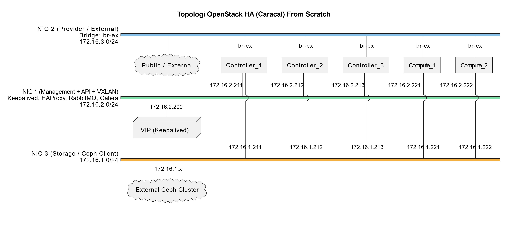

---

---

## **==Structure Script==**

```bash
openstack-caracal-ansible/
├── ansible.cfg
├── requirements.yml
├── site.yml
├── README.md
├── Makefile
│
├── inventories/
│ ├── lab-5node/
│ │ ├── hosts.yml
│ │ ├── group_vars/
│ │ │ ├── all.yml
│ │ │ ├── controllers.yml
│ │ │ ├── computes.yml
│ │ │ ├── openstack.yml
│ │ │ ├── network.yml
│ │ │ ├── ceph.yml
│ │ │ └── vault.yml # ansible-vault
│ │ └── host_vars/
│ │ ├── ctrl01.yml
│ │ ├── ctrl02.yml
│ │ ├── ctrl03.yml
│ │ ├── cmp01.yml
│ │ └── cmp02.yml
│ │
│ └── production/
│ ├── hosts.yml
│ ├── group_vars/
│ └── host_vars/
│
├── playbooks/
│ ├── 00-preflight.yml
│ ├── 01-base.yml
│ ├── 02-network.yml
│ ├── 03-ceph-client.yml
│ ├── 04-ha-vip-lb.yml
│ ├── 05-database.yml
│ ├── 06-message-cache.yml
│ ├── 07-keystone.yml
│ ├── 08-image-placement.yml
│ ├── 09-nova.yml
│ ├── 10-neutron.yml
│ ├── 11-cinder.yml
│ ├── 12-horizon.yml
│ ├── 13-telemetry.yml
│ ├── 14-instance-ha.yml
│ └── 99-validate.yml
│
├── roles/
│ ├── base/
│ │ ├── common/
│ │ ├── ntp_chrony/
│ │ ├── os_hardening/
│ │ ├── apt_openstack_repo/
│ │ └── kernel_tuning/
│ │
│ ├── network/
│ │ ├── netplan/
│ │ ├── openvswitch/
│ │ └── linuxbridge/
│ │
│ ├── ceph/
│ │ └── ceph_client/
│ │
│ ├── ha/
│ │ ├── keepalived/
│ │ ├── haproxy/
│ │ ├── apache2_tls/
│ │ ├── pacemaker/
│ │ └── corosync/
│ │
│ ├── infra/
│ │ ├── mariadb_galera/
│ │ ├── rabbitmq/
│ │ └── memcached/
│ │
│ ├── openstack/
│ │ ├── keystone/
│ │ ├── glance/
│ │ ├── placement/
│ │ ├── nova_controller/
│ │ ├── nova_compute/
│ │ ├── neutron_controller/
│ │ ├── neutron_compute/
│ │ ├── cinder/
│ │ ├── horizon/
│ │ ├── gnocchi/
│ │ ├── ceilometer/
│ │ ├── aodh/
│ │ └── masakari/
│ │
│ └── validation/
│ ├── openstack_cli/
│ ├── service_checks/
│ └── smoke_tests/
│
├── templates/
│ ├── haproxy/
│ ├── apache2/
│ ├── openstack/
│ └── systemd/
│
├── files/
│ └── ceph/
│ ├── ceph.conf
│ ├── ceph.client.glance.keyring
│ ├── ceph.client.cinder.keyring
│ ├── ceph.client.nova.keyring
│ └── ceph.client.gnocchi.keyring
│
├── scripts/
│ ├── bootstrap-deployer.sh
│ ├── ansible-lint.sh
│ └── vault-edit.sh
│
└── docs/
├── architecture.md
├── network-plan.md
├── install-order.md
├── operations.md
└── recovery.md
```

---

## Initial Setup & Pre-requisites (Semua Node)

### Konfigurasi Hostname

```bash
# Di Node Controller-1:
hostnamectl set-hostname controller-01

# Di Node Controller-2:
hostnamectl set-hostname controller-02

# Di Node Controller-3:
hostnamectl set-hostname controller-03

# Di Node Compute 01:
hostnamectl set-hostname compute-01

# Di Node Compute 02:
hostnamectl set-hostname compute-02
```

### Mapping /etc/hosts (di SEMUA Node)

```bash
nano /etc/hosts
```

```bash
127.0.0.1 localhost

# OpenStack Nodes - Net-Public
172.16.2.211 controller-01
172.16.2.212 controller-02
172.16.2.213 controller-03
172.16.2.221 compute-01
172.16.2.222 compute-02
172.16.2.200 openstack-api.internal openstack-api
```

### Setup SSH Passwordless (Hanya di Deployer)

```bash
# Buat SSH Key (tekan Enter terus sampai selesai)
ssh-keygen -t rsa -N ""

# Copy key ke semua node (masukkan password masing-masing node saat diminta)
ssh-copy-id root@controller-01
ssh-copy-id root@controller-02
ssh-copy-id root@controller-03
ssh-copy-id root@compute-01
ssh-copy-id root@compute-02
```

### Matikan Cloud-Init jika ada

```bash
sudo touch /etc/cloud/cloud-init.disabled

sudo systemctl stop cloud-init-local.service cloud-init.service cloud-config.service cloud-final.service
sudo systemctl disable cloud-init-local.service cloud-init.service cloud-config.service cloud-final.service
```

### Sinkronisasi Waktu / NTP (di SEMUA Node)

```bash
sudo apt update && sudo apt install -y wget curl
curl -sSL https://raw.githubusercontent.com/ica4me/configure-new-server/main/setup_time.sh | bash
```

```bash
# Sinkronkan dan restart chrony ke semua node
for node in controller-01 controller-02 controller-03 compute-01 compute-02; do
  echo "Syncing $node..."
  ssh root@$node "apt install chrony -y && chronyc makestep && systemctl restart chronyd"
done
```

---

---

| Node | Inventory Alias | Hostname OS | Management | Provider | Storage / Ceph Client |
| --- | --- | --- | --- | --- | --- |
| Controller 1 | ctrl01 | controller-01 | 172.16.2.211 | br-ex | 172.16.1.211 |
| Controller 2 | ctrl02 | controller-02 | 172.16.2.212 | br-ex | 172.16.1.212 |
| Controller 3 | ctrl03 | controller-03 | 172.16.2.213 | br-ex | 172.16.1.213 |
| Compute 1 | cmp01 | compute-01 | 172.16.2.221 | br-ex | 172.16.1.221 |
| Compute 2 | cmp02 | compute-02 | 172.16.2.222 | br-ex | 172.16.1.222 |
| VIP | \-  | \-  | 172.16.2.200 | \-  | \-  |

### Verifikasi Host

```bash
getent hosts controller-01
getent hosts controller-02
getent hosts controller-03
getent hosts compute-01
getent hosts compute-02
```

### Buat Struktur Repository

```bash
mkdir -p openstack-caracal-ansible
cd openstack-caracal-ansible

mkdir -p \
  inventories/lab-5node/group_vars \
  inventories/lab-5node/host_vars \
  inventories/production/group_vars \
  inventories/production/host_vars \
  playbooks \
  roles/base/{common,ntp_chrony,os_hardening,apt_openstack_repo,kernel_tuning}/{tasks,handlers,templates,defaults,vars,files,meta} \
  roles/network/{netplan,openvswitch,linuxbridge}/{tasks,handlers,templates,defaults,vars,files,meta} \
  roles/ceph/ceph_client/{tasks,handlers,templates,defaults,vars,files,meta} \
  roles/ha/{keepalived,haproxy,apache2_tls,pacemaker,corosync}/{tasks,handlers,templates,defaults,vars,files,meta} \
  roles/infra/{mariadb_galera,rabbitmq,memcached}/{tasks,handlers,templates,defaults,vars,files,meta} \
  roles/openstack/{keystone,glance,placement,nova_controller,nova_compute,neutron_controller,neutron_compute,cinder,horizon,gnocchi,ceilometer,aodh,masakari}/{tasks,handlers,templates,defaults,vars,files,meta} \
  roles/validation/{openstack_cli,service_checks,smoke_tests}/{tasks,handlers,templates,defaults,vars,files,meta} \
  templates/{haproxy,apache2,openstack,systemd} \
  files/ceph \
  scripts \
  docs
```

```bash
touch \
  ansible.cfg \
  requirements.yml \
  site.yml \
  README.md \
  Makefile \
  inventories/lab-5node/hosts.yml \
  inventories/lab-5node/group_vars/{all.yml,controllers.yml,computes.yml,openstack.yml,network.yml,ceph.yml,vault.yml} \
  inventories/lab-5node/host_vars/{ctrl01.yml,ctrl02.yml,ctrl03.yml,cmp01.yml,cmp02.yml} \
  playbooks/{00-preflight.yml,01-base.yml,02-network.yml,03-ceph-client.yml,04-ha-vip-lb.yml,05-database.yml,06-message-cache.yml,07-keystone.yml,08-image-placement.yml,09-nova.yml,10-neutron.yml,11-cinder.yml,12-horizon.yml,13-telemetry.yml,14-instance-ha.yml,99-validate.yml} \
  scripts/{bootstrap-deployer.sh,ansible-lint.sh,vault-edit.sh}
```

INSTALL PAKET ANSIBLE DEPLOYER

```
apt update
apt install -y software-properties-common python3-pip python3-venv git sshpass make jq curl vim netcat-openbsd

add-apt-repository --yes --update ppa:ansible/ansible

apt install -y ansible
```

---

# ==Conf-1 (Persiapan-Cluster)==

---

```
nano ansible.cfg
```

```
# ansible.cfg
[defaults]
inventory = inventories/lab-5node/hosts.yml
roles_path = roles
host_key_checking = False
retry_files_enabled = False
forks = 30
timeout = 60
interpreter_python = auto_silent
stdout_callback = yaml
bin_ansible_callbacks = True
collections_path = collections
vault_password_file = .vault_pass

[ssh_connection]
pipelining = True
ssh_args = -o ControlMaster=auto -o ControlPersist=60s -o ServerAliveInterval=30
```

```
nano requirements.yml
```

```
# requirements.yml
---
collections:
  - name: ansible.posix
  - name: community.general
  - name: community.crypto
  - name: community.mysql
  - name: openstack.cloud
```

```
ansible-galaxy collection install -r requirements.yml
```

---

```
nano inventories/lab-5node/hosts.yml
```

```
# inventories/lab-5node/hosts.yml
---
all:
  children:
    controllers:
      hosts:
        ctrl01:
          ansible_host: 172.16.2.211
          expected_hostname: controller-01
          management_ip: 172.16.2.211
          storage_ip: 172.16.1.211
          management_iface: ens19
          provider_iface: ens20
          storage_iface: eth0
          keepalived_priority: 110

        ctrl02:
          ansible_host: 172.16.2.212
          expected_hostname: controller-02
          management_ip: 172.16.2.212
          storage_ip: 172.16.1.212
          management_iface: ens19
          provider_iface: ens20
          storage_iface: eth0
          keepalived_priority: 100

        ctrl03:
          ansible_host: 172.16.2.213
          expected_hostname: controller-03
          management_ip: 172.16.2.213
          storage_ip: 172.16.1.213
          management_iface: ens19
          provider_iface: ens20
          storage_iface: eth0
          keepalived_priority: 90

    computes:
      hosts:
        cmp01:
          ansible_host: 172.16.2.221
          expected_hostname: compute-01
          management_ip: 172.16.2.221
          storage_ip: 172.16.1.221
          management_iface: ens19
          provider_iface: ens20
          storage_iface: eth0

        cmp02:
          ansible_host: 172.16.2.222
          expected_hostname: compute-02
          management_ip: 172.16.2.222
          storage_ip: 172.16.1.222
          management_iface: ens19
          provider_iface: ens20
          storage_iface: eth0

    openstack:
      children:
        controllers:
        computes:

    network:
      children:
        openstack:

    ceph_clients:
      children:
        openstack:

    vault:
      children:
        openstack:
```

```
nano inventories/lab-5node/group_vars/all.yml
```

```
# inventories/lab-5node/group_vars/all.yml
---
deployment_name: lab-5node

openstack_release: caracal
ubuntu_release: jammy
openstack_cloud_archive: cloud-archive:caracal

timezone: Asia/Jakarta

ansible_user: root
ansible_become: true
ansible_become_method: sudo

# HA API VIP berada di Management Network
vip_internal: 172.16.2.200
vip_interface: ens19

internal_fqdn: openstack-api.internal
public_fqdn: openstack-api.local

openstack_region: RegionOne
openstack_domain: Default
openstack_admin_project: admin
openstack_service_project: service

enable_tls: false
enable_horizon: true
enable_telemetry: true
enable_masakari: true

controller_count: "{{ groups['controllers'] | length }}"
compute_count: "{{ groups['computes'] | length }}"
bootstrap_controller: "{{ groups['controllers'][0] }}"

hosts_entries:
  - { ip: "172.16.2.211", name: "controller-01" }
  - { ip: "172.16.2.212", name: "controller-02" }
  - { ip: "172.16.2.213", name: "controller-03" }
  - { ip: "172.16.2.221", name: "compute-01" }
  - { ip: "172.16.2.222", name: "compute-02" }
  - { ip: "172.16.2.200", name: "openstack-api.internal openstack-api" }
```

```
nano inventories/lab-5node/group_vars/network.yml
```

```
# inventories/lab-5node/group_vars/network.yml
---
# NIC 1 - Management + API + VXLAN
management_cidr: 172.16.2.0/24
management_gateway: 172.16.2.1

# NIC 2 - Provider / External / Floating IP
provider_cidr: 172.16.3.0/24
provider_gateway: 172.16.3.1

# NIC 3 - Storage / Ceph External Client
storage_cidr: 172.16.1.0/24

dns_servers:
  - 8.8.8.8
  - 1.1.1.1

management_iface_default: ens19
provider_iface_default: ens20
storage_iface_default: eth0

# Neutron ML2 + Open vSwitch baseline
neutron_plugin: ml2
neutron_mechanism_driver: openvswitch

neutron_type_drivers:
  - flat
  - vlan
  - vxlan

neutron_tenant_network_types:
  - vxlan

# VXLAN endpoint memakai NIC management
neutron_tunnel_interface: "{{ management_iface | default(management_iface_default) }}"
neutron_local_ip: "{{ management_ip }}"

# Provider bridge
neutron_external_bridge: br-ex
neutron_provider_physnet: provider

neutron_bridge_mappings:
  - "{{ neutron_provider_physnet }}:{{ neutron_external_bridge }}"

neutron_flat_networks:
  - provider
```

```
nano inventories/lab-5node/group_vars/openstack.yml
```

```
# inventories/lab-5node/group_vars/openstack.yml
---
endpoint_protocol: http
endpoint_host: "{{ vip_internal }}"
endpoint_base_url: "{{ endpoint_protocol }}://{{ endpoint_host }}"

db_host: "{{ vip_internal }}"
rabbitmq_host: "{{ vip_internal }}"

memcached_servers: >-
  {{ groups['controllers']
     | map('extract', hostvars, 'management_ip')
     | map('regex_replace', '^(.*)$', '\\1:11211')
     | join(',') }}

service_endpoints:
  keystone: "{{ endpoint_base_url }}:5000/v3"
  glance: "{{ endpoint_base_url }}:9292"
  placement: "{{ endpoint_base_url }}:8778"
  nova: "{{ endpoint_base_url }}:8774/v2.1"
  neutron: "{{ endpoint_base_url }}:9696"
  cinder: "{{ endpoint_base_url }}:8776/v3/%(project_id)s"
  horizon: "{{ endpoint_base_url }}/horizon"
  gnocchi: "{{ endpoint_base_url }}:8041"
  aodh: "{{ endpoint_base_url }}:8042"
```

```bash
nano inventories/lab-5node/group_vars/ceph.yml
```

:::warning
Ganti ceph_mon_hosts sesuai IP MON Ceph external. Misal bootstrap Ceph memakai --mon-ip 172.16.1.21.
:::

```
# inventories/lab-5node/group_vars/ceph.yml
---
ceph_external: true
ceph_cluster_name: ceph

# OpenStack controller/compute sebagai Ceph client memakai NIC 3
ceph_public_network: 172.16.1.0/24
openstack_ceph_client_network: 172.16.1.0/24

# OpenStack client tidak memakai Ceph cluster/private network.
# Isi hanya untuk dokumentasi jika perlu.
ceph_cluster_network: ""

ceph_conf_path: /etc/ceph/ceph.conf

ceph_mon_hosts:
  - 172.16.1.21

ceph_pools:
  glance: images
  cinder: volumes
  nova: vms
  gnocchi: metrics
  backup: backups

ceph_users:
  glance: client.glance
  cinder: client.cinder
  nova: client.nova
  gnocchi: client.gnocchi

rbd_secret_uuid: "00000000-0000-0000-0000-000000000001"

glance_backend: rbd
glance_rbd_store_pool: "{{ ceph_pools.glance }}"
glance_image_format: raw

cinder_backend: rbd
cinder_rbd_pool: "{{ ceph_pools.cinder }}"
cinder_rbd_user: cinder

nova_rbd_pool: "{{ ceph_pools.nova }}"
nova_rbd_user: nova

gnocchi_backend: ceph
gnocchi_rbd_pool: "{{ ceph_pools.gnocchi }}"
gnocchi_rbd_user: gnocchi
```

```
ln -sf ceph.yml inventories/lab-5node/group_vars/ceph_clients.yml
```

```bash
nano inventories/lab-5node/group_vars/controllers.yml
```

```bash
# inventories/lab-5node/group_vars/controllers.yml
---
node_role: controller

controller_services:
  - keepalived
  - haproxy
  - mariadb
  - rabbitmq-server
  - memcached
  - apache2
```

```
nano inventories/lab-5node/group_vars/computes.yml
```

```
# inventories/lab-5node/group_vars/computes.yml
---
node_role: compute

compute_services:
  - nova-compute
  - neutron-openvswitch-agent
  - libvirtd
```

```
nano inventories/lab-5node/group_vars/vault.yml
```

```bash
# inventories/lab-5node/group_vars/vault.yml
---
vault_mysql_root_password: "CHANGE_ME"
vault_galera_sst_password: "CHANGE_ME"
vault_rabbitmq_erlang_cookie: "CHANGE_ME"
vault_rabbitmq_openstack_password: "CHANGE_ME"

vault_keystone_admin_password: "CHANGE_ME"
vault_keystone_db_password: "CHANGE_ME"

vault_glance_db_password: "CHANGE_ME"
vault_glance_service_password: "CHANGE_ME"

vault_placement_db_password: "CHANGE_ME"
vault_placement_service_password: "CHANGE_ME"

vault_nova_db_password: "CHANGE_ME"
vault_nova_api_db_password: "CHANGE_ME"
vault_nova_cell0_db_password: "CHANGE_ME"
vault_nova_service_password: "CHANGE_ME"

vault_neutron_db_password: "CHANGE_ME"
vault_neutron_service_password: "CHANGE_ME"
vault_metadata_secret: "CHANGE_ME"

vault_cinder_db_password: "CHANGE_ME"
vault_cinder_service_password: "CHANGE_ME"

vault_aodh_db_password: "CHANGE_ME"
vault_aodh_service_password: "CHANGE_ME"

vault_gnocchi_db_password: "CHANGE_ME"
vault_gnocchi_service_password: "CHANGE_ME"

vault_masakari_db_password: "CHANGE_ME"
vault_masakari_service_password: "CHANGE_ME"

vault_keepalived_auth_pass: "CHANGE_ME"
```

Generate otomatis dan encrypt:

```
openssl rand -base64 32 > .vault_pass
chmod 600 .vault_pass

python3 - <<'PY'
import secrets
import pathlib

keys = [
"vault_mysql_root_password",
"vault_galera_sst_password",
"vault_rabbitmq_erlang_cookie",
"vault_rabbitmq_openstack_password",
"vault_keystone_admin_password",
"vault_keystone_db_password",
"vault_glance_db_password",
"vault_glance_service_password",
"vault_placement_db_password",
"vault_placement_service_password",
"vault_nova_db_password",
"vault_nova_api_db_password",
"vault_nova_cell0_db_password",
"vault_nova_service_password",
"vault_neutron_db_password",
"vault_neutron_service_password",
"vault_metadata_secret",
"vault_cinder_db_password",
"vault_cinder_service_password",
"vault_aodh_db_password",
"vault_aodh_service_password",
"vault_gnocchi_db_password",
"vault_gnocchi_service_password",
"vault_masakari_db_password",
"vault_masakari_service_password",
"vault_keepalived_auth_pass",
]

content = "---\n"
for key in keys:
    content += f'{key}: "{secrets.token_urlsafe(32)}"\n'

path = pathlib.Path("inventories/lab-5node/group_vars/vault.yml")
path.write_text(content, encoding="utf-8")
PY

ansible-vault encrypt inventories/lab-5node/group_vars/vault.yml
```

```
nano site.yml
```

```
# site.yml
---
- import_playbook: playbooks/00-preflight.yml
- import_playbook: playbooks/01-base.yml
- import_playbook: playbooks/02-network.yml
- import_playbook: playbooks/03-ceph-client.yml
- import_playbook: playbooks/04-ha-vip-lb.yml
- import_playbook: playbooks/05-database.yml
- import_playbook: playbooks/06-message-cache.yml
- import_playbook: playbooks/07-keystone.yml
- import_playbook: playbooks/08-image-placement.yml
- import_playbook: playbooks/09-nova.yml
- import_playbook: playbooks/10-neutron.yml
- import_playbook: playbooks/11-cinder.yml
- import_playbook: playbooks/12-horizon.yml
- import_playbook: playbooks/13-telemetry.yml
  when: enable_telemetry | bool
- import_playbook: playbooks/14-instance-ha.yml
  when: enable_masakari | bool
- import_playbook: playbooks/99-validate.yml
```

```
nano Makefile
```

```bash
# Makefile
INV ?= inventories/lab-5node/hosts.yml
LIMIT ?= all

.PHONY: ping graph vars preflight base network ceph ha db msg core validate all vault-edit vault-view

ping:
	ansible -i $(INV) $(LIMIT) -m ping

graph:
	ansible-inventory -i $(INV) --graph

vars:
	ansible-inventory -i $(INV) --list

preflight:
	ansible-playbook -i $(INV) playbooks/00-preflight.yml

base:
	ansible-playbook -i $(INV) playbooks/01-base.yml

network:
	ansible-playbook -i $(INV) playbooks/02-network.yml

ceph:
	ansible-playbook -i $(INV) playbooks/03-ceph-client.yml

ha:
	ansible-playbook -i $(INV) playbooks/04-ha-vip-lb.yml

db:
	ansible-playbook -i $(INV) playbooks/05-database.yml

msg:
	ansible-playbook -i $(INV) playbooks/06-message-cache.yml

core:
	ansible-playbook -i $(INV) playbooks/07-keystone.yml
	ansible-playbook -i $(INV) playbooks/08-image-placement.yml
	ansible-playbook -i $(INV) playbooks/09-nova.yml
	ansible-playbook -i $(INV) playbooks/10-neutron.yml

validate:
	ansible-playbook -i $(INV) playbooks/99-validate.yml

all:
	ansible-playbook -i $(INV) site.yml

vault-edit:
	ansible-vault edit inventories/lab-5node/group_vars/vault.yml

vault-view:
	ansible-vault view inventories/lab-5node/group_vars/vault.yml

msgcache:
	ansible-playbook -i inventories/lab-5node/hosts.yml playbooks/06-message-cache.yml
```

```
nano playbooks/00-preflight.yml
```

```
# playbooks/00-preflight.yml
---
- name: Phase 00 - Preflight validation for OpenStack HA cluster
  hosts: openstack
  become: true
  gather_facts: true

  pre_tasks:
    - name: Show host identity
      ansible.builtin.debug:
        msg:
          - "Inventory host: {{ inventory_hostname }}"
          - "Expected hostname: {{ expected_hostname | default('undefined') }}"
          - "Detected hostname: {{ ansible_hostname }}"
          - "Role: {{ node_role | default('undefined') }}"
          - "Management IP: {{ management_ip | default('undefined') }}"
          - "Storage IP: {{ storage_ip | default('undefined') }}"
          - "Management iface: {{ management_iface | default('undefined') }}"
          - "Provider iface: {{ provider_iface | default('undefined') }}"
          - "Storage iface: {{ storage_iface | default('undefined') }}"

  tasks:
    - name: Assert node runs Ubuntu 22.04
      ansible.builtin.assert:
        that:
          - ansible_distribution == "Ubuntu"
          - ansible_distribution_version is version("22.04", "==")
        fail_msg: "Node harus Ubuntu 22.04 LTS."
        success_msg: "OS valid: Ubuntu 22.04 LTS."

    - name: Assert expected hostname is configured
      ansible.builtin.assert:
        that:
          - expected_hostname is defined
          - ansible_hostname == expected_hostname
        fail_msg: "Hostname OS tidak sesuai. Jalankan hostnamectl set-hostname sesuai node."
        success_msg: "Hostname OS sesuai inventory."

    - name: Assert controller count is at least 3 and odd
      ansible.builtin.assert:
        that:
          - groups['controllers'] | length >= 3
          - ((groups['controllers'] | length) % 2) == 1
        fail_msg: "Jumlah controller harus minimal 3 dan ganjil untuk quorum HA."
        success_msg: "Jumlah controller valid."
      run_once: true

    - name: Assert compute count is at least 1
      ansible.builtin.assert:
        that:
          - groups['computes'] | length >= 1
        fail_msg: "Minimal harus ada 1 compute node."
        success_msg: "Jumlah compute valid."
      run_once: true

    - name: Assert required global variables exist
      ansible.builtin.assert:
        that:
          - vip_internal is defined
          - vip_interface is defined
          - management_cidr is defined
          - provider_cidr is defined
          - storage_cidr is defined
          - openstack_cloud_archive is defined
          - bootstrap_controller is defined
        fail_msg: "Ada variabel global wajib yang belum didefinisikan."
        success_msg: "Variabel global wajib lengkap."
      run_once: true

    - name: Assert required host variables exist
      ansible.builtin.assert:
        that:
          - management_ip is defined
          - storage_ip is defined
          - management_iface is defined
          - provider_iface is defined
          - storage_iface is defined
        fail_msg: "Variabel host wajib belum lengkap."
        success_msg: "Variabel host wajib lengkap."

    - name: Assert network interfaces exist
      ansible.builtin.assert:
        that:
          - management_iface in ansible_facts.interfaces
          - provider_iface in ansible_facts.interfaces
          - storage_iface in ansible_facts.interfaces
        fail_msg: "Salah satu NIC tidak ditemukan. Cek nama interface di inventory."
        success_msg: "Semua NIC ditemukan."

    - name: Assert management IP belongs to 172.16.2.x allocation
      ansible.builtin.assert:
        that:
          - management_ip is match('^172\\.16\\.2\\.')
        fail_msg: "management_ip harus berada di network 172.16.2.0/24."
        success_msg: "management_ip sesuai topologi."

    - name: Assert storage IP belongs to 172.16.1.x allocation
      ansible.builtin.assert:
        that:
          - storage_ip is match('^172\\.16\\.1\\.')
        fail_msg: "storage_ip harus berada di network 172.16.1.0/24."
        success_msg: "storage_ip sesuai topologi."

    - name: Assert VIP belongs to management allocation
      ansible.builtin.assert:
        that:
          - vip_internal is match('^172\\.16\\.2\\.')
          - vip_internal == '172.16.2.200'
        fail_msg: "VIP harus 172.16.2.200 di management network."
        success_msg: "VIP sesuai topologi."
      run_once: true

    - name: Validate local hostname resolution from /etc/hosts or DNS
      ansible.builtin.command: "getent hosts {{ item.name.split()[0] }}"
      loop: "{{ hosts_entries }}"
      changed_when: false

    - name: Check management SSH connectivity between all OpenStack nodes
      ansible.builtin.wait_for:
        host: "{{ hostvars[item].management_ip }}"
        port: 22
        timeout: 5
      loop: "{{ groups['openstack'] }}"
      changed_when: false

    - name: Check Ceph MON v2 port from each OpenStack node
      ansible.builtin.wait_for:
        host: "{{ item }}"
        port: 3300
        timeout: 5
      loop: "{{ ceph_mon_hosts }}"
      changed_when: false

    - name: Check Ceph MON legacy v1 port from each OpenStack node
      ansible.builtin.wait_for:
        host: "{{ item }}"
        port: 6789
        timeout: 5
      loop: "{{ ceph_mon_hosts }}"
      changed_when: false
      failed_when: false

    - name: Check if VIP is not already used before keepalived deployment
      ansible.builtin.command: "ping -c 1 -W 1 {{ vip_internal }}"
      register: vip_ping
      failed_when: false
      changed_when: false
      run_once: true

    - name: Assert VIP is currently unused
      ansible.builtin.assert:
        that:
          - vip_ping.rc != 0
        fail_msg: "VIP {{ vip_internal }} sudah aktif/dipakai. Cek konflik IP sebelum lanjut."
        success_msg: "VIP {{ vip_internal }} belum dipakai, aman untuk keepalived."
      run_once: true

    - name: Print final cluster summary
      ansible.builtin.debug:
        msg:
          - "Deployment: {{ deployment_name }}"
          - "OpenStack release: {{ openstack_release }}"
          - "Ubuntu release: {{ ubuntu_release }}"
          - "Cloud archive: {{ openstack_cloud_archive }}"
          - "Management network: {{ management_cidr }}"
          - "Provider network: {{ provider_cidr }}"
          - "Storage/Ceph network: {{ storage_cidr }}"
          - "VIP: {{ vip_internal }}"
          - "Controllers: {{ groups['controllers'] | join(', ') }}"
          - "Computes: {{ groups['computes'] | join(', ') }}"
          - "Bootstrap controller: {{ bootstrap_controller }}"
          - "Ceph MON hosts: {{ ceph_mon_hosts | join(', ') }}"
      run_once: true
```

```
nano scripts/bootstrap-deployer.sh
```

```
#!/usr/bin/env bash
set -euo pipefail

apt update

apt install -y \
  software-properties-common \
  python3-pip \
  python3-venv \
  git \
  sshpass \
  make \
  jq \
  curl \
  vim \
  netcat-openbsd

add-apt-repository --yes --update ppa:ansible/ansible

apt install -y ansible

ansible --version
ansible-playbook --version
ansible-galaxy --version

ansible-galaxy collection install -r requirements.yml
```

```
chmod +x scripts/bootstrap-deployer.sh
```

```
nano scripts/vault-edit.sh
```

```
#!/usr/bin/env bash
set -euo pipefail

ansible-vault edit inventories/lab-5node/group_vars/vault.yml
```

```
chmod +x scripts/vault-edit.sh
```

```
nano scripts/ansible-lint.sh
```

```
#!/usr/bin/env bash
set -euo pipefail

if ! command -v ansible-lint >/dev/null 2>&1; then
  python3 -m pip install --user ansible-lint
fi

ansible-lint .
```

```
chmod +x scripts/ansible-lint.sh
```

### Validasi Con-1

```
bash scripts/bootstrap-deployer.sh
```

Cek inventory

```
make graph
```

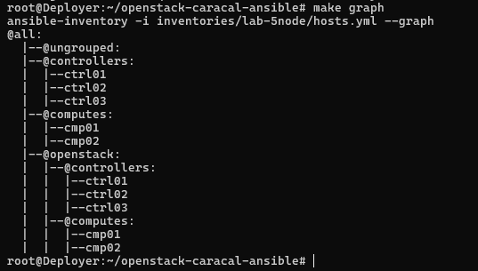

Cek koneksi Ansible

```
make ping
```

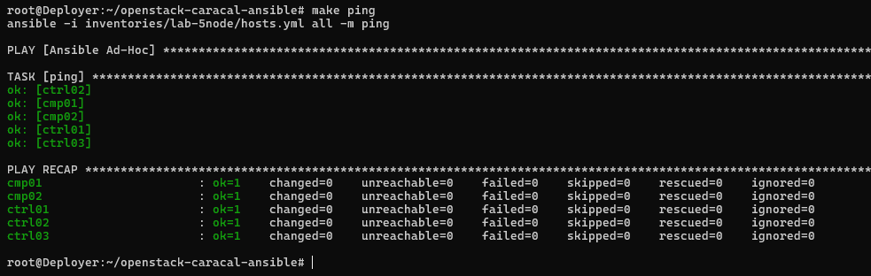

Cek variabel

```
make vars
```

Jalankan preflight

```
make preflight
```

| Item | Status |
| --- | --- |
| Hostname OS sudah `controller-01`, `controller-02`, `controller-03`, `compute-01`, `compute-02` | Wajib |
| `/etc/hosts` semua node berisi mapping management IP | Wajib |
| `make graph` sukses | Wajib |
| `make ping` sukses semua node | Wajib |
| `make preflight` sukses | Wajib |
| VIP `172.16.2.200` belum dipakai sebelum Keepalived | Wajib |
| Ceph MON di `ceph_mon_hosts` reachable dari semua node | Wajib |
| `vault.yml` sudah terenkripsi | Wajib |
| NIC provider belum diberi IP host | Wajib |

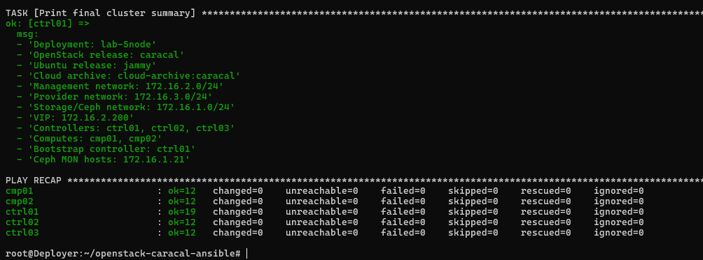

---

---

---

|

|

|

---

# ==Conf-2 (Base OS Preparation)==

---

```
nano playbooks/01-base.yml
```

```
---
- name: Phase 01 - Base OS preparation
  hosts: openstack
  become: true
  gather_facts: true

  roles:
    - role: base/common
    - role: base/ntp_chrony
    - role: base/apt_openstack_repo
    - role: base/os_hardening
    - role: base/kernel_tuning

  post_tasks:
    - name: Print base phase summary
      ansible.builtin.debug:
        msg:
          - "Base phase completed on {{ inventory_hostname }}"
          - "OS: {{ ansible_distribution }} {{ ansible_distribution_version }}"
          - "OpenStack archive: {{ openstack_cloud_archive }}"
          - "Timezone: {{ timezone }}"
```

```
nano roles/base/common/defaults/main.yml
```

```
---
common_packages:
  - software-properties-common
  - python3-pip
  - python3-venv
  - python3-dev
  - python3-setuptools
  - python3-openstackclient
  - crudini
  - curl
  - wget
  - vim
  - jq
  - rsync
  - lsof
  - net-tools
  - iproute2
  - iputils-ping
  - dnsutils
  - tcpdump
  - netcat-openbsd
  - bridge-utils
  - iftop
  - htop
  - chrony
  - ca-certificates
  - gnupg
  - lsb-release
  - apt-transport-https
  - ubuntu-cloud-keyring
```

```
nano roles/base/common/tasks/main.yml
```

```
---
- name: Update apt cache
  ansible.builtin.apt:
    update_cache: true
    cache_valid_time: 3600

- name: Install common packages
  ansible.builtin.apt:
    name: "{{ common_packages }}"
    state: present
  retries: 3
  delay: 10
  register: common_pkg_result
  until: common_pkg_result is succeeded

- name: Set timezone
  community.general.timezone:
    name: "{{ timezone }}"

- name: Ensure /etc/hosts contains OpenStack entries
  ansible.builtin.lineinfile:
    path: /etc/hosts
    regexp: "^{{ item.ip | regex_escape() }}\\s+"
    line: "{{ item.ip }} {{ item.name }}"
    state: present
    create: true
    backup: true
  loop: "{{ hosts_entries }}"

- name: Ensure root SSH directory exists
  ansible.builtin.file:
    path: /root/.ssh
    state: directory
    owner: root
    group: root
    mode: "0700"

- name: Ensure bash history timestamp format
  ansible.builtin.lineinfile:
    path: /etc/profile.d/history-timestamp.sh
    line: 'export HISTTIMEFORMAT="%F %T "'
    create: true
    owner: root
    group: root
    mode: "0644"

- name: Check basic hostname resolution
  ansible.builtin.command: "getent hosts {{ item.name.split()[0] }}"
  loop: "{{ hosts_entries }}"
  changed_when: false
```

```
nano roles/base/ntp_chrony/defaults/main.yml
```

```
---
chrony_package: chrony
chrony_service: chrony

chrony_ntp_servers:
  - 0.id.pool.ntp.org
  - 1.id.pool.ntp.org
  - 2.id.pool.ntp.org
  - 3.id.pool.ntp.org

chrony_allow_networks:
  - 172.16.1.0/24
  - 172.16.2.0/24
  - 172.16.3.0/24
```

```
nano roles/base/ntp_chrony/templates/chrony.conf.j2
```

```
# Managed by Ansible - OpenStack Caracal HA


pool {{ server }} iburst


driftfile /var/lib/chrony/chrony.drift
logdir /var/log/chrony

maxupdateskew 100.0
rtcsync
makestep 1 3


allow {{ network }}

```

```
nano roles/base/ntp_chrony/handlers/main.yml
```

```
---
- name: Restart chrony
  ansible.builtin.service:
    name: "{{ chrony_service }}"
    state: restarted
```

```
nano roles/base/ntp_chrony/tasks/main.yml
```

```
---
- name: Install chrony
  ansible.builtin.apt:
    name: "{{ chrony_package }}"
    state: present
    update_cache: true

- name: Configure chrony
  ansible.builtin.template:
    src: chrony.conf.j2
    dest: /etc/chrony/chrony.conf
    owner: root
    group: root
    mode: "0644"
    backup: true
  notify: Restart chrony

- name: Ensure chrony is enabled and started
  ansible.builtin.service:
    name: "{{ chrony_service }}"
    state: started
    enabled: true

- name: Check chrony tracking
  ansible.builtin.command: chronyc tracking
  register: chrony_tracking
  changed_when: false
  failed_when: false

- name: Show chrony tracking summary
  ansible.builtin.debug:
    var: chrony_tracking.stdout_lines
```

```
nano roles/base/apt_openstack_repo/tasks/main.yml
```

```
---
- name: Ensure packages required for Ubuntu Cloud Archive are installed
  ansible.builtin.apt:
    name:
      - software-properties-common
      - ubuntu-cloud-keyring
      - python3-apt
    state: present
    update_cache: true

- name: Check whether Ubuntu Cloud Archive Caracal source already exists
  ansible.builtin.shell: |
    grep -R "ubuntu-cloud.archive.canonical.com/ubuntu.*caracal" /etc/apt/sources.list /etc/apt/sources.list.d/*.list 2>/dev/null || true
  register: uca_caracal_source
  changed_when: false

- name: Enable Ubuntu Cloud Archive for OpenStack Caracal
  ansible.builtin.command: add-apt-repository -y cloud-archive:caracal
  when: uca_caracal_source.stdout | length == 0
  register: add_uca_caracal

- name: Update apt cache after enabling Ubuntu Cloud Archive
  ansible.builtin.apt:
    update_cache: true
  retries: 3
  delay: 10
  register: apt_update_after_uca
  until: apt_update_after_uca is succeeded

- name: Upgrade packages after enabling OpenStack archive
  ansible.builtin.apt:
    upgrade: dist
    update_cache: true
  register: apt_dist_upgrade
  retries: 3
  delay: 10
  until: apt_dist_upgrade is succeeded

- name: Install OpenStack client package
  ansible.builtin.apt:
    name:
      - python3-openstackclient
      - crudini
    state: present

- name: Check OpenStack client version
  ansible.builtin.command: openstack --version
  register: openstack_client_version
  changed_when: false
  failed_when: false

- name: Show OpenStack client version
  ansible.builtin.debug:
    var: openstack_client_version.stdout

- name: Show Ubuntu Cloud Archive Caracal source
  ansible.builtin.shell: |
    grep -R "caracal" /etc/apt/sources.list /etc/apt/sources.list.d/*.list 2>/dev/null || true
  register: uca_caracal_check
  changed_when: false

- name: Print Ubuntu Cloud Archive source check
  ansible.builtin.debug:
    var: uca_caracal_check.stdout_lines
```

```
nano roles/base/os_hardening/defaults/main.yml
```

```
---
disable_ipv6: false

openstack_limits:
  - domain: "*"
    type: soft
    item: nofile
    value: 1048576
  - domain: "*"
    type: hard
    item: nofile
    value: 1048576
  - domain: "*"
    type: soft
    item: nproc
    value: 1048576
  - domain: "*"
    type: hard
    item: nproc
    value: 1048576
```

```
nano roles/base/os_hardening/tasks/main.yml
```

```
---
- name: Ensure limits.d directory exists
  ansible.builtin.file:
    path: /etc/security/limits.d
    state: directory
    owner: root
    group: root
    mode: "0755"

- name: Configure OpenStack nofile and nproc limits
  ansible.builtin.copy:
    dest: /etc/security/limits.d/99-openstack.conf
    owner: root
    group: root
    mode: "0644"
    content: |
      # Managed by Ansible - OpenStack limits
      
      {{ limit.domain }} {{ limit.type }} {{ limit.item }} {{ limit.value }}
      

- name: Ensure pam_limits is enabled for common-session
  ansible.builtin.lineinfile:
    path: /etc/pam.d/common-session
    line: "session required pam_limits.so"
    state: present
    backup: true

- name: Ensure pam_limits is enabled for common-session-noninteractive
  ansible.builtin.lineinfile:
    path: /etc/pam.d/common-session-noninteractive
    line: "session required pam_limits.so"
    state: present
    backup: true

- name: Disable swap immediately if active
  ansible.builtin.command: swapoff -a
  when: ansible_swaptotal_mb | int > 0
  changed_when: true

- name: Disable swap in fstab
  ansible.builtin.replace:
    path: /etc/fstab
    regexp: '^([^#].*\sswap\s.*)$'
    replace: '# \1'
    backup: true
```

```
nano roles/base/kernel_tuning/tasks/main.yml
```

```
---
- name: Ensure br_netfilter module is loaded
  community.general.modprobe:
    name: br_netfilter
    state: present

- name: Ensure overlay module is loaded
  community.general.modprobe:
    name: overlay
    state: present

- name: Persist kernel modules
  ansible.builtin.copy:
    dest: /etc/modules-load.d/openstack.conf
    owner: root
    group: root
    mode: "0644"
    content: |
      br_netfilter
      overlay

- name: Apply OpenStack sysctl tuning
  ansible.posix.sysctl:
    name: "{{ item.key }}"
    value: "{{ item.value }}"
    state: present
    reload: true
    sysctl_file: /etc/sysctl.d/99-openstack.conf
  loop: "{{ openstack_sysctl | dict2items }}"
```

```
nano roles/base/kernel_tuning/defaults/main.yml
```

```
---
openstack_sysctl:
  net.ipv4.ip_forward: 1
  net.ipv4.conf.all.rp_filter: 0
  net.ipv4.conf.default.rp_filter: 0
  net.ipv4.conf.all.arp_ignore: 1
  net.ipv4.conf.all.arp_announce: 2
  net.bridge.bridge-nf-call-iptables: 1
  net.bridge.bridge-nf-call-ip6tables: 1
  net.bridge.bridge-nf-call-arptables: 1
  vm.swappiness: 1
  fs.file-max: 2097152
```

```
nano roles/base/kernel_tuning/tasks/main.yml
```

```
---
- name: Ensure br_netfilter module is loaded
  community.general.modprobe:
    name: br_netfilter
    state: present

- name: Ensure overlay module is loaded
  community.general.modprobe:
    name: overlay
    state: present

- name: Persist kernel modules
  ansible.builtin.copy:
    dest: /etc/modules-load.d/openstack.conf
    owner: root
    group: root
    mode: "0644"
    content: |
      br_netfilter
      overlay

- name: Apply OpenStack sysctl tuning
  ansible.posix.sysctl:
    name: "{{ item.key }}"
    value: "{{ item.value }}"
    state: present
    reload: true
    sysctl_file: /etc/sysctl.d/99-openstack.conf
  loop: "{{ openstack_sysctl | dict2items }}"
```

### Validasi Conf-2

```
make base
```

```
ansible -i inventories/lab-5node/hosts.yml openstack -m command -a "timedatectl"
ansible -i inventories/lab-5node/hosts.yml openstack -m command -a "chronyc tracking"
ansible -i inventories/lab-5node/hosts.yml openstack -m command -a "openstack --version"
ansible -i inventories/lab-5node/hosts.yml openstack -m command -a "apt-cache policy nova-api"
ansible -i inventories/lab-5node/hosts.yml openstack -m command -a "sysctl net.ipv4.ip_forward"
```

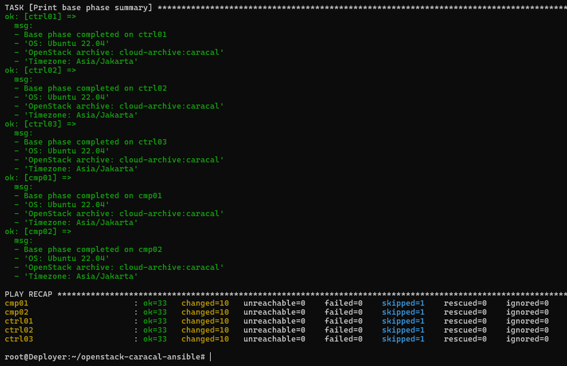

---

---

---

|

|

|

---

# ==Conf-3 (Network + Open vSwitch)==

---

| Fungsi | Interface | Subnet | Catatan |
| --- | --- | --- | --- |
| Storage / Ceph client | `eth0` | `172.16.1.0/24` | IP statis |
| Management + API + VXLAN | `ens19` | `172.16.2.0/24` | IP statis + default route |
| Provider / Floating IP | `ens20` | `172.16.3.0/24` | `br-ex` |
| Provider bridge | `br-ex` | \-  | OVS bridge |
| VIP | `ens19` | `172.16.2.200` | Untuk Keepalived/HAProxy |

:::warning
Netplan automation bisa memutus koneksi jika salah gateway/interface. Karena Ansible masuk lewat 172.16.2.x di ens19, pastikan ens19 memang interface management aktif di semua node.
:::

```
nano playbooks/02-network.yml
```

```
---
- name: Phase 02 - Network and Open vSwitch baseline
  hosts: network
  become: true
  gather_facts: true

  roles:
    - role: network/netplan
    - role: network/openvswitch

  post_tasks:
    - name: Validate management IP is reachable locally
      ansible.builtin.command: "ip -4 addr show {{ management_iface }}"
      changed_when: false

    - name: Validate storage IP is reachable locally
      ansible.builtin.command: "ip -4 addr show {{ storage_iface }}"
      changed_when: false

    - name: Validate provider interface has no IPv4 address
      ansible.builtin.shell: |
        ip -4 addr show {{ provider_iface }} | grep -q 'inet ' && exit 1 || exit 0
      changed_when: false

    - name: Validate br-ex exists
      ansible.builtin.command: ovs-vsctl br-exists {{ neutron_external_bridge }}
      changed_when: false

    - name: Validate provider interface is attached to br-ex
      ansible.builtin.shell: |
        ovs-vsctl list-ports {{ neutron_external_bridge }} | grep -w {{ provider_iface }}
      changed_when: false

    - name: Print network phase summary
      ansible.builtin.debug:
        msg:
          - "Network phase completed on {{ inventory_hostname }}"
          - "Storage iface: {{ storage_iface }} / {{ storage_ip }}"
          - "Management iface: {{ management_iface }} / {{ management_ip }}"
          - "Provider iface: {{ provider_iface }} / bridge {{ neutron_external_bridge }}"
          - "VXLAN local IP: {{ neutron_local_ip }}"
```

```
nano roles/network/netplan/defaults/main.yml
```

```
---
netplan_config_file: /etc/netplan/99-openstack-ansible.yaml
netplan_renderer: networkd

# Prefix default untuk /24
management_prefix: 24
storage_prefix: 24

# Provider interface tidak diberi IP host.
provider_dhcp4: false
provider_dhcp6: false
```

```
nano roles/network/netplan/templates/99-openstack-ansible.yaml.j2
```

```
# Managed by Ansible - OpenStack Caracal network baseline
network:
  version: 2
  renderer: {{ netplan_renderer }}
  ethernets:
    {{ storage_iface }}:
      dhcp4: false
      dhcp6: false
      addresses:
        - {{ storage_ip }}/{{ storage_prefix }}
      optional: true

    {{ management_iface }}:
      dhcp4: false
      dhcp6: false
      addresses:
        - {{ management_ip }}/{{ management_prefix }}
      routes:
        - to: default
          via: {{ management_gateway }}
      nameservers:
        addresses:

          - {{ dns }}

      optional: false

    {{ provider_iface }}:
      dhcp4: false
      dhcp6: false
      accept-ra: false
      link-local: []
      optional: true
```

```
nano roles/network/netplan/handlers/main.yml
```

```
---
- name: Generate netplan
  ansible.builtin.command: netplan generate
  changed_when: false

- name: Apply netplan
  ansible.builtin.command: netplan apply
  async: 45
  poll: 0
```

```
nano roles/network/netplan/tasks/main.yml
```

```
---
- name: Assert expected network variables exist
  ansible.builtin.assert:
    that:
      - management_ip is defined
      - storage_ip is defined
      - management_iface is defined
      - storage_iface is defined
      - provider_iface is defined
      - management_gateway is defined
      - dns_servers is defined
    fail_msg: "Variabel network wajib belum lengkap."

- name: Assert expected interfaces exist before applying netplan
  ansible.builtin.assert:
    that:
      - storage_iface in ansible_facts.interfaces
      - management_iface in ansible_facts.interfaces
      - provider_iface in ansible_facts.interfaces
    fail_msg: "Interface tidak ditemukan. Cek eth0/ens19/ens20 di inventory."

- name: Backup existing netplan directory
  ansible.builtin.archive:
    path: /etc/netplan
    dest: "/root/netplan-backup-{{ ansible_date_time.iso8601_basic_short }}.tgz"
    format: gz
  ignore_errors: true

- name: Disable cloud-init network config if present
  ansible.builtin.copy:
    dest: /etc/cloud/cloud.cfg.d/99-disable-network-config.cfg
    owner: root
    group: root
    mode: "0644"
    content: |
      network: {config: disabled}
  when: ansible_facts['distribution'] == 'Ubuntu'

- name: Deploy OpenStack netplan configuration
  ansible.builtin.template:
    src: 99-openstack-ansible.yaml.j2
    dest: "{{ netplan_config_file }}"
    owner: root
    group: root
    mode: "0600"
    backup: true
  notify:
    - Generate netplan
    - Apply netplan

- name: Flush netplan handlers now
  ansible.builtin.meta: flush_handlers

- name: Wait for SSH to come back on management IP
  ansible.builtin.wait_for_connection:
    timeout: 60
    delay: 5

- name: Validate management interface has expected IP
  ansible.builtin.shell: |
    ip -4 -br addr show {{ management_iface }} | grep -F "{{ management_ip }}/"
  changed_when: false

- name: Validate storage interface has expected IP
  ansible.builtin.shell: |
    ip -4 -br addr show {{ storage_iface }} | grep -F "{{ storage_ip }}/"
  changed_when: false

- name: Validate provider interface has no IPv4 address
  ansible.builtin.shell: |
    ip -4 -br addr show {{ provider_iface }} | grep -q ' [0-9]' && exit 1 || exit 0
  changed_when: false
```

```
nano roles/network/openvswitch/defaults/main.yml
```

```
---
openvswitch_packages:
  - openvswitch-switch

openvswitch_service: openvswitch-switch
```

```
nnao roles/network/openvswitch/tasks/main.yml
```

```
---
- name: Install Open vSwitch packages
  ansible.builtin.apt:
    name: "{{ openvswitch_packages }}"
    state: present
    update_cache: true

- name: Ensure Open vSwitch service is enabled and started
  ansible.builtin.service:
    name: "{{ openvswitch_service }}"
    state: started
    enabled: true

- name: Check if provider bridge exists
  ansible.builtin.command: "ovs-vsctl br-exists {{ neutron_external_bridge }}"
  register: br_ex_exists
  failed_when: false
  changed_when: false

- name: Create provider bridge br-ex
  ansible.builtin.command: "ovs-vsctl add-br {{ neutron_external_bridge }}"
  when: br_ex_exists.rc != 0

- name: Check current ports on provider bridge
  ansible.builtin.command: "ovs-vsctl list-ports {{ neutron_external_bridge }}"
  register: br_ex_ports
  changed_when: false

- name: Add provider interface to br-ex
  ansible.builtin.command: "ovs-vsctl add-port {{ neutron_external_bridge }} {{ provider_iface }}"
  when: provider_iface not in br_ex_ports.stdout_lines

- name: Set provider interface external-ids
  ansible.builtin.command: "ovs-vsctl set Interface {{ provider_iface }} external-ids:iface-role=provider"
  changed_when: false

- name: Show OVS bridge mapping
  ansible.builtin.command: ovs-vsctl show
  register: ovs_show
  changed_when: false

- name: Print OVS state
  ansible.builtin.debug:
    var: ovs_show.stdout_lines
```

### Verifikasi Conf-3

```
ansible -i inventories/lab-5node/hosts.yml openstack -m command -a "ip -4 -br addr" -o
```

:::warning
Interface br-ex(ip wajib kosong)
:::

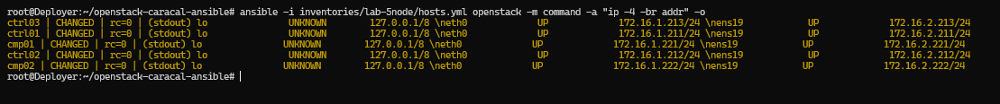

```
make network
```

```
ansible -i inventories/lab-5node/hosts.yml openstack -m command -a "ip -br addr"
ansible -i inventories/lab-5node/hosts.yml openstack -m command -a "ip route"
ansible -i inventories/lab-5node/hosts.yml openstack -m command -a "ovs-vsctl show"
ansible -i inventories/lab-5node/hosts.yml openstack -m shell -a "ip -4 addr show ens20 | grep -q 'inet ' && echo BAD_HAS_IP || echo OK_NO_IP"
ansible -i inventories/lab-5node/hosts.yml openstack -m command -a "ping -c 3 172.16.1.21"
```

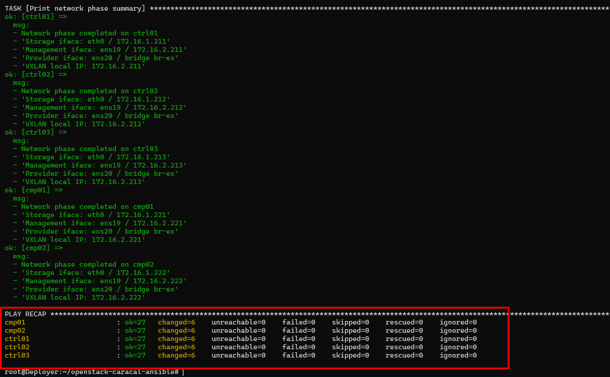

---

---

|

|

|

---

# ==Conf-4 (Ceph Client Integration)==

---

Ceph status (External Cluster)

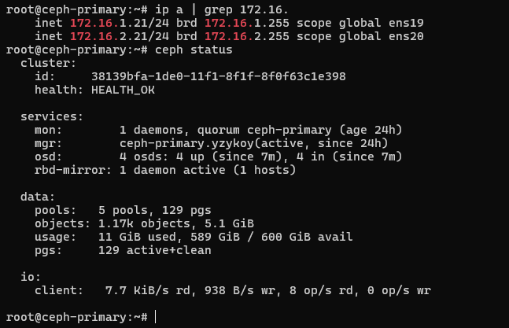

DATA Ceph

| Item | Nilai |
| --- | --- |
| Ceph node utama | `ceph-primary` |
| Ceph public/client IP | `172.16.1.21` di `ens19` |
| Ceph cluster/internal IP | `172.16.2.21` di `ens20` |
| Ceph FSID | `38139bfa-1de0-11f1-8f1f-8f0f63c1e398` |
| Ceph health | `HEALTH_OK` |
| MON | 1 daemon, quorum `ceph-primary` |
| OSD | 4 up, 4 in |
| Pool saat ini | 5 pools |
| OpenStack client network | `172.16.1.0/24` |

Pastikan koneksi dari OpenStack node ke Ceph MON

```
ansible -i inventories/lab-5node/hosts.yml ceph_clients -m command -a "ping -c 3 172.16.1.21"
ansible -i inventories/lab-5node/hosts.yml ceph_clients -m shell -a "nc -vz 172.16.1.21 3300"
ansible -i inventories/lab-5node/hosts.yml ceph_clients -m shell -a "nc -vz 172.16.1.21 6789"
```

---

EKSEKSI DI CEPH-HOST

Cek pool yang sudah ada

```
ceph osd pool ls
```


Aktifkan RBD application

:::info
https://docs.ceph.com/en/reef/rbd/rbd-openstack
:::

```
ceph osd pool application enable images rbd
ceph osd pool application enable volumes rbd
ceph osd pool application enable vms rbd
ceph osd pool application enable metrics rbd
ceph osd pool application enable backups rbd
```

Buat keyring service untuk OpenStack

```
ceph auth get-or-create client.glance \
  mon 'profile rbd' \
  osd 'profile rbd pool=images' \
  -o /etc/ceph/ceph.client.glance.keyring

ceph auth get-or-create client.cinder \
  mon 'profile rbd' \
  osd 'profile rbd pool=volumes, profile rbd pool=images, profile rbd pool=vms, profile rbd pool=backups' \
  -o /etc/ceph/ceph.client.cinder.keyring

ceph auth get-or-create client.nova \
  mon 'profile rbd' \
  osd 'profile rbd pool=vms, profile rbd pool=images, profile rbd pool=volumes' \
  -o /etc/ceph/ceph.client.nova.keyring

ceph auth get-or-create client.gnocchi \
  mon 'profile rbd' \
  osd 'profile rbd pool=metrics' \
  -o /etc/ceph/ceph.client.gnocchi.keyring
```

Verifikasi Keyring

```
ceph auth get client.glance
ceph auth get client.cinder
ceph auth get client.nova
ceph auth get client.gnocchi
```

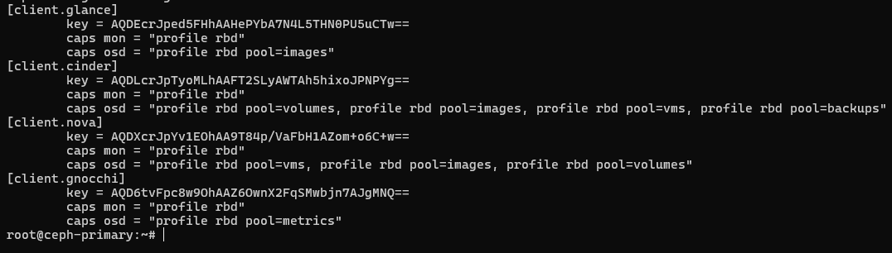

Export keyring ke `/etc/ceph`

```
ceph auth get client.glance  -o /etc/ceph/ceph.client.glance.keyring
ceph auth get client.cinder  -o /etc/ceph/ceph.client.cinder.keyring
ceph auth get client.nova    -o /etc/ceph/ceph.client.nova.keyring
ceph auth get client.gnocchi -o /etc/ceph/ceph.client.gnocchi.keyring
```

Verifikasi

```
ls -lah /etc/ceph/ceph.client.*.keyring
ceph auth get client.glance
ceph auth get client.cinder
ceph auth get client.nova
ceph auth get client.gnocchi
```

Validasi akses pool dari `ceph-primary`

```
rbd -p images ls --id glance
rbd -p volumes ls --id cinder
rbd -p vms ls --id nova
rbd -p metrics ls --id gnocchi
```

### Ambil Keyring Ceph di Deployer

```
mkdir -p files/ceph
```

```
cd ~/openstack-caracal-ansible

scp root@172.16.1.21:/etc/ceph/ceph.conf files/ceph/ceph.conf
scp root@172.16.1.21:/etc/ceph/ceph.client.glance.keyring files/ceph/ceph.client.glance.keyring
scp root@172.16.1.21:/etc/ceph/ceph.client.cinder.keyring files/ceph/ceph.client.cinder.keyring
scp root@172.16.1.21:/etc/ceph/ceph.client.nova.keyring files/ceph/ceph.client.nova.keyring
scp root@172.16.1.21:/etc/ceph/ceph.client.gnocchi.keyring files/ceph/ceph.client.gnocchi.keyring
```

```
ls -lah files/ceph/
```

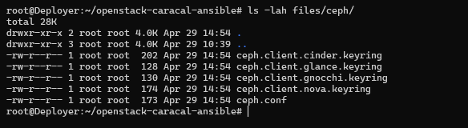

---

```
nano inventories/lab-5node/group_vars/ceph.yml
```

```
---
ceph_external: true
ceph_cluster_name: ceph

ceph_fsid: 38139bfa-1de0-11f1-8f1f-8f0f63c1e398

ceph_public_network: 172.16.1.0/24
openstack_ceph_client_network: 172.16.1.0/24
ceph_cluster_network: 172.16.2.0/24

ceph_mon_hosts:
  - 172.16.1.21

ceph_mon_ports:
  - 3300
  - 6789

ceph_conf_path: /etc/ceph/ceph.conf

# Project root dihitung dari lokasi inventory:
# /root/openstack-caracal-ansible/inventories/lab-5node -> ../..
ceph_files_dir: "{{ inventory_dir }}/../../files/ceph"

ceph_pools:
  glance: images
  cinder: volumes
  nova: vms
  cinder_backup: backups
  gnocchi: metrics

ceph_users:
  glance: client.glance
  cinder: client.cinder
  nova: client.nova
  gnocchi: client.gnocchi

ceph_keyrings:
  - service: glance
    client_name: client.glance
    client_id: glance
    src: "{{ ceph_files_dir }}/ceph.client.glance.keyring"
    dest: /etc/ceph/ceph.client.glance.keyring
    validate_pool: images

  - service: cinder
    client_name: client.cinder
    client_id: cinder
    src: "{{ ceph_files_dir }}/ceph.client.cinder.keyring"
    dest: /etc/ceph/ceph.client.cinder.keyring
    validate_pool: volumes

  - service: nova
    client_name: client.nova
    client_id: nova
    src: "{{ ceph_files_dir }}/ceph.client.nova.keyring"
    dest: /etc/ceph/ceph.client.nova.keyring
    validate_pool: vms

  - service: gnocchi
    client_name: client.gnocchi
    client_id: gnocchi
    src: "{{ ceph_files_dir }}/ceph.client.gnocchi.keyring"
    dest: /etc/ceph/ceph.client.gnocchi.keyring
    validate_pool: metrics

rbd_secret_uuid: "00000000-0000-0000-0000-000000000001"

glance_backend: rbd
glance_rbd_store_pool: "{{ ceph_pools.glance }}"
glance_image_format: raw
glance_rbd_user: glance

cinder_backend: rbd
cinder_rbd_pool: "{{ ceph_pools.cinder }}"
cinder_backup_rbd_pool: "{{ ceph_pools.cinder_backup }}"
cinder_rbd_user: cinder

nova_rbd_pool: "{{ ceph_pools.nova }}"
nova_rbd_user: nova

gnocchi_backend: ceph
gnocchi_rbd_pool: "{{ ceph_pools.gnocchi }}"
gnocchi_rbd_user: gnocchi
```

```
ln -sf ceph.yml inventories/lab-5node/group_vars/ceph_clients.yml
```

```
nano playbooks/03-ceph-client.yml
```

```
# playbooks/03-ceph-client.yml
---
- name: Phase 03 - Configure external Ceph client integration
  hosts: ceph_clients
  become: true
  gather_facts: true

  roles:
    - role: ceph/ceph_client

  post_tasks:
    - name: Validate ceph.conf exists
      ansible.builtin.stat:
        path: "{{ ceph_conf_path }}"
      register: ceph_conf_stat

    - name: Assert ceph.conf exists
      ansible.builtin.assert:
        that:
          - ceph_conf_stat.stat.exists
          - ceph_conf_stat.stat.size | int > 0
        fail_msg: "{{ ceph_conf_path }} tidak ditemukan atau kosong."

    - name: Validate Ceph cluster status using client.cinder
      ansible.builtin.command: >
        ceph -s
        --cluster {{ ceph_cluster_name }}
        --name client.cinder
        --keyring /etc/ceph/ceph.client.cinder.keyring
      register: ceph_status_cinder
      changed_when: false

    - name: Show Ceph status via client.cinder
      ansible.builtin.debug:
        var: ceph_status_cinder.stdout_lines

    - name: Assert Ceph cluster is reachable
      ansible.builtin.assert:
        that:
          - ceph_status_cinder.rc == 0
          - "'cluster:' in ceph_status_cinder.stdout"
        fail_msg: "Ceph client validation gagal. Cek ceph.conf, keyring client.cinder, firewall, MON 172.16.1.21, dan caps Ceph."

    - name: Print Ceph client phase summary
      ansible.builtin.debug:
        msg:
          - "Ceph client phase completed on {{ inventory_hostname }}"
          - "Ceph cluster name: {{ ceph_cluster_name }}"
          - "Ceph FSID: {{ ceph_fsid }}"
          - "Ceph MON hosts: {{ ceph_mon_hosts | join(', ') }}"
          - "Ceph public network: {{ ceph_public_network }}"
          - "OpenStack Ceph client network: {{ openstack_ceph_client_network }}"
          - "Pools: images={{ ceph_pools.glance }}, volumes={{ ceph_pools.cinder }}, vms={{ ceph_pools.nova }}, backups={{ ceph_pools.cinder_backup }}, metrics={{ ceph_pools.gnocchi }}"
```

```
nano roles/ceph/ceph_client/defaults/main.yml
```

```
# roles/ceph/ceph_client/defaults/main.yml
---
ceph_client_packages:
  - ceph-common

ceph_dir: /etc/ceph

# Port Ceph MON:
# 3300 = messenger v2
# 6789 = legacy messenger v1
ceph_validate_mon_ports:
  - 3300
  - 6789

ceph_conf_owner: root
ceph_conf_group: root
ceph_conf_mode: "0644"

ceph_keyring_owner: root
ceph_keyring_group: root
ceph_keyring_mode: "0600"

# Jika true, role akan gagal bila port 6789 tidak terbuka.
# Default false karena cluster modern bisa saja hanya memakai v2/3300.
ceph_require_legacy_mon_port: false

# Validasi RBD pool dengan rbd ls.
ceph_validate_rbd_pools: true
```

```
nano roles/ceph/ceph_client/templates/ceph.conf.j2
```

```
# roles/ceph/ceph_client/templates/ceph.conf.j2
# Managed by Ansible - external Ceph client config

[global]
fsid = {{ ceph_fsid }}
mon_host = {{ ceph_mon_hosts | join(',') }}
public_network = {{ ceph_public_network }}

cluster_network = {{ ceph_cluster_network }}

auth_cluster_required = cephx
auth_service_required = cephx
auth_client_required = cephx

[client]
rbd_cache = true
rbd_cache_writethrough_until_flush = true
```

```
nano roles/ceph/ceph_client/tasks/main.yml
```

```
---
- name: Assert Ceph integration variables exist
  ansible.builtin.assert:
    that:
      - ceph_external | bool
      - ceph_cluster_name is defined
      - ceph_fsid is defined
      - ceph_conf_path is defined
      - ceph_mon_hosts is defined
      - ceph_mon_hosts | length > 0
      - ceph_public_network is defined
      - openstack_ceph_client_network is defined
      - ceph_keyrings is defined
      - ceph_keyrings | length > 0
    fail_msg: "Variabel Ceph belum lengkap. Cek inventories/lab-5node/group_vars/ceph.yml."

- name: Assert Ceph client network matches storage network
  ansible.builtin.assert:
    that:
      - openstack_ceph_client_network == storage_cidr
    fail_msg: "openstack_ceph_client_network harus sama dengan storage_cidr."

- name: Validate Ceph MON v2 port 3300 is reachable
  ansible.builtin.wait_for:
    host: "{{ item }}"
    port: 3300
    timeout: 5
  loop: "{{ ceph_mon_hosts }}"
  changed_when: false

- name: Validate Ceph MON legacy port 6789
  ansible.builtin.wait_for:
    host: "{{ item }}"
    port: 6789
    timeout: 5
  loop: "{{ ceph_mon_hosts }}"
  changed_when: false
  failed_when: ceph_require_legacy_mon_port | bool

- name: Validate local keyring files exist on deployer
  ansible.builtin.stat:
    path: "{{ item.src }}"
  loop: "{{ ceph_keyrings }}"
  loop_control:
    label: "{{ item.service }} -> {{ item.src }}"
  delegate_to: localhost
  become: false
  run_once: true
  register: local_ceph_keyring_stats

- name: Assert local keyring files exist on deployer
  ansible.builtin.assert:
    that:
      - item.stat.exists
      - item.stat.size | int > 0
    fail_msg: "File keyring lokal tidak ditemukan/kosong di deployer: {{ item.item.src }}"
  loop: "{{ local_ceph_keyring_stats.results }}"
  loop_control:
    label: "{{ item.item.src }}"
  run_once: true

- name: Install Ceph client packages
  ansible.builtin.apt:
    name: "{{ ceph_client_packages }}"
    state: present
    update_cache: true

- name: Ensure /etc/ceph directory exists
  ansible.builtin.file:
    path: "{{ ceph_dir }}"
    state: directory
    owner: root
    group: root
    mode: "0755"

- name: Deploy minimal ceph.conf for external cluster
  ansible.builtin.template:
    src: ceph.conf.j2
    dest: "{{ ceph_conf_path }}"
    owner: "{{ ceph_conf_owner }}"
    group: "{{ ceph_conf_group }}"
    mode: "{{ ceph_conf_mode }}"
    backup: true

- name: Copy Ceph service keyrings
  ansible.builtin.copy:
    src: "{{ item.src }}"
    dest: "{{ item.dest }}"
    owner: "{{ ceph_keyring_owner }}"
    group: "{{ ceph_keyring_group }}"
    mode: "{{ ceph_keyring_mode }}"
    backup: true
  loop: "{{ ceph_keyrings }}"
  loop_control:
    label: "{{ item.service }} -> {{ item.dest }}"

- name: Validate copied keyring files exist
  ansible.builtin.stat:
    path: "{{ item.dest }}"
  loop: "{{ ceph_keyrings }}"
  loop_control:
    label: "{{ item.dest }}"
  register: ceph_keyring_stats

- name: Assert copied keyring files exist and are not empty
  ansible.builtin.assert:
    that:
      - item.stat.exists
      - item.stat.size | int > 0
    fail_msg: "Keyring {{ item.item.dest }} tidak ada atau kosong."
  loop: "{{ ceph_keyring_stats.results }}"
  loop_control:
    label: "{{ item.item.dest }}"

- name: Validate ceph.conf contains expected FSID
  ansible.builtin.command: "grep -F '{{ ceph_fsid }}' {{ ceph_conf_path }}"
  changed_when: false

- name: Validate Ceph status with client.cinder keyring
  ansible.builtin.command: >
    ceph -s
    --cluster {{ ceph_cluster_name }}
    --name client.cinder
    --keyring /etc/ceph/ceph.client.cinder.keyring
  register: ceph_status_cinder
  changed_when: false

- name: Show Ceph status
  ansible.builtin.debug:
    var: ceph_status_cinder.stdout_lines

- name: Validate RBD pools with their service users
  ansible.builtin.command: >
    rbd -p {{ item.validate_pool }} ls
    --id {{ item.client_id }}
  loop: "{{ ceph_keyrings }}"
  loop_control:
    label: "{{ item.client_id }} -> {{ item.validate_pool }}"
  register: rbd_pool_validation
  changed_when: false
  when: ceph_validate_rbd_pools | bool

- name: Print RBD pool validation summary
  ansible.builtin.debug:
    msg: "{{ item.item.client_id }} can access pool {{ item.item.validate_pool }}"
  loop: "{{ rbd_pool_validation.results | default([]) }}"
  loop_control:
    label: "{{ item.item.client_id }} -> {{ item.item.validate_pool }}"
  when: ceph_validate_rbd_pools | bool
```

### Verifikasi Conf-4

:::info
Ceph Client Integration
:::

```
ansible-inventory -i inventories/lab-5node/hosts.yml --host ctrl01 | grep -A10 ceph_mon_hosts
ansible-inventory -i inventories/lab-5node/hosts.yml --host ctrl01 | grep -E 'ceph_fsid|ceph_public_network|openstack_ceph_client_network|storage_cidr'
```

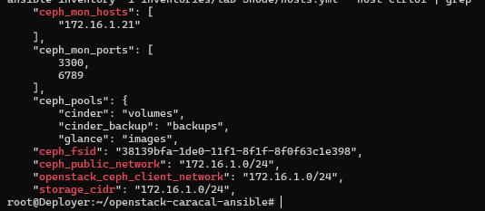

```
make ceph
```

```
ansible -i inventories/lab-5node/hosts.yml ceph_clients -m command -a "ls -lah /etc/ceph"
ansible -i inventories/lab-5node/hosts.yml ceph_clients -m command -a "ceph -s --name client.cinder --keyring /etc/ceph/ceph.client.cinder.keyring"
```

```
# Ubah Group Ownership dan Tambahkan Izin Baca (Read) user cinder
ansible controllers -i inventories/lab-5node/hosts.yml -b -m shell -a "chgrp cinder /etc/ceph/ceph.client.cinder.keyring && chmod 0640 /etc/ceph/ceph.client.cinder.keyring"
```

```
ansible -i inventories/lab-5node/hosts.yml ceph_clients -m command -a "ls -lah /etc/ceph"
ansible -i inventories/lab-5node/hosts.yml ceph_clients -m command -a "ceph -s --name client.cinder --keyring /etc/ceph/ceph.client.cinder.keyring"
ansible -i inventories/lab-5node/hosts.yml ceph_clients -m command -a "rbd -p images ls --id glance"
ansible -i inventories/lab-5node/hosts.yml ceph_clients -m command -a "rbd -p volumes ls --id cinder"
ansible -i inventories/lab-5node/hosts.yml ceph_clients -m command -a "rbd -p vms ls --id nova"
ansible -i inventories/lab-5node/hosts.yml ceph_clients -m command -a "rbd -p metrics ls --id gnocchi"
```

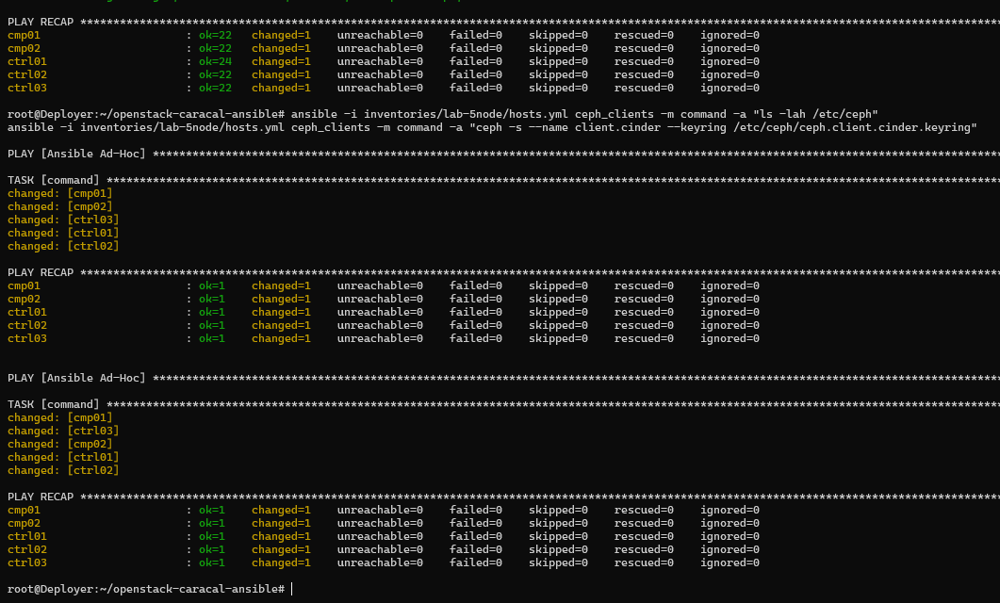

---

---

---

|

|

|

---

# ==Conf-5 (HA VIP + HAProxy)==

---

```
nano playbooks/04-ha-vip-lb.yml
```

```
---
- name: Phase 04 - HA VIP and HAProxy baseline
  hosts: controllers
  become: true
  gather_facts: true

  roles:
    - role: ha/keepalived
    - role: ha/haproxy

  post_tasks:
    - name: Validate keepalived service is active
      ansible.builtin.command: systemctl is-active keepalived
      changed_when: false

    - name: Validate haproxy service is active
      ansible.builtin.command: systemctl is-active haproxy
      changed_when: false

    - name: Validate HAProxy configuration
      ansible.builtin.command: haproxy -c -f /etc/haproxy/haproxy.cfg
      changed_when: false

    - name: Check VIP status on controllers
      ansible.builtin.shell: "ip -4 addr show {{ vip_interface }} | grep -F '{{ vip_internal }}' || true"
      register: vip_check
      changed_when: false

    - name: Print VIP status
      ansible.builtin.debug:
        msg:
          - "Host: {{ inventory_hostname }}"
          - "VIP interface: {{ vip_interface }}"
          - "VIP: {{ vip_internal }}"
          - "VIP check: {{ vip_check.stdout | default('not-present-on-this-node') }}"

    - name: Print HA phase summary
      ansible.builtin.debug:
        msg:
          - "HA phase completed on {{ inventory_hostname }}"
          - "Keepalived VIP: {{ vip_internal }} on {{ vip_interface }}"
          - "HAProxy installed and validated"
```

```
nano inventories/lab-5node/group_vars/controllers.yml
```

```
---
node_role: controller

controller_services:
  - keepalived
  - haproxy
  - mariadb
  - rabbitmq-server
  - memcached
  - apache2

keepalived_router_id: 51
keepalived_state: BACKUP
keepalived_auth_type: PASS
keepalived_auth_pass: "{{ vault_keepalived_auth_pass | default('OpenStackVIPPass') }}"
keepalived_virtual_ip: "{{ vip_internal }}"
keepalived_interface: "{{ vip_interface }}"

haproxy_global_maxconn: 4096
haproxy_stats_enabled: true
haproxy_stats_bind: "0.0.0.0:8404"
haproxy_stats_uri: /stats

# Backend awal. Beberapa service belum aktif di fase ini, jadi health check dibuat tcp.
# Nanti setelah service dipasang, backend akan mulai UP otomatis.
haproxy_openstack_services:
  - name: keystone_public
    bind_ip: "{{ vip_internal }}"
    bind_port: 5000
    backend_port: 5000
    mode: http
    check_type: tcp

  - name: glance_api
    bind_ip: "{{ vip_internal }}"
    bind_port: 9292
    backend_port: 9292
    mode: http
    check_type: tcp

  - name: placement_api
    bind_ip: "{{ vip_internal }}"
    bind_port: 8778
    backend_port: 8778
    mode: http
    check_type: tcp

  - name: nova_api
    bind_ip: "{{ vip_internal }}"
    bind_port: 8774
    backend_port: 8774
    mode: http
    check_type: tcp

  - name: neutron_api
    bind_ip: "{{ vip_internal }}"
    bind_port: 9696
    backend_port: 9696
    mode: http
    check_type: tcp

  - name: cinder_api
    bind_ip: "{{ vip_internal }}"
    bind_port: 8776
    backend_port: 8776
    mode: http
    check_type: tcp

  - name: horizon
    bind_ip: "{{ vip_internal }}"
    bind_port: 80
    backend_port: 80
    mode: http
    check_type: tcp
```

```
nano roles/ha/keepalived/defaults/main.yml
```

```
---
keepalived_package: keepalived
keepalived_service: keepalived

keepalived_check_script: /etc/keepalived/check_haproxy.sh
keepalived_check_interval: 2
keepalived_fall: 2
keepalived_rise: 2
```

```
nano roles/ha/keepalived/templates/keepalived.conf.j2
```

```
# Managed by Ansible - OpenStack HA VIP

global_defs {
  router_id {{ inventory_hostname }}
  enable_script_security
  script_user root
}

vrrp_script chk_haproxy {
  script "{{ keepalived_check_script }}"
  interval {{ keepalived_check_interval }}
  fall {{ keepalived_fall }}
  rise {{ keepalived_rise }}
}

vrrp_instance VI_OPENSTACK_API {
  state {{ keepalived_state }}
  interface {{ keepalived_interface }}
  virtual_router_id {{ keepalived_router_id }}
  priority {{ keepalived_priority }}
  advert_int 1

  authentication {
    auth_type {{ keepalived_auth_type }}
    auth_pass {{ keepalived_auth_pass }}
  }

  virtual_ipaddress {
    {{ keepalived_virtual_ip }}/24 dev {{ keepalived_interface }}
  }

  track_script {
    chk_haproxy
  }
}
```

```
nano roles/ha/keepalived/handlers/main.yml
```

```
---
- name: Restart keepalived
  ansible.builtin.service:
    name: "{{ keepalived_service }}"
    state: restarted
```

```
nano roles/ha/keepalived/tasks/main.yml
```

```
---
- name: Assert Keepalived variables exist
  ansible.builtin.assert:
    that:
      - keepalived_virtual_ip is defined
      - keepalived_interface is defined
      - keepalived_priority is defined
      - keepalived_router_id is defined
      - keepalived_auth_pass is defined
    fail_msg: "Variabel Keepalived belum lengkap."

- name: Assert VIP interface exists
  ansible.builtin.assert:
    that:
      - keepalived_interface in ansible_facts.interfaces
    fail_msg: "Interface VIP {{ keepalived_interface }} tidak ditemukan."

- name: Install keepalived
  ansible.builtin.apt:
    name: "{{ keepalived_package }}"
    state: present
    update_cache: true

- name: Ensure keepalived config directory exists
  ansible.builtin.file:
    path: /etc/keepalived
    state: directory
    owner: root
    group: root
    mode: "0755"

- name: Install HAProxy health check script
  ansible.builtin.copy:
    dest: "{{ keepalived_check_script }}"
    owner: root
    group: root
    mode: "0755"
    content: |
      #!/usr/bin/env bash
      systemctl is-active --quiet haproxy

- name: Deploy keepalived configuration
  ansible.builtin.template:
    src: keepalived.conf.j2
    dest: /etc/keepalived/keepalived.conf
    owner: root
    group: root
    mode: "0644"
    backup: true
  notify: Restart keepalived

- name: Enable and start keepalived
  ansible.builtin.service:
    name: "{{ keepalived_service }}"
    state: started
    enabled: true
```

```
nano roles/ha/haproxy/defaults/main.yml
```

```
---
haproxy_package: haproxy
haproxy_service: haproxy

haproxy_cfg_path: /etc/haproxy/haproxy.cfg
haproxy_log_socket: /dev/log
haproxy_connect_timeout: 5000
haproxy_client_timeout: 50000
haproxy_server_timeout: 50000
```

```
nano roles/ha/haproxy/templates/haproxy.cfg.j2
```

```
# Managed by Ansible - OpenStack HAProxy

global
    log {{ haproxy_log_socket }} local0
    log {{ haproxy_log_socket }} local1 notice
    chroot /var/lib/haproxy
    stats socket /run/haproxy/admin.sock mode 660 level admin expose-fd listeners
    stats timeout 30s
    user haproxy
    group haproxy
    daemon
    maxconn {{ haproxy_global_maxconn }}

defaults
    log global
    mode http
    option httplog
    option dontlognull
    option redispatch
    retries 3
    timeout connect {{ haproxy_connect_timeout }}
    timeout client {{ haproxy_client_timeout }}
    timeout server {{ haproxy_server_timeout }}


listen stats
    bind {{ haproxy_stats_bind }}
    mode http
    stats enable
    stats uri {{ haproxy_stats_uri }}
    stats refresh 10s



listen {{ svc.name }}
    bind {{ svc.bind_ip }}:{{ svc.bind_port }}
    mode {{ svc.mode | default('http') }}
    balance roundrobin


    option httpchk {{ svc.httpchk.method | default('GET') }} {{ svc.httpchk.uri | default('/') }}

    http-check expect status {{ svc.httpchk.expect_status }}


    option httpchk



    server {{ host }} {{ hostvars[host].management_ip }}:{{ svc.backend_port }} check inter 2000 rise 2 fall 3



```

```
nano roles/ha/haproxy/handlers/main.yml
```

```
---
- name: Restart haproxy
  ansible.builtin.service:
    name: "{{ haproxy_service }}"
    state: restarted
```

```
nano roles/ha/haproxy/tasks/main.yml
```

```
---
- name: Assert HAProxy variables exist
  ansible.builtin.assert:
    that:
      - haproxy_openstack_services is defined
      - haproxy_openstack_services | length > 0
      - vip_internal is defined
    fail_msg: "Variabel HAProxy belum lengkap."

- name: Install HAProxy
  ansible.builtin.apt:
    name: "{{ haproxy_package }}"
    state: present
    update_cache: true

- name: Ensure HAProxy can bind to non-local VIP
  ansible.posix.sysctl:
    name: net.ipv4.ip_nonlocal_bind
    value: "1"
    state: present
    reload: true
    sysctl_file: /etc/sysctl.d/99-openstack-ha.conf

- name: Deploy HAProxy configuration
  ansible.builtin.template:
    src: haproxy.cfg.j2
    dest: "{{ haproxy_cfg_path }}"
    owner: root
    group: root
    mode: "0644"
    backup: true
  notify: Restart haproxy

- name: Validate HAProxy config before restart
  ansible.builtin.command: "haproxy -c -f {{ haproxy_cfg_path }}"
  changed_when: false

- name: Enable and start HAProxy
  ansible.builtin.service:
    name: "{{ haproxy_service }}"
    state: started
    enabled: true
```

### Verifikasi Conf-5

```
make ha
```

```
ansible -i inventories/lab-5node/hosts.yml controllers -m command -a "systemctl status keepalived --no-pager"
ansible -i inventories/lab-5node/hosts.yml controllers -m command -a "systemctl status haproxy --no-pager"
ansible -i inventories/lab-5node/hosts.yml controllers -m command -a "haproxy -c -f /etc/haproxy/haproxy.cfg"
ansible -i inventories/lab-5node/hosts.yml controllers -m command -a "ip -4 addr show ens19"
```

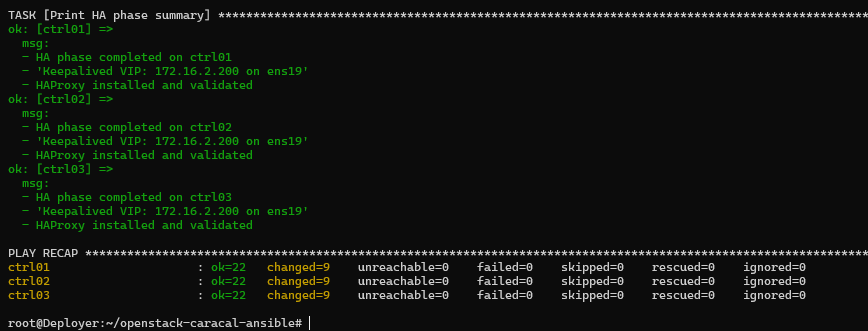

Diagnosis VIP

```
ansible -i inventories/lab-5node/hosts.yml controllers -m shell -a "systemctl is-active keepalived; systemctl is-active haproxy; ip -4 -br addr show ens19; ip -4 addr show ens19 | grep 172.16.2.200 || true" -o

ansible -i inventories/lab-5node/hosts.yml controllers -b -m shell -a "journalctl -u keepalived -n 80 --no-pager | egrep -i 'error|fault|master|backup|vip|vrrp|script|auth|interface|permission' || true"

ansible -i inventories/lab-5node/hosts.yml controllers -b -m shell -a "cat /etc/keepalived/keepalived.conf"
```

---

---

---

|

|

|

---

# ==Conf-6 (MariaDB Galera Cluster)==

---

```
nano inventories/lab-5node/group_vars/controllers.yml
```

```
---
node_role: controller

controller_services:
  - keepalived
  - haproxy
  - mariadb
  - rabbitmq-server
  - memcached
  - apache2

keepalived_router_id: 51
keepalived_state: BACKUP
keepalived_auth_type: PASS
keepalived_auth_pass: "{{ vault_keepalived_auth_pass | default('OpenStackVIPPass') }}"
keepalived_virtual_ip: "{{ vip_internal }}"
keepalived_interface: "{{ vip_interface }}"

haproxy_global_maxconn: 4096
haproxy_stats_enabled: true
haproxy_stats_bind: "0.0.0.0:8404"
haproxy_stats_uri: /stats

# Backend awal. Beberapa service belum aktif di fase ini, jadi health check dibuat tcp.
# Nanti setelah service dipasang, backend akan mulai UP otomatis.
haproxy_openstack_services:
  - name: keystone_public
    bind_ip: "{{ vip_internal }}"
    bind_port: 5000
    backend_port: 5000
    mode: http
    check_type: tcp

  - name: glance_api
    bind_ip: "{{ vip_internal }}"
    bind_port: 9292
    backend_port: 9292
    mode: http
    check_type: tcp

  - name: placement_api
    bind_ip: "{{ vip_internal }}"
    bind_port: 8778
    backend_port: 8778
    mode: http
    httpchk:
      method: GET
      uri: /
      expect_status: 200

  - name: nova_api
    bind_ip: "{{ vip_internal }}"
    bind_port: 8774
    backend_port: 8774
    mode: http
    check_type: tcp

  - name: neutron_api
    bind_ip: "{{ vip_internal }}"
    bind_port: 9696
    backend_port: 9696
    mode: http
    check_type: tcp

  - name: cinder_api
    bind_ip: "{{ vip_internal }}"
    bind_port: 8776
    backend_port: 8776
    mode: http
    check_type: tcp

  - name: horizon
    bind_ip: "{{ vip_internal }}"
    bind_port: 80
    backend_port: 80
    mode: http
    check_type: tcp

# MariaDB Galera
mariadb_bind_address: "0.0.0.0"
mariadb_port: 3306

galera_cluster_name: openstack_galera
galera_wsrep_provider: /usr/lib/galera/libgalera_smm.so
galera_sst_method: rsync
galera_bootstrap_node: "{{ bootstrap_controller }}"
galera_cluster_nodes: "{{ groups['controllers'] }}"
galera_cluster_address: >-
  gcomm://{{ groups['controllers']
    | map('extract', hostvars, 'management_ip')
    | join(',') }}

mariadb_openstack_databases:
  - keystone
  - glance
  - placement
  - nova
  - nova_api
  - nova_cell0
  - neutron
  - cinder
  - gnocchi
  - aodh
  - masakari
```

```
nano playbooks/05-database.yml
```

```
---
- name: Phase 05 - MariaDB Galera Cluster
  hosts: controllers
  become: true
  gather_facts: true
  serial: 1

  roles:
    - role: infra/mariadb_galera

  post_tasks:
    - name: Check MariaDB service
      ansible.builtin.command: systemctl is-active mariadb
      changed_when: false

- name: Phase 05 - Validate Galera cluster
  hosts: controllers
  become: true
  gather_facts: false

  tasks:
    - name: Validate wsrep cluster size equals controller count
      ansible.builtin.shell: |
        mysql --defaults-extra-file=/root/.my.cnf \
          -e "SHOW STATUS LIKE 'wsrep_cluster_size';" \
          --batch --skip-column-names | awk '{print $2}'
      register: final_wsrep_cluster_size
      changed_when: false
      no_log: true
      run_once: true
      delegate_to: "{{ groups['controllers'][0] }}"

    - name: Assert Galera cluster size
      ansible.builtin.assert:
        that:
          - final_wsrep_cluster_size.stdout | int == groups['controllers'] | length
        fail_msg: "Galera cluster size belum sesuai jumlah controller."
        success_msg: "Galera cluster size valid."
      run_once: true

    - name: Print database phase summary
      ansible.builtin.debug:
        msg:
          - "MariaDB Galera phase completed."
          - "Bootstrap controller: {{ groups['controllers'][0] }}"
          - "Controllers: {{ groups['controllers'] | join(', ') }}"
          - "Cluster size: {{ final_wsrep_cluster_size.stdout }}"
      run_once: true
```

```
nano roles/infra/mariadb_galera/defaults/main.yml
```

```
---
mariadb_packages:
  - mariadb-server
  - mariadb-client
  - galera-4
  - python3-pymysql
  - rsync

mariadb_service: mariadb

mariadb_config_dir: /etc/mysql/mariadb.conf.d
mariadb_galera_config: /etc/mysql/mariadb.conf.d/99-openstack-galera.cnf
mariadb_openstack_config: /etc/mysql/mariadb.conf.d/98-openstack.cnf

mariadb_max_connections: 4096
mariadb_innodb_buffer_pool_size: 1G
mariadb_character_set: utf8mb4
mariadb_collation: utf8mb4_general_ci

galera_bootstrap_marker: /var/lib/mysql/.openstack_galera_bootstrapped
```

```
nano roles/infra/mariadb_galera/templates/60-galera.cnf.j2
```

```
# Managed by Ansible - MariaDB Galera for OpenStack

[mariadb]
bind-address={{ mariadb_bind_address }}
port={{ mariadb_port }}

wsrep_on=ON
wsrep_provider={{ galera_wsrep_provider }}

wsrep_cluster_name="{{ galera_cluster_name }}"
wsrep_cluster_address="{{ galera_cluster_address }}"

wsrep_node_name="{{ inventory_hostname }}"
wsrep_node_address="{{ management_ip }}"

wsrep_sst_method={{ galera_sst_method }}

binlog_format=ROW
default_storage_engine=InnoDB
innodb_autoinc_lock_mode=2

wsrep_provider_options="gmcast.listen_addr=tcp://{{ management_ip }}:4567"
wsrep_sst_receive_address="{{ management_ip }}:4444"
```

```
nano roles/infra/mariadb_galera/templates/99-openstack.cnf.j2
```

```
# Managed by Ansible - MariaDB tuning for OpenStack

[mysqld]
bind-address = {{ mariadb_bind_address }}
port = {{ mariadb_port }}

max_connections = {{ mariadb_max_connections }}
character-set-server = {{ mariadb_character_set }}
collation-server = {{ mariadb_collation }}

default-storage-engine = innodb
innodb_file_per_table = 1
innodb_buffer_pool_size = {{ mariadb_innodb_buffer_pool_size }}
innodb_flush_log_at_trx_commit = 2
innodb_flush_method = O_DIRECT

skip-name-resolve
```

```
nano roles/infra/mariadb_galera/handlers/main.yml
```

```
---
- name: Restart mariadb
  ansible.builtin.service:
    name: "{{ mariadb_service }}"
    state: restarted
```

```
nano roles/infra/mariadb_galera/tasks/main.yml
```

```
---
- name: Assert MariaDB Galera variables exist
  ansible.builtin.assert:
    that:
      - vault_mysql_root_password is defined
      - galera_cluster_name is defined
      - galera_cluster_address is defined
      - galera_bootstrap_node is defined
      - management_ip is defined
    fail_msg: "Variabel MariaDB/Galera belum lengkap."

- name: Install MariaDB and Galera packages
  ansible.builtin.apt:
    name: "{{ mariadb_packages }}"
    state: present
    update_cache: true

- name: Deploy OpenStack MariaDB tuning config
  ansible.builtin.template:
    src: 99-openstack.cnf.j2
    dest: "{{ mariadb_openstack_config }}"
    owner: root
    group: root
    mode: "0644"
    backup: true

- name: Deploy Galera config
  ansible.builtin.template:
    src: 60-galera.cnf.j2
    dest: "{{ mariadb_galera_config }}"
    owner: root
    group: root
    mode: "0644"
    backup: true
  register: galera_config_deploy

- name: Check MariaDB active state
  ansible.builtin.command: systemctl is-active mariadb
  register: mariadb_active
  failed_when: false
  changed_when: false

- name: Stop bootstrap node when Galera config changed and MariaDB is active
  ansible.builtin.service:
    name: "{{ mariadb_service }}"
    state: stopped
  when:
    - inventory_hostname == galera_bootstrap_node
    - mariadb_active.rc == 0
    - galera_config_deploy.changed

- name: Bootstrap Galera primary node when MariaDB is not active or config changed
  ansible.builtin.command: galera_new_cluster
  when:
    - inventory_hostname == galera_bootstrap_node
    - mariadb_active.rc != 0 or galera_config_deploy.changed

- name: Start or restart non-bootstrap nodes to join Galera
  ansible.builtin.service:
    name: "{{ mariadb_service }}"
    state: restarted
    enabled: true
  when: inventory_hostname != galera_bootstrap_node

- name: Ensure MariaDB is enabled
  ansible.builtin.service:
    name: "{{ mariadb_service }}"
    enabled: true

- name: Wait for MariaDB port
  ansible.builtin.wait_for:
    host: "{{ management_ip }}"
    port: 3306
    timeout: 120

- name: Write root MySQL client config on bootstrap node
  ansible.builtin.copy:
    dest: /root/.my.cnf
    owner: root
    group: root
    mode: "0600"
    content: |
      [client]
      user=root
      password={{ vault_mysql_root_password }}
      socket=/run/mysqld/mysqld.sock
  no_log: true
  when: inventory_hostname == galera_bootstrap_node

- name: Check root login using configured password
  ansible.builtin.command: mysql --defaults-extra-file=/root/.my.cnf -e "SELECT 1;"
  register: root_login_with_password
  changed_when: false
  failed_when: false
  no_log: true
  when: inventory_hostname == galera_bootstrap_node

- name: Set MariaDB root password only when password login is not working
  community.mysql.mysql_user:
    name: root
    host: localhost
    password: "{{ vault_mysql_root_password }}"
    priv: "*.*:ALL,GRANT"
    login_unix_socket: /run/mysqld/mysqld.sock
    check_implicit_admin: true
    state: present
  no_log: true
  when:
    - inventory_hostname == galera_bootstrap_node
    - root_login_with_password.rc != 0

- name: Create root user for 127.0.0.1 on bootstrap node
  community.mysql.mysql_user:
    name: root
    host: 127.0.0.1
    password: "{{ vault_mysql_root_password }}"
    priv: "*.*:ALL,GRANT"
    login_unix_socket: /run/mysqld/mysqld.sock
    config_file: /root/.my.cnf
    state: present
  no_log: true
  when: inventory_hostname == galera_bootstrap_node

- name: Remove anonymous MariaDB users on bootstrap node
  community.mysql.mysql_user:
    name: ''
    host_all: true
    state: absent
    login_unix_socket: /run/mysqld/mysqld.sock
    config_file: /root/.my.cnf
  no_log: true
  when: inventory_hostname == galera_bootstrap_node

- name: Remove test database on bootstrap node
  community.mysql.mysql_db:
    name: test
    state: absent
    login_unix_socket: /run/mysqld/mysqld.sock
    config_file: /root/.my.cnf
  no_log: true
  when: inventory_hostname == galera_bootstrap_node

- name: Create OpenStack service databases on bootstrap node
  community.mysql.mysql_db:
    name: "{{ item }}"
    state: present
    encoding: utf8
    collation: utf8_general_ci
    login_unix_socket: /run/mysqld/mysqld.sock
    config_file: /root/.my.cnf
  loop: "{{ mariadb_openstack_databases }}"
  no_log: true
  when: inventory_hostname == galera_bootstrap_node

- name: Check wsrep local status
  ansible.builtin.shell: |
    mysql --protocol=socket -uroot -p'{{ vault_mysql_root_password }}' \
      -S /run/mysqld/mysqld.sock \
      -e "SHOW STATUS WHERE Variable_name IN ('wsrep_cluster_size','wsrep_cluster_status','wsrep_ready','wsrep_local_state_comment');" \
      --batch
  register: wsrep_status
  changed_when: false
  failed_when: false
  no_log: true

- name: Print Galera local service summary
  ansible.builtin.debug:
    msg:
      - "MariaDB/Galera configured on {{ inventory_hostname }}"
      - "Node IP: {{ management_ip }}"
      - "Cluster: {{ galera_cluster_name }}"
      - "Status command executed."
```

### Verifikasi Conf-6

```
MYSQL_ROOT_PASSWORD="$(ansible-vault view inventories/lab-5node/group_vars/vault.yml | sed -n 's/^vault_mysql_root_password: "\(.*\)"/\1/p')"

echo "Password length: ${#MYSQL_ROOT_PASSWORD}"
```

```
MYSQL_ROOT_PASSWORD="$(ansible-vault view inventories/lab-5node/group_vars/vault.yml | sed -n 's/^vault_mysql_root_password: "\(.*\)"/\1/p')"

ansible -i inventories/lab-5node/hosts.yml ctrl01 -b -m copy -a "dest=/root/.my.cnf owner=root group=root mode=0600 content='[client]
user=root
password=${MYSQL_ROOT_PASSWORD}
socket=/run/mysqld/mysqld.sock
'"
```

```
make db
```

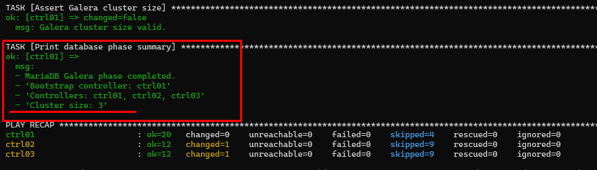

---

---

|

|

|

---

# ==Conf-7 (RabbitMQ Cluster + Memcached)==

---

Tambahkan Vault Variable RabbitMQ

```
nano ansible-vault edit inventories/lab-5node/group_vars/vault.yml
```

```
# Tambah paling bawah
vault_rabbitmq_erlang_cookie: "CNLXPKNGLFKQGFXQJQYHLBSVJZKTXQWZ"
vault_rabbitmq_openstack_password: "RabbitMQOpenStackStrongPasswordChangeMe"
```

```
ansible-inventory -i inventories/lab-5node/hosts.yml --host ctrl01 | grep -E 'vault_rabbitmq_erlang_cookie|vault_rabbitmq_openstack_password'
```

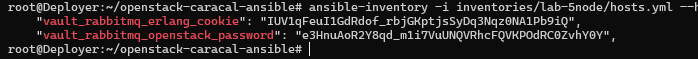

```
nano inventories/lab-5node/group_vars/controllers.yml
```

```
# RabbitMQ Cluster
rabbitmq_cluster_name: openstack_rabbitmq
rabbitmq_bootstrap_node: "{{ groups['controllers'][0] }}"
rabbitmq_openstack_user: openstack
rabbitmq_openstack_vhost: /
rabbitmq_openstack_password: "{{ vault_rabbitmq_openstack_password }}"
rabbitmq_erlang_cookie: "{{ vault_rabbitmq_erlang_cookie }}"

# Memcached
memcached_port: 11211
memcached_listen_ip: "{{ management_ip }}"
memcached_memory_mb: 256
memcached_max_connections: 4096
```

```
nano playbooks/06-message-cache.yml
```

```
---
- name: Phase 06 - RabbitMQ Cluster and Memcached
  hosts: controllers
  become: true
  gather_facts: true
  serial: 1

  roles:
    - role: infra/rabbitmq
    - role: infra/memcached

  post_tasks:
    - name: Check RabbitMQ service
      ansible.builtin.command: systemctl is-active rabbitmq-server
      changed_when: false

    - name: Check Memcached service
      ansible.builtin.command: systemctl is-active memcached
      changed_when: false

- name: Phase 06 - Validate RabbitMQ and Memcached
  hosts: controllers
  become: true
  gather_facts: false

  tasks:
    - name: Validate RabbitMQ cluster status from bootstrap node
      ansible.builtin.command: rabbitmqctl cluster_status
      register: rabbitmq_cluster_status
      changed_when: false
      run_once: true
      delegate_to: "{{ groups['controllers'][0] }}"

    - name: Print RabbitMQ cluster status
      ansible.builtin.debug:
        var: rabbitmq_cluster_status.stdout_lines
      run_once: true

    - name: Validate RabbitMQ OpenStack user exists
      ansible.builtin.command: rabbitmqctl list_users
      register: rabbitmq_users
      changed_when: false
      run_once: true
      delegate_to: "{{ groups['controllers'][0] }}"

    - name: Assert RabbitMQ OpenStack user exists
      ansible.builtin.assert:
        that:
          - rabbitmq_openstack_user in rabbitmq_users.stdout
        success_msg: "RabbitMQ OpenStack user exists."
        fail_msg: "RabbitMQ OpenStack user belum ada."
      run_once: true

    - name: Validate Memcached is listening on management IP
      ansible.builtin.wait_for:
        host: "{{ management_ip }}"
        port: "{{ memcached_port }}"
        timeout: 10

    - name: Print message/cache phase summary
      ansible.builtin.debug:
        msg:
          - "RabbitMQ + Memcached phase completed."
          - "RabbitMQ bootstrap: {{ groups['controllers'][0] }}"
          - "Controllers: {{ groups['controllers'] | join(', ') }}"
          - "Memcached port: {{ memcached_port }}"
      run_once: true
```

```
mkdir -p roles/infra/rabbitmq/{defaults,tasks,templates}
```

```
nano roles/infra/rabbitmq/defaults/main.yml
```

```
---
rabbitmq_packages:
  - rabbitmq-server

rabbitmq_service: rabbitmq-server
rabbitmq_erlang_cookie_path: /var/lib/rabbitmq/.erlang.cookie

rabbitmq_management_plugin_enabled: true
rabbitmq_cluster_partition_handling: pause_minority
rabbitmq_loopback_users: none
```

```
nano roles/infra/rabbitmq/templates/rabbitmq.conf.j2
```

```
# Managed by Ansible - RabbitMQ for OpenStack

listeners.tcp.default = 5672
management.tcp.port = 15672

cluster_partition_handling = {{ rabbitmq_cluster_partition_handling }}
loopback_users.guest = {{ rabbitmq_loopback_users }}
```

```
nano roles/infra/rabbitmq/tasks/main.yml
```

```
---
- name: Assert RabbitMQ variables exist
  ansible.builtin.assert:
    that:
      - rabbitmq_erlang_cookie is defined
      - rabbitmq_bootstrap_node is defined
      - rabbitmq_openstack_user is defined
      - rabbitmq_openstack_password is defined
      - management_ip is defined
    fail_msg: "Variabel RabbitMQ belum lengkap."

- name: Install RabbitMQ packages
  ansible.builtin.apt:
    name: "{{ rabbitmq_packages }}"
    state: present
    update_cache: true

- name: Stop RabbitMQ before setting Erlang cookie
  ansible.builtin.service:
    name: "{{ rabbitmq_service }}"
    state: stopped

- name: Write shared Erlang cookie
  ansible.builtin.copy:
    dest: "{{ rabbitmq_erlang_cookie_path }}"
    content: "{{ rabbitmq_erlang_cookie }}"
    owner: rabbitmq
    group: rabbitmq
    mode: "0600"
  no_log: true

- name: Deploy RabbitMQ config
  ansible.builtin.template:
    src: rabbitmq.conf.j2
    dest: /etc/rabbitmq/rabbitmq.conf
    owner: root
    group: rabbitmq
    mode: "0644"
    backup: true

- name: Start RabbitMQ bootstrap node
  ansible.builtin.service:
    name: "{{ rabbitmq_service }}"
    state: started
    enabled: true
  when: inventory_hostname == rabbitmq_bootstrap_node

- name: Start RabbitMQ joining node
  ansible.builtin.service:
    name: "{{ rabbitmq_service }}"
    state: started
    enabled: true
  when: inventory_hostname != rabbitmq_bootstrap_node

- name: Wait for RabbitMQ AMQP port
  ansible.builtin.wait_for:
    host: "{{ management_ip }}"
    port: 5672
    timeout: 60

- name: Enable RabbitMQ management plugin
  ansible.builtin.command: rabbitmq-plugins enable rabbitmq_management
  register: rabbitmq_plugin_enable
  changed_when: "'already enabled' not in rabbitmq_plugin_enable.stdout"
  when: rabbitmq_management_plugin_enabled | bool

- name: Check RabbitMQ cluster membership
  ansible.builtin.command: rabbitmqctl cluster_status
  register: rabbitmq_cluster_status_before
  changed_when: false
  failed_when: false

- name: Join RabbitMQ cluster from non-bootstrap nodes
  ansible.builtin.shell: |
    set -e
    rabbitmqctl stop_app
    rabbitmqctl reset
    rabbitmqctl join_cluster rabbit@{{ hostvars[rabbitmq_bootstrap_node].expected_hostname }}
    rabbitmqctl start_app
  when:
    - inventory_hostname != rabbitmq_bootstrap_node
    - hostvars[rabbitmq_bootstrap_node].expected_hostname not in rabbitmq_cluster_status_before.stdout
  register: rabbitmq_join_cluster

- name: Ensure RabbitMQ OpenStack user exists on bootstrap node
  ansible.builtin.command: >
    rabbitmqctl add_user {{ rabbitmq_openstack_user }} {{ rabbitmq_openstack_password }}
  register: rabbitmq_add_user
  changed_when: rabbitmq_add_user.rc == 0
  failed_when:
    - rabbitmq_add_user.rc != 0
    - "'user_already_exists' not in rabbitmq_add_user.stderr"
  no_log: true
  when: inventory_hostname == rabbitmq_bootstrap_node

- name: Set RabbitMQ OpenStack user permissions on bootstrap node
  ansible.builtin.command: >
    rabbitmqctl set_permissions -p {{ rabbitmq_openstack_vhost }}
    {{ rabbitmq_openstack_user }} ".*" ".*" ".*"
  no_log: true
  when: inventory_hostname == rabbitmq_bootstrap_node

- name: Set RabbitMQ OpenStack user tags
  ansible.builtin.command: >
    rabbitmqctl set_user_tags {{ rabbitmq_openstack_user }} administrator
  no_log: true
  when: inventory_hostname == rabbitmq_bootstrap_node

- name: Show RabbitMQ cluster status
  ansible.builtin.command: rabbitmqctl cluster_status
  register: rabbitmq_cluster_status_after
  changed_when: false

- name: Print RabbitMQ local summary
  ansible.builtin.debug:
    msg:
      - "RabbitMQ configured on {{ inventory_hostname }}"
      - "Bootstrap node: {{ rabbitmq_bootstrap_node }}"
      - "Expected hostname: {{ expected_hostname }}"
```

```
mkdir -p roles/infra/memcached/{defaults,tasks,templates}
```

```
nano roles/infra/memcached/defaults/main.yml
```

```
---
memcached_packages:
  - memcached
  - python3-memcache

memcached_service: memcached
memcached_config_path: /etc/memcached.conf
```

```
nano roles/infra/memcached/templates/memcached.conf.j2
```

```
# Managed by Ansible - Memcached for OpenStack

-d
logfile /var/log/memcached.log
-m {{ memcached_memory_mb }}
-p {{ memcached_port }}
-u memcache
-l {{ memcached_listen_ip }}
-c {{ memcached_max_connections }}
-P /var/run/memcached/memcached.pid
```

```
nano roles/infra/memcached/tasks/main.yml
```

```
---
- name: Assert Memcached variables exist
  ansible.builtin.assert:
    that:
      - memcached_listen_ip is defined
      - memcached_port is defined
      - memcached_memory_mb is defined
      - memcached_max_connections is defined
    fail_msg: "Variabel Memcached belum lengkap."

- name: Install Memcached packages
  ansible.builtin.apt:
    name: "{{ memcached_packages }}"
    state: present
    update_cache: true

- name: Deploy Memcached config
  ansible.builtin.template:
    src: memcached.conf.j2
    dest: "{{ memcached_config_path }}"
    owner: root
    group: root
    mode: "0644"
    backup: true

- name: Enable and restart Memcached
  ansible.builtin.service:
    name: "{{ memcached_service }}"
    state: restarted
    enabled: true

- name: Wait for Memcached port
  ansible.builtin.wait_for:
    host: "{{ memcached_listen_ip }}"
    port: "{{ memcached_port }}"
    timeout: 30

- name: Print Memcached local summary
  ansible.builtin.debug:
    msg:
      - "Memcached configured on {{ inventory_hostname }}"
      - "Listen: {{ memcached_listen_ip }}:{{ memcached_port }}"
```

### Verifikasi Conf-7

```
make msgcache
```

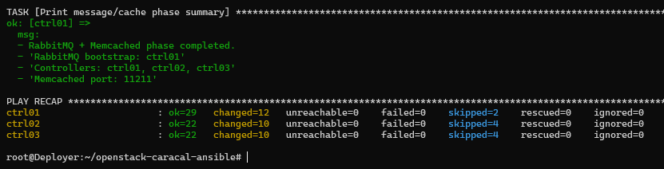

---

---

---

|

|

|

---

# ==Conf-8 (Keystone)==

---

Tambahkan password Keystone ke Vault

```
ansible-vault edit inventories/lab-5node/group_vars/vault.yml
```

```
vault_keystone_db_password: "KeystoneDBStrongPasswordChangeMe"
vault_keystone_admin_password: "AdminOpenStackStrongPasswordChangeMe"
```

```
ansible-inventory -i inventories/lab-5node/hosts.yml --host ctrl01 | grep -E 'vault_keystone_db_password|vault_keystone_admin_password'
```

```
nano inventories/lab-5node/group_vars/openstack.yml
```

```
# Keystone / Identity
keystone_db_name: keystone
keystone_db_user: keystone
keystone_db_password: "{{ vault_keystone_db_password }}"

keystone_admin_user: admin
keystone_admin_password: "{{ vault_keystone_admin_password }}"
keystone_admin_project: admin
keystone_admin_role: admin
keystone_service_project: service
keystone_default_domain: Default
keystone_region: RegionOne

keystone_public_endpoint: "http://{{ internal_fqdn }}:5000/v3"
keystone_internal_endpoint: "http://{{ internal_fqdn }}:5000/v3"
keystone_admin_endpoint: "http://{{ internal_fqdn }}:5000/v3"

keystone_database_connection: "mysql+pymysql://{{ keystone_db_user }}:{{ keystone_db_password }}@{{ vip_internal }}/{{ keystone_db_name }}"
keystone_memcached_servers: >-
  {{ groups['controllers'] | map('extract', hostvars, 'management_ip') | map('regex_replace', '$', ':11211') | join(',') }}

keystone_fernet_key_repository: /etc/keystone/fernet-keys
keystone_credential_key_repository: /etc/keystone/credential-keys
```

```
grep -n "internal_fqdn" inventories/lab-5node/group_vars/all.yml || \
cat >> inventories/lab-5node/group_vars/all.yml <<'EOF'

internal_fqdn: openstack-api.internal
EOF
```

```
nano playbooks/07-keystone.yml
```

```
---
- name: Phase 07 - Keystone Identity Service
  hosts: controllers
  become: true
  gather_facts: true
  serial: 1

  roles:
    - role: openstack/keystone

  post_tasks:
    - name: Check Apache2 service
      ansible.builtin.command: systemctl is-active apache2
      changed_when: false

    - name: Check Keystone API locally
      ansible.builtin.uri:
        url: "http://{{ management_ip }}:5000/v3"
        method: GET
        status_code:
          - 200
          - 300
          - 401

- name: Phase 07 - Validate Keystone VIP endpoint
  hosts: controllers
  become: true
  gather_facts: false

  tasks:
    - name: Validate Keystone endpoint through VIP
      ansible.builtin.uri:
        url: "http://{{ internal_fqdn }}:5000/v3"
        method: GET
        status_code:
          - 200
          - 300
          - 401
      run_once: true
      delegate_to: "{{ groups['controllers'][0] }}"

    - name: Print Keystone phase summary
      ansible.builtin.debug:
        msg:
          - "Keystone phase completed."
          - "Endpoint: http://{{ internal_fqdn }}:5000/v3"
          - "Region: {{ keystone_region }}"
          - "Bootstrap controller: {{ groups['controllers'][0] }}"
      run_once: true
```

```
mkdir -p roles/openstack/keystone/{defaults,tasks,templates}
```

```
nano roles/openstack/keystone/defaults/main.yml
```

```
---
keystone_packages:
  - keystone
  - apache2
  - libapache2-mod-wsgi-py3
  - python3-openstackclient
  - python3-pymysql

keystone_service_name: apache2
keystone_conf_path: /etc/keystone/keystone.conf
keystone_db_sync_marker: /var/lib/keystone/.db_synced
keystone_bootstrap_marker: /var/lib/keystone/.bootstrapped
keystone_fernet_marker: /var/lib/keystone/.fernet_initialized
keystone_credential_marker: /var/lib/keystone/.credential_initialized
```

```
nano roles/openstack/keystone/templates/keystone.conf.j2
```

```
# Managed by Ansible - Keystone Caracal

[DEFAULT]
debug = false
log_dir = /var/log/keystone

[database]
connection = {{ keystone_database_connection }}

[token]
provider = fernet

[cache]
enabled = true
backend = dogpile.cache.memcached
memcache_servers = {{ keystone_memcached_servers }}

[fernet_tokens]
key_repository = {{ keystone_fernet_key_repository }}

[credential]
key_repository = {{ keystone_credential_key_repository }}
```

```
nano roles/openstack/keystone/templates/admin-openrc.j2
```

```
export OS_PROJECT_DOMAIN_NAME={{ keystone_default_domain }}
export OS_USER_DOMAIN_NAME={{ keystone_default_domain }}
export OS_PROJECT_NAME={{ keystone_admin_project }}
export OS_USERNAME={{ keystone_admin_user }}
export OS_PASSWORD={{ keystone_admin_password }}
export OS_AUTH_URL=http://{{ internal_fqdn }}:5000/v3
export OS_IDENTITY_API_VERSION=3
export OS_IMAGE_API_VERSION=2
```

```
nano roles/openstack/keystone/tasks/main.yml
```

```
---
- name: Assert Keystone variables exist
  ansible.builtin.assert:
    that:
      - keystone_db_name is defined
      - keystone_db_user is defined
      - keystone_db_password is defined
      - keystone_admin_user is defined
      - keystone_admin_password is defined
      - keystone_admin_project is defined
      - keystone_database_connection is defined
      - keystone_memcached_servers is defined
      - keystone_public_endpoint is defined
      - keystone_internal_endpoint is defined
      - keystone_admin_endpoint is defined
      - keystone_region is defined
      - keystone_fernet_key_repository is defined
      - keystone_credential_key_repository is defined
      - internal_fqdn is defined
      - vip_internal is defined
      - management_ip is defined
    fail_msg: "Variabel Keystone belum lengkap. Cek group_vars/openstack.yml dan vault.yml."

- name: Set Keystone local marker facts
  ansible.builtin.set_fact:
    keystone_db_sync_marker_file: "{{ keystone_db_sync_marker | default('/var/lib/keystone/.db_synced') }}"
    keystone_bootstrap_marker_file: "{{ keystone_bootstrap_marker | default('/var/lib/keystone/.bootstrapped') }}"

- name: Install Keystone packages
  ansible.builtin.apt:
    name: "{{ keystone_packages }}"
    state: present
    update_cache: true

- name: Ensure Keystone database exists on bootstrap controller
  community.mysql.mysql_db:
    name: "{{ keystone_db_name }}"
    state: present
    encoding: utf8
    collation: utf8_general_ci
    config_file: /root/.my.cnf
  when: inventory_hostname == groups['controllers'][0]

- name: Ensure Keystone database user exists on bootstrap controller
  community.mysql.mysql_user:
    name: "{{ keystone_db_user }}"
    password: "{{ keystone_db_password }}"
    host: "%"
    priv: "{{ keystone_db_name }}.*:ALL"
    state: present
    config_file: /root/.my.cnf
  no_log: false
  when: inventory_hostname == groups['controllers'][0]

- name: Deploy keystone.conf
  ansible.builtin.template:
    src: keystone.conf.j2
    dest: "{{ keystone_conf_path }}"
    owner: root
    group: keystone
    mode: "0640"
    backup: true

- name: Check Keystone DB sync marker
  ansible.builtin.stat:
    path: "{{ keystone_db_sync_marker_file }}"
  register: keystone_db_sync_marker_stat
  when: inventory_hostname == groups['controllers'][0]

- name: Check whether Keystone DB already has migrated tables
  ansible.builtin.shell: |
    mysql --defaults-extra-file=/root/.my.cnf {{ keystone_db_name }} \
      --batch --skip-column-names \
      -e "SELECT COUNT(*) FROM information_schema.tables WHERE table_schema='{{ keystone_db_name }}';"
  register: keystone_table_count
  changed_when: false
  when: inventory_hostname == groups['controllers'][0]

- name: Populate Keystone database on bootstrap controller
  ansible.builtin.command: keystone-manage db_sync
  become_user: keystone
  when:
    - inventory_hostname == groups['controllers'][0]
    - not keystone_db_sync_marker_stat.stat.exists
    - keystone_table_count.stdout | int == 0

- name: Create Keystone DB sync marker
  ansible.builtin.file:
    path: "{{ keystone_db_sync_marker_file }}"
    state: touch
    owner: keystone
    group: keystone
    mode: "0600"
  when:
    - inventory_hostname == groups['controllers'][0]
    - not keystone_db_sync_marker_stat.stat.exists

# -------------------------------------------------------------------
# Fernet and credential key setup + HA synchronization
# -------------------------------------------------------------------

- name: Ensure Keystone key repositories exist on bootstrap controller
  ansible.builtin.file:
    path: "{{ item }}"
    state: directory
    owner: keystone
    group: keystone
    mode: "0700"
  loop:
    - "{{ keystone_fernet_key_repository }}"
    - "{{ keystone_credential_key_repository }}"
  when: inventory_hostname == groups['controllers'][0]

- name: Find Fernet keys on bootstrap controller
  ansible.builtin.find:
    paths: "{{ keystone_fernet_key_repository }}"
    file_type: file
  register: bootstrap_fernet_keys
  when: inventory_hostname == groups['controllers'][0]

- name: Find credential keys on bootstrap controller
  ansible.builtin.find:
    paths: "{{ keystone_credential_key_repository }}"
    file_type: file
  register: bootstrap_credential_keys
  when: inventory_hostname == groups['controllers'][0]

- name: Initialize Fernet token repository on bootstrap controller when empty
  ansible.builtin.command: keystone-manage fernet_setup --keystone-user keystone --keystone-group keystone
  when:
    - inventory_hostname == groups['controllers'][0]
    - bootstrap_fernet_keys.matched | int == 0

- name: Initialize Keystone credential repository on bootstrap controller when empty
  ansible.builtin.command: keystone-manage credential_setup --keystone-user keystone --keystone-group keystone
  when:
    - inventory_hostname == groups['controllers'][0]
    - bootstrap_credential_keys.matched | int == 0

- name: Find Fernet keys from bootstrap controller for sync
  ansible.builtin.find:
    paths: "{{ keystone_fernet_key_repository }}"
    file_type: file
  register: keystone_fernet_files_from_bootstrap
  delegate_to: "{{ groups['controllers'][0] }}"

- name: Find credential keys from bootstrap controller for sync
  ansible.builtin.find:
    paths: "{{ keystone_credential_key_repository }}"
    file_type: file
  register: keystone_credential_files_from_bootstrap
  delegate_to: "{{ groups['controllers'][0] }}"

- name: Assert bootstrap key repositories are not empty before sync
  ansible.builtin.assert:
    that:
      - keystone_fernet_files_from_bootstrap.matched | int > 0
      - keystone_credential_files_from_bootstrap.matched | int > 0
    fail_msg: "Key repository di bootstrap controller masih kosong. Cek keystone-manage fernet_setup/credential_setup."

- name: Slurp Fernet key files from bootstrap controller
  ansible.builtin.slurp:
    src: "{{ item.path }}"
  loop: "{{ keystone_fernet_files_from_bootstrap.files }}"
  loop_control:
    label: "{{ item.path }}"
  register: slurped_fernet_keys
  delegate_to: "{{ groups['controllers'][0] }}"
  no_log: false

- name: Slurp credential key files from bootstrap controller
  ansible.builtin.slurp:
    src: "{{ item.path }}"
  loop: "{{ keystone_credential_files_from_bootstrap.files }}"
  loop_control:
    label: "{{ item.path }}"
  register: slurped_credential_keys
  delegate_to: "{{ groups['controllers'][0] }}"
  no_log: false

- name: Ensure Keystone key repositories exist on this controller
  ansible.builtin.file:
    path: "{{ item }}"
    state: directory
    owner: keystone
    group: keystone
    mode: "0700"
  loop:
    - "{{ keystone_fernet_key_repository }}"
    - "{{ keystone_credential_key_repository }}"

- name: Copy Fernet key files to this controller
  ansible.builtin.copy:
    dest: "{{ keystone_fernet_key_repository }}/{{ item.item.path | basename }}"
    content: "{{ item.content | b64decode }}"
    owner: keystone
    group: keystone
    mode: "0600"
  loop: "{{ slurped_fernet_keys.results }}"
  loop_control:
    label: "{{ item.item.path | basename }}"
  no_log: false

- name: Copy credential key files to this controller
  ansible.builtin.copy:
    dest: "{{ keystone_credential_key_repository }}/{{ item.item.path | basename }}"
    content: "{{ item.content | b64decode }}"
    owner: keystone
    group: keystone
    mode: "0600"
  loop: "{{ slurped_credential_keys.results }}"
  loop_control:
    label: "{{ item.item.path | basename }}"
  no_log: false

- name: Fix Keystone key repository directory permissions
  ansible.builtin.file:
    path: "{{ item }}"
    owner: keystone
    group: keystone
    mode: "0700"
    state: directory
  loop:
    - "{{ keystone_fernet_key_repository }}"
    - "{{ keystone_credential_key_repository }}"

- name: Find Fernet keys on this controller
  ansible.builtin.find:
    paths: "{{ keystone_fernet_key_repository }}"
    file_type: file
  register: local_fernet_keys

- name: Find credential keys on this controller
  ansible.builtin.find:
    paths: "{{ keystone_credential_key_repository }}"
    file_type: file
  register: local_credential_keys

- name: Assert Keystone key repositories are not empty on this controller
  ansible.builtin.assert:
    that:
      - local_fernet_keys.matched | int > 0
      - local_credential_keys.matched | int > 0
    fail_msg: "Fernet atau credential keys kosong pada {{ inventory_hostname }}."

# -------------------------------------------------------------------
# Keystone bootstrap - idempotent by DB state, not marker only
# -------------------------------------------------------------------

- name: Check Keystone bootstrap marker
  ansible.builtin.stat:
    path: "{{ keystone_bootstrap_marker_file }}"
  register: keystone_bootstrap_marker_check
  when: inventory_hostname == groups['controllers'][0]

- name: Check whether Keystone admin user exists
  ansible.builtin.shell: |
    mysql --defaults-extra-file=/root/.my.cnf {{ keystone_db_name }} \
      --batch --skip-column-names \
      -e "SELECT COUNT(*) FROM local_user WHERE name='{{ keystone_admin_user }}';"
  register: keystone_admin_user_count
  changed_when: false
  when: inventory_hostname == groups['controllers'][0]

- name: Check whether Keystone admin project exists
  ansible.builtin.shell: |
    mysql --defaults-extra-file=/root/.my.cnf {{ keystone_db_name }} \
      --batch --skip-column-names \
      -e "SELECT COUNT(*) FROM project WHERE name='{{ keystone_admin_project }}';"
  register: keystone_admin_project_count
  changed_when: false
  when: inventory_hostname == groups['controllers'][0]

- name: Check whether Keystone identity service exists
  ansible.builtin.shell: |
    mysql --defaults-extra-file=/root/.my.cnf {{ keystone_db_name }} \
      --batch --skip-column-names \
      -e "SELECT COUNT(*) FROM service WHERE type='identity';"
  register: keystone_identity_service_count
  changed_when: false
  when: inventory_hostname == groups['controllers'][0]

- name: Check Keystone endpoint count
  ansible.builtin.shell: |
    mysql --defaults-extra-file=/root/.my.cnf {{ keystone_db_name }} \
      --batch --skip-column-names \
      -e "SELECT COUNT(*) FROM endpoint;"
  register: keystone_endpoint_count
  changed_when: false
  when: inventory_hostname == groups['controllers'][0]

- name: Mark Keystone bootstrap complete when DB resources exist
  ansible.builtin.file:
    path: "{{ keystone_bootstrap_marker_file }}"
    state: touch
    owner: keystone
    group: keystone
    mode: "0600"
  when:
    - inventory_hostname == groups['controllers'][0]
    - keystone_admin_user_count.stdout | int > 0
    - keystone_admin_project_count.stdout | int > 0
    - keystone_identity_service_count.stdout | int > 0
    - keystone_endpoint_count.stdout | int >= 3

- name: Re-check Keystone bootstrap marker
  ansible.builtin.stat:
    path: "{{ keystone_bootstrap_marker_file }}"
  register: keystone_bootstrap_marker_final
  when: inventory_hostname == groups['controllers'][0]

- name: Bootstrap Keystone identity service
  ansible.builtin.command: >
    keystone-manage bootstrap
    --bootstrap-password {{ keystone_admin_password }}
    --bootstrap-admin-url {{ keystone_admin_endpoint }}
    --bootstrap-internal-url {{ keystone_internal_endpoint }}
    --bootstrap-public-url {{ keystone_public_endpoint }}
    --bootstrap-region-id {{ keystone_region }}
  no_log: false
  when:
    - inventory_hostname == groups['controllers'][0]
    - not keystone_bootstrap_marker_final.stat.exists

- name: Create Keystone bootstrap marker after bootstrap
  ansible.builtin.file:
    path: "{{ keystone_bootstrap_marker_file }}"
    state: touch
    owner: keystone
    group: keystone
    mode: "0600"
  when:
    - inventory_hostname == groups['controllers'][0]
    - not keystone_bootstrap_marker_final.stat.exists

# -------------------------------------------------------------------
# Apache WSGI backend
# -------------------------------------------------------------------

- name: Disable default Apache site to avoid port 80 conflict with HAProxy
  ansible.builtin.command: a2dissite 000-default.conf
  register: a2dissite_default
  changed_when: "'already disabled' not in a2dissite_default.stdout"
  failed_when: false

- name: Deploy Apache ports.conf for Keystone backend only
  ansible.builtin.template:
    src: apache-ports.conf.j2
    dest: /etc/apache2/ports.conf
    owner: root
    group: root
    mode: "0644"
    backup: true

- name: Deploy Keystone Apache WSGI site bound to management IP
  ansible.builtin.template:
    src: apache-keystone.conf.j2
    dest: /etc/apache2/sites-available/keystone.conf
    owner: root
    group: root
    mode: "0644"
    backup: true

- name: Enable Keystone Apache site
  ansible.builtin.command: a2ensite keystone.conf
  register: a2ensite_keystone
  changed_when: "'already enabled' not in a2ensite_keystone.stdout"

- name: Configure Apache ServerName
  ansible.builtin.lineinfile:
    path: /etc/apache2/apache2.conf
    regexp: '^ServerName '
    line: "ServerName {{ internal_fqdn }}"
    state: present
    backup: true

- name: Enable Apache wsgi module
  ansible.builtin.command: a2enmod wsgi
  register: a2enmod_wsgi
  changed_when: "'already enabled' not in a2enmod_wsgi.stdout"

- name: Validate Apache configuration
  ansible.builtin.command: apache2ctl configtest
  changed_when: false

- name: Restart Apache2
  ansible.builtin.service:
    name: apache2
    state: restarted
    enabled: true

- name: Deploy admin-openrc on controllers
  ansible.builtin.template:
    src: admin-openrc.j2
    dest: /root/admin-openrc
    owner: root
    group: root
    mode: "0600"
  no_log: false
- name: Ensure OpenStack service project exists
  ansible.builtin.shell: |
    . /root/admin-openrc
    openstack project show {{ keystone_service_project }} >/dev/null 2>&1 || \
    openstack project create --domain {{ keystone_default_domain }} \
      --description "Service Project" {{ keystone_service_project }}
  changed_when: false
  when: inventory_hostname == groups['controllers'][0]

- name: Validate Keystone API locally
  ansible.builtin.uri:
    url: "http://{{ management_ip }}:5000/v3"
    method: GET
    status_code:
      - 200
      - 300
      - 401
```

Confugirasi biar port 80 Apache tidak nabrak

```
mkdir -p roles/openstack/keystone/templates
```

```
nano roles/openstack/keystone/templates/apache-keystone.conf.j2
```

```
# Managed by Ansible - Keystone WSGI backend
# Apache hanya listen di management IP. HAProxy listen di VIP.

WSGIRestrictEmbedded On

<VirtualHost {{ management_ip }}:5000>
    ServerName {{ internal_fqdn }}

    WSGIDaemonProcess keystone-public \
        processes=4 \
        threads=1 \
        user=keystone \
        group=keystone \
        display-name=%{GROUP}

    WSGIProcessGroup keystone-public
    WSGIApplicationGroup %{GLOBAL}

    WSGIImportScript /usr/bin/keystone-wsgi-public \
        process-group=keystone-public \
        application-group=%{GLOBAL}

    WSGIScriptAlias / /usr/bin/keystone-wsgi-public \
        process-group=keystone-public \
        application-group=%{GLOBAL}

    WSGIPassAuthorization On

    ErrorLog /var/log/apache2/keystone_error.log
    CustomLog /var/log/apache2/keystone_access.log combined

    <Directory /usr/bin>
        Require all granted
    </Directory>
</VirtualHost>
```

```
nano roles/openstack/keystone/templates/apache-ports.conf.j2
```

```
# Managed by Ansible - OpenStack backend Apache ports
Listen {{ management_ip }}:5000
```

### Verifikasi Conf-8

```
make keystone
```

```
ansible -i inventories/lab-5node/hosts.yml controllers -b -m command -a "systemctl is-active apache2"

curl -s http://172.16.2.200:5000/v3 | jq .

source /root/openstack-caracal-ansible/admin-openrc 2>/dev/null || true
```

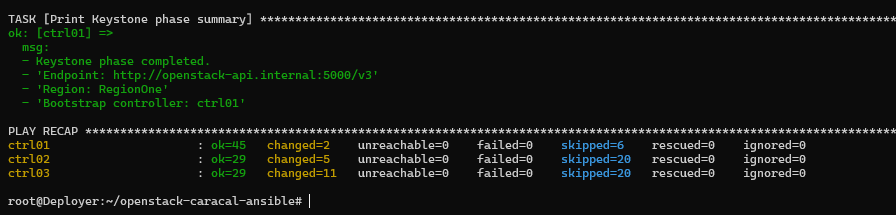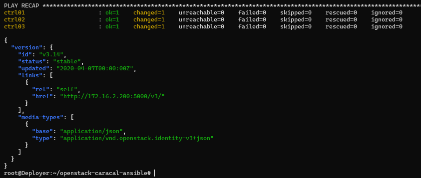

:::info
Identity file akan tersimpan di controller leader dengan nama admin-openrc
:::

---

---

---

|

|

|

---

# ==Conf-9 (Glance + Placement)==

---

:::note
Glance akan memakai Ceph RBD pool images sebagai backend image storage, sedangkan Placement akan memakai database placement dan endpoint API port 8778.
:::

Tambahkan password Glance dan Placement ke Vault

```
EDITOR=nano ansible-vault edit inventories/lab-5node/group_vars/vault.yml
```

```
vault_glance_db_password: "GlanceDBStrongPasswordChangeMe"
vault_glance_service_password: "GlanceServiceStrongPasswordChangeMe"

vault_placement_db_password: "PlacementDBStrongPasswordChangeMe"
vault_placement_service_password: "PlacementServiceStrongPasswordChangeMe"
```

```
ansible-inventory -i inventories/lab-5node/hosts.yml --host ctrl01 | grep -E 'vault_glance|vault_placement'
```

---

Tambahkan variable Glance + Placement

```
nano inventories/lab-5node/group_vars/openstack.yml
```

```
# Glance / Image Service
glance_db_name: glance
glance_db_user: glance
glance_db_password: "{{ vault_glance_db_password }}"
glance_service_user: glance
glance_service_password: "{{ vault_glance_service_password }}"
glance_service_name: glance
glance_service_type: image
glance_service_description: "OpenStack Image"
glance_api_port: 9292
glance_api_bind_host: "{{ management_ip }}"
glance_public_endpoint: "http://{{ internal_fqdn }}:9292"
glance_internal_endpoint: "http://{{ internal_fqdn }}:9292"
glance_admin_endpoint: "http://{{ internal_fqdn }}:9292"

glance_database_connection: "mysql+pymysql://{{ glance_db_user }}:{{ glance_db_password }}@{{ vip_internal }}/{{ glance_db_name }}"

# Glance backend: Ceph RBD
glance_default_backend: rbd
glance_enabled_backends: "rbd:rbd"
glance_rbd_store_ceph_conf: /etc/ceph/ceph.conf
glance_rbd_store_user: glance
glance_rbd_store_pool: "{{ ceph_pools.glance | default('images') }}"
glance_rbd_store_chunk_size: 8

# Placement Service
placement_db_name: placement
placement_db_user: placement
placement_db_password: "{{ vault_placement_db_password }}"
placement_service_user: placement
placement_service_password: "{{ vault_placement_service_password }}"
placement_service_name: placement
placement_service_type: placement
placement_service_description: "Placement API"
placement_api_port: 8778
placement_api_bind_host: "{{ management_ip }}"
placement_public_endpoint: "http://{{ internal_fqdn }}:8778"
placement_internal_endpoint: "http://{{ internal_fqdn }}:8778"
placement_admin_endpoint: "http://{{ internal_fqdn }}:8778"

placement_database_connection: "mysql+pymysql://{{ placement_db_user }}:{{ placement_db_password }}@{{ vip_internal }}/{{ placement_db_name }}"
```

```
nano playbooks/08-image-placement.yml
```

```
---
- name: Phase 08 - Glance Image Service
  hosts: controllers
  become: true
  gather_facts: true
  serial: 1

  roles:
    - role: openstack/glance

  post_tasks:
    - name: Check Glance API service
      ansible.builtin.command: systemctl is-active glance-api
      changed_when: false

    - name: Validate Glance API locally
      ansible.builtin.uri:
        url: "http://{{ management_ip }}:9292"
        method: GET
        status_code:
          - 200
          - 300
          - 401

- name: Phase 08 - Placement API
  hosts: controllers
  become: true
  gather_facts: true
  serial: 1

  roles:
    - role: openstack/placement

  post_tasks:
    - name: Check Apache2 service
      ansible.builtin.command: systemctl is-active apache2
      changed_when: false

    - name: Validate Placement API locally
      ansible.builtin.uri:
        url: "http://{{ management_ip }}:8778"
        method: GET
        status_code:
          - 200
          - 300
          - 401

- name: Phase 08 - Validate Glance and Placement VIP endpoints
  hosts: controllers
  become: true
  gather_facts: false

  tasks:
    - name: Validate Glance endpoint through VIP
      ansible.builtin.uri:
        url: "http://{{ internal_fqdn }}:9292"
        method: GET
        status_code:
          - 200
          - 300
          - 401
      run_once: true
      delegate_to: "{{ groups['controllers'][0] }}"

    - name: Validate Placement endpoint through VIP
      ansible.builtin.uri:
        url: "http://{{ internal_fqdn }}:8778"
        method: GET
        status_code:
          - 200
          - 300
          - 401
      run_once: true
      delegate_to: "{{ groups['controllers'][0] }}"

    - name: Validate OpenStack service catalog entries
      ansible.builtin.shell: |
        set -e
        . /root/admin-openrc
        openstack service show image
        openstack service show placement
        openstack endpoint list --service glance
        openstack endpoint list --service placement
      changed_when: false
      run_once: true
      delegate_to: "{{ groups['controllers'][0] }}"

    - name: Print image-placement phase summary
      ansible.builtin.debug:
        msg:
          - "Glance + Placement phase completed."
          - "Glance endpoint: {{ glance_public_endpoint }}"
          - "Placement endpoint: {{ placement_public_endpoint }}"
          - "Glance backend: Ceph RBD pool {{ glance_rbd_store_pool }}"
      run_once: true
```

Role openstack/glance

```
mkdir -p roles/openstack/glance/{defaults,tasks,templates}
```

```
 nano roles/openstack/glance/defaults/main.yml
```

```
---
glance_packages:
  - glance
  - python3-rados
  - python3-rbd
  - python3-cephfs
  - python3-pymysql
  - python3-openstackclient

glance_service: glance-api
glance_conf_path: /etc/glance/glance-api.conf
glance_db_sync_marker: /var/lib/glance/.db_synced
glance_api_workers: 4
```

```
nano roles/openstack/glance/templates/glance-api.conf.j2
```

```
# Managed by Ansible - Glance API Caracal

[DEFAULT]
debug = false
bind_host = {{ glance_api_bind_host }}
bind_port = {{ glance_api_port }}
workers = {{ glance_api_workers }}
enabled_backends = {{ glance_enabled_backends }}

[database]
connection = {{ glance_database_connection }}

[glance_store]
default_backend = {{ glance_default_backend }}

[rbd]
rbd_store_ceph_conf = {{ glance_rbd_store_ceph_conf }}
rbd_store_user = {{ glance_rbd_store_user }}
rbd_store_pool = {{ glance_rbd_store_pool }}
rbd_store_chunk_size = {{ glance_rbd_store_chunk_size }}

[keystone_authtoken]
www_authenticate_uri = http://{{ internal_fqdn }}:5000
auth_url = http://{{ internal_fqdn }}:5000
memcached_servers = {{ keystone_memcached_servers }}
auth_type = password
project_domain_name = {{ keystone_default_domain }}
user_domain_name = {{ keystone_default_domain }}
project_name = {{ keystone_service_project }}
username = {{ glance_service_user }}
password = {{ glance_service_password }}

[paste_deploy]
flavor = keystone
```

```
nano roles/openstack/glance/tasks/main.yml
```

```
---
- name: Assert Glance variables exist
  ansible.builtin.assert:
    that:
      - glance_db_name is defined
      - glance_db_user is defined
      - glance_db_password is defined
      - glance_service_user is defined
      - glance_service_password is defined
      - glance_database_connection is defined
      - glance_api_bind_host is defined
      - glance_api_port is defined
      - glance_rbd_store_pool is defined
      - glance_rbd_store_user is defined
      - internal_fqdn is defined
      - keystone_memcached_servers is defined
    fail_msg: "Variabel Glance belum lengkap."

- name: Install Glance packages
  ansible.builtin.apt:
    name: "{{ glance_packages }}"
    state: present
    update_cache: true

- name: Ensure Glance database exists on bootstrap controller
  community.mysql.mysql_db:
    name: "{{ glance_db_name }}"
    state: present
    encoding: utf8
    collation: utf8_general_ci
    config_file: /root/.my.cnf
  when: inventory_hostname == groups['controllers'][0]

- name: Ensure Glance database user exists on bootstrap controller
  community.mysql.mysql_user:
    name: "{{ glance_db_user }}"
    password: "{{ glance_db_password }}"
    host: "%"
    priv: "{{ glance_db_name }}.*:ALL"
    state: present
    config_file: /root/.my.cnf
  no_log: true
  when: inventory_hostname == groups['controllers'][0]

- name: Ensure service project exists
  ansible.builtin.shell: |
    . /root/admin-openrc
    openstack project show {{ keystone_service_project }} >/dev/null 2>&1 || \
    openstack project create --domain {{ keystone_default_domain }} \
      --description "Service Project" {{ keystone_service_project }}
  changed_when: false
  when: inventory_hostname == groups['controllers'][0]

- name: Check Glance service user
  ansible.builtin.shell: |
    . /root/admin-openrc
    openstack user show {{ glance_service_user }} -f value -c id
  register: glance_user_check
  changed_when: false
  failed_when: false
  when: inventory_hostname == groups['controllers'][0]

- name: Create Glance service user
  ansible.builtin.shell: |
    . /root/admin-openrc
    openstack user create --domain {{ keystone_default_domain }} --password '{{ glance_service_password }}' {{ glance_service_user }}
  no_log: true
  when:
    - inventory_hostname == groups['controllers'][0]
    - glance_user_check.rc != 0

- name: Assign admin role to Glance service user
  ansible.builtin.shell: |
    . /root/admin-openrc
    openstack role add --project {{ keystone_service_project }} --user {{ glance_service_user }} admin
  changed_when: false
  when: inventory_hostname == groups['controllers'][0]

- name: Check Glance service catalog entry
  ansible.builtin.shell: |
    . /root/admin-openrc
    openstack service show {{ glance_service_type }} -f value -c id
  register: glance_service_check
  changed_when: false
  failed_when: false
  when: inventory_hostname == groups['controllers'][0]

- name: Create Glance service catalog entry
  ansible.builtin.shell: |
    . /root/admin-openrc
    openstack service create --name {{ glance_service_name }} --description "{{ glance_service_description }}" {{ glance_service_type }}
  when:
    - inventory_hostname == groups['controllers'][0]
    - glance_service_check.rc != 0

- name: Check Glance endpoint count
  ansible.builtin.shell: |
    . /root/admin-openrc
    openstack endpoint list --service {{ glance_service_name }} -f value -c ID | wc -l
  register: glance_endpoint_count
  changed_when: false
  when: inventory_hostname == groups['controllers'][0]

- name: Create Glance public endpoint
  ansible.builtin.shell: |
    . /root/admin-openrc
    openstack endpoint create --region {{ keystone_region }} {{ glance_service_type }} public {{ glance_public_endpoint }}
  when:
    - inventory_hostname == groups['controllers'][0]
    - glance_endpoint_count.stdout | int == 0

- name: Create Glance internal endpoint
  ansible.builtin.shell: |
    . /root/admin-openrc
    openstack endpoint create --region {{ keystone_region }} {{ glance_service_type }} internal {{ glance_internal_endpoint }}
  when:
    - inventory_hostname == groups['controllers'][0]
    - glance_endpoint_count.stdout | int == 0

- name: Create Glance admin endpoint
  ansible.builtin.shell: |
    . /root/admin-openrc
    openstack endpoint create --region {{ keystone_region }} {{ glance_service_type }} admin {{ glance_admin_endpoint }}
  when:
    - inventory_hostname == groups['controllers'][0]
    - glance_endpoint_count.stdout | int == 0

- name: Deploy glance-api.conf
  ansible.builtin.template:
    src: glance-api.conf.j2
    dest: "{{ glance_conf_path }}"
    owner: root
    group: glance
    mode: "0640"
    backup: true

- name: Ensure Glance can read Ceph keyring
  ansible.builtin.file:
    path: /etc/ceph/ceph.client.glance.keyring
    owner: root
    group: glance
    mode: "0640"

- name: Check Glance DB sync marker
  ansible.builtin.stat:
    path: "{{ glance_db_sync_marker }}"
  register: glance_db_sync_marker_stat
  when: inventory_hostname == groups['controllers'][0]

- name: Populate Glance database
  ansible.builtin.command: glance-manage db_sync
  become_user: glance
  when:
    - inventory_hostname == groups['controllers'][0]
    - not glance_db_sync_marker_stat.stat.exists

- name: Create Glance DB sync marker
  ansible.builtin.file:
    path: "{{ glance_db_sync_marker }}"
    state: touch
    owner: glance
    group: glance
    mode: "0600"
  when:
    - inventory_hostname == groups['controllers'][0]
    - not glance_db_sync_marker_stat.stat.exists

- name: Restart and enable Glance API
  ansible.builtin.service:
    name: "{{ glance_service }}"
    state: restarted
    enabled: true

- name: Wait for Glance API port
  ansible.builtin.wait_for:
    host: "{{ glance_api_bind_host }}"
    port: "{{ glance_api_port }}"
    timeout: 60

- name: Validate Glance API local response
  ansible.builtin.uri:
    url: "http://{{ glance_api_bind_host }}:{{ glance_api_port }}"
    method: GET
    status_code:
      - 200
      - 300
      - 401
```

Role openstack/placement

```
mkdir -p roles/openstack/placement/{defaults,tasks,templates}
```

```
 nano roles/openstack/placement/defaults/main.yml
```

```
---
placement_packages:
  - placement-api
  - python3-pymysql
  - python3-openstackclient

placement_conf_path: /etc/placement/placement.conf
placement_db_sync_marker: /var/lib/placement/.db_synced
```

```
nano roles/openstack/placement/templates/placement.conf.j2
```

```
# Managed by Ansible - Placement API Caracal

[DEFAULT]
debug = false

[placement_database]
connection = {{ placement_database_connection }}

[api]
auth_strategy = keystone

[keystone_authtoken]
www_authenticate_uri = http://{{ internal_fqdn }}:5000
auth_url = http://{{ internal_fqdn }}:5000
memcached_servers = {{ keystone_memcached_servers }}
auth_type = password
project_domain_name = {{ keystone_default_domain }}
user_domain_name = {{ keystone_default_domain }}
project_name = {{ keystone_service_project }}
username = {{ placement_service_user }}
password = {{ placement_service_password }}
```

```
nano roles/openstack/placement/templates/apache-placement.conf.j2
```

```
# Managed by Ansible - Placement API WSGI backend

Listen {{ placement_api_bind_host }}:{{ placement_api_port }}

<VirtualHost {{ placement_api_bind_host }}:{{ placement_api_port }}>
    ServerName {{ internal_fqdn }}

    WSGIDaemonProcess placement-api processes=4 threads=1 user=placement group=placement display-name=%{GROUP}
    WSGIProcessGroup placement-api
    WSGIApplicationGroup %{GLOBAL}
    WSGIScriptAlias / /usr/bin/placement-api

    WSGIPassAuthorization On

    ErrorLog /var/log/apache2/placement_error.log
    CustomLog /var/log/apache2/placement_access.log combined

    <Directory /usr/bin>
        Require all granted
    </Directory>
</VirtualHost>
```

```
nano roles/openstack/placement/tasks/main.yml
```

```
---
- name: Assert Placement variables exist
  ansible.builtin.assert:
    that:
      - placement_db_name is defined
      - placement_db_user is defined
      - placement_db_password is defined
      - placement_service_user is defined
      - placement_service_password is defined
      - placement_database_connection is defined
      - placement_api_bind_host is defined
      - placement_api_port is defined
      - internal_fqdn is defined
      - keystone_memcached_servers is defined
    fail_msg: "Variabel Placement belum lengkap."

- name: Install Placement packages
  ansible.builtin.apt:
    name: "{{ placement_packages }}"
    state: present
    update_cache: true

- name: Ensure Placement database exists on bootstrap controller
  community.mysql.mysql_db:
    name: "{{ placement_db_name }}"
    state: present
    encoding: utf8
    collation: utf8_general_ci
    config_file: /root/.my.cnf
  when: inventory_hostname == groups['controllers'][0]

- name: Ensure Placement database user exists on bootstrap controller
  community.mysql.mysql_user:
    name: "{{ placement_db_user }}"
    password: "{{ placement_db_password }}"
    host: "%"
    priv: "{{ placement_db_name }}.*:ALL"
    state: present
    config_file: /root/.my.cnf
  no_log: true
  when: inventory_hostname == groups['controllers'][0]

- name: Check Placement service user
  ansible.builtin.shell: |
    . /root/admin-openrc
    openstack user show {{ placement_service_user }} -f value -c id
  register: placement_user_check
  changed_when: false
  failed_when: false
  when: inventory_hostname == groups['controllers'][0]

- name: Ensure service project exists
  ansible.builtin.shell: |
    . /root/admin-openrc
    openstack project show {{ keystone_service_project }} >/dev/null 2>&1 || \
    openstack project create --domain {{ keystone_default_domain }} \
      --description "Service Project" {{ keystone_service_project }}
  changed_when: false
  when: inventory_hostname == groups['controllers'][0]

- name: Create Placement service user
  ansible.builtin.shell: |
    . /root/admin-openrc
    openstack user create --domain {{ keystone_default_domain }} --password '{{ placement_service_password }}' {{ placement_service_user }}
  no_log: true
  when:
    - inventory_hostname == groups['controllers'][0]
    - placement_user_check.rc != 0

- name: Assign admin role to Placement service user
  ansible.builtin.shell: |
    . /root/admin-openrc
    openstack role add --project {{ keystone_service_project }} --user {{ placement_service_user }} admin
  changed_when: false
  when: inventory_hostname == groups['controllers'][0]

- name: Check Placement service catalog entry
  ansible.builtin.shell: |
    . /root/admin-openrc
    openstack service show {{ placement_service_type }} -f value -c id
  register: placement_service_check
  changed_when: false
  failed_when: false
  when: inventory_hostname == groups['controllers'][0]

- name: Create Placement service catalog entry
  ansible.builtin.shell: |
    . /root/admin-openrc
    openstack service create --name {{ placement_service_name }} --description "{{ placement_service_description }}" {{ placement_service_type }}
  when:
    - inventory_hostname == groups['controllers'][0]
    - placement_service_check.rc != 0

- name: Check Placement endpoint count
  ansible.builtin.shell: |
    . /root/admin-openrc
    openstack endpoint list --service {{ placement_service_name }} -f value -c ID | wc -l
  register: placement_endpoint_count
  changed_when: false
  when: inventory_hostname == groups['controllers'][0]

- name: Create Placement public endpoint
  ansible.builtin.shell: |
    . /root/admin-openrc
    openstack endpoint create --region {{ keystone_region }} {{ placement_service_type }} public {{ placement_public_endpoint }}
  when:
    - inventory_hostname == groups['controllers'][0]
    - placement_endpoint_count.stdout | int == 0

- name: Create Placement internal endpoint
  ansible.builtin.shell: |
    . /root/admin-openrc
    openstack endpoint create --region {{ keystone_region }} {{ placement_service_type }} internal {{ placement_internal_endpoint }}
  when:
    - inventory_hostname == groups['controllers'][0]
    - placement_endpoint_count.stdout | int == 0

- name: Create Placement admin endpoint
  ansible.builtin.shell: |
    . /root/admin-openrc
    openstack endpoint create --region {{ keystone_region }} {{ placement_service_type }} admin {{ placement_admin_endpoint }}
  when:
    - inventory_hostname == groups['controllers'][0]
    - placement_endpoint_count.stdout | int == 0

- name: Deploy placement.conf
  ansible.builtin.template:
    src: placement.conf.j2
    dest: "{{ placement_conf_path }}"
    owner: root
    group: placement
    mode: "0640"
    backup: true

- name: Check Placement DB sync marker
  ansible.builtin.stat:
    path: "{{ placement_db_sync_marker }}"
  register: placement_db_sync_marker_stat
  when: inventory_hostname == groups['controllers'][0]

- name: Populate Placement database
  ansible.builtin.command: placement-manage db sync
  become_user: placement
  when:
    - inventory_hostname == groups['controllers'][0]
    - not placement_db_sync_marker_stat.stat.exists

- name: Create Placement DB sync marker
  ansible.builtin.file:
    path: "{{ placement_db_sync_marker }}"
    state: touch
    owner: placement
    group: placement
    mode: "0600"
  when:
    - inventory_hostname == groups['controllers'][0]
    - not placement_db_sync_marker_stat.stat.exists

- name: Deploy Placement Apache site
  ansible.builtin.template:
    src: apache-placement.conf.j2
    dest: /etc/apache2/sites-available/placement-api.conf
    owner: root
    group: root
    mode: "0644"
    backup: true

- name: Enable Placement Apache site
  ansible.builtin.command: a2ensite placement-api.conf
  register: a2ensite_placement
  changed_when: "'already enabled' not in a2ensite_placement.stdout"

- name: Validate Apache configuration
  ansible.builtin.command: apache2ctl configtest
  changed_when: false

- name: Restart Apache2 for Placement
  ansible.builtin.service:
    name: apache2
    state: restarted
    enabled: true

- name: Wait for Placement API port
  ansible.builtin.wait_for:
    host: "{{ placement_api_bind_host }}"
    port: "{{ placement_api_port }}"
    timeout: 60

- name: Validate Placement API local response
  ansible.builtin.uri:
    url: "http://{{ placement_api_bind_host }}:{{ placement_api_port }}"
    method: GET
    status_code:
      - 200
      - 300
      - 401
```

### Validasi Conf-9

```
make image-placement
```

```
curl -s http://172.16.2.200:9292 | jq .
curl -s http://172.16.2.200:8778 | jq .
```

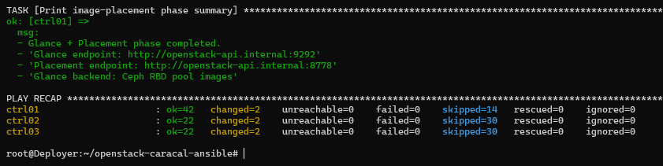

### Tes upload image kecil ke Glance

```
ansible -i inventories/lab-5node/hosts.yml ctrl01 -b -m shell -a '
set -e
. /root/admin-openrc

cd /tmp
if [ ! -f cirros-0.6.2-x86_64-disk.img ]; then
  wget -O cirros-0.6.2-x86_64-disk.img https://download.cirros-cloud.net/0.6.2/cirros-0.6.2-x86_64-disk.img
fi

openstack image show cirros-0.6.2 >/dev/null 2>&1 || \
openstack image create cirros-0.6.2-test \
  --file /tmp/cirros-0.6.2-x86_64-disk.img \
  --disk-format qcow2 \
  --container-format bare \
  --public

openstack image list
'
```

```
openstack image list
```

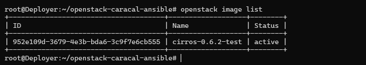

---

---

---

|

|

|

---

# ==Conf-10 (Nova Controller + Nova Compute)==

---

:::note
\[libvirt\]  
virt_type = kvm  
cpu_mode = host-model
:::

### Persyaratan KVM-OK di Semua Node Compute

:::warning
Agar bisa membuat VM atau menempatkan vm diatas Compute harus support virtualisasi KVM.
:::

```bash
root@compute:~# kvm-ok
INFO: /dev/kvm exists
KVM acceleration can be used
```

---

Tambahkan variable Nova (Paling bawah)

```
nano inventories/lab-5node/group_vars/openstack.yml
```

```
# ============================================================
# Nova / Compute Service
# ============================================================

nova_service_name: nova
nova_service_type: compute
nova_service_description: "OpenStack Compute"
nova_service_user: nova
nova_service_password: "{{ vault_nova_service_password }}"

nova_api_port: 8774
nova_metadata_port: 8775
nova_vncproxy_port: 6080

nova_public_endpoint: "http://{{ internal_fqdn }}:8774/v2.1"
nova_internal_endpoint: "http://{{ internal_fqdn }}:8774/v2.1"
nova_admin_endpoint: "http://{{ internal_fqdn }}:8774/v2.1"

nova_api_db_name: nova_api
nova_api_db_user: nova_api
nova_api_db_password: "{{ vault_nova_api_db_password }}"

nova_db_name: nova
nova_db_user: nova
nova_db_password: "{{ vault_nova_db_password }}"

nova_cell0_db_name: nova_cell0
nova_cell0_db_user: nova_cell0
nova_cell0_db_password: "{{ vault_nova_cell0_db_password }}"

nova_api_database_connection: "mysql+pymysql://{{ nova_api_db_user }}:{{ nova_api_db_password }}@{{ vip_internal }}/{{ nova_api_db_name }}"
nova_database_connection: "mysql+pymysql://{{ nova_db_user }}:{{ nova_db_password }}@{{ vip_internal }}/{{ nova_db_name }}"
nova_cell0_database_connection: "mysql+pymysql://{{ nova_cell0_db_user }}:{{ nova_cell0_db_password }}@{{ vip_internal }}/{{ nova_cell0_db_name }}"

nova_rabbit_hosts: >-
  {{
    groups['controllers']
    | map('extract', hostvars, 'management_ip')
    | map('regex_replace', '^(.*)$', rabbitmq_openstack_user ~ ':' ~ rabbitmq_openstack_password ~ '@\\1:5672')
    | join(',')
  }}

nova_transport_url: "rabbit://{{ nova_rabbit_hosts }}/"

nova_memcached_servers: "{{ keystone_memcached_servers }}"

nova_glance_api_servers: "http://{{ internal_fqdn }}:9292"
nova_placement_auth_url: "http://{{ internal_fqdn }}:5000/v3"

nova_novncproxy_base_url: "http://{{ internal_fqdn }}:6080/vnc_auto.html"

nova_compute_driver: libvirt.LibvirtDriver
nova_virt_type: kvm
nova_cpu_mode: host-model

# Nova ephemeral backend via external Ceph RBD
nova_images_type: rbd
nova_rbd_pool: "{{ ceph_pools.nova | default('vms') }}"
nova_rbd_user: nova
nova_rbd_secret_uuid: "{{ rbd_secret_uuid }}"

nova_state_path: /var/lib/nova
nova_instances_path: /var/lib/nova/instances

nova_discover_hosts_interval: 300
```

Buat playbook Nova

```
nano playbooks/09-nova.yml
```

```
---
- name: Phase 09 - Nova Controller
  hosts: controllers
  become: true
  gather_facts: true
  serial: 1

  roles:
    - role: openstack/nova_controller

  post_tasks:
    - name: Check Nova controller services
      ansible.builtin.shell: |
        set -e
        systemctl is-active nova-api
        systemctl is-active nova-scheduler
        systemctl is-active nova-conductor
        systemctl is-active nova-novncproxy
      changed_when: false

- name: Phase 09 - Nova Compute
  hosts: computes
  become: true
  gather_facts: true

  roles:
    - role: openstack/nova_compute

  post_tasks:
    - name: Check Nova compute service
      ansible.builtin.shell: |
        set -e
        systemctl is-active libvirtd
        systemctl is-active nova-compute
      changed_when: false

- name: Phase 09 - Discover Nova compute hosts and validate
  hosts: controllers
  become: true
  gather_facts: false

  tasks:
    - name: Discover compute hosts in cell
      ansible.builtin.command: nova-manage cell_v2 discover_hosts --verbose
      changed_when: false
      failed_when: false
      run_once: true
      delegate_to: "{{ groups['controllers'][0] }}"

    - name: Validate Nova API through VIP
      ansible.builtin.uri:
        url: "http://{{ internal_fqdn }}:8774/"
        method: GET
        status_code:
          - 200
          - 300
          - 401
      run_once: true
      delegate_to: "{{ groups['controllers'][0] }}"

    - name: Validate Nova service catalog
      ansible.builtin.shell: |
        set -e
        . /root/admin-openrc
        openstack service show compute
        openstack endpoint list --service nova
        openstack compute service list
      changed_when: false
      run_once: true
      delegate_to: "{{ groups['controllers'][0] }}"

    - name: Validate Nova hypervisor list
      ansible.builtin.shell: |
        set -e
        . /root/admin-openrc
        openstack hypervisor list
      changed_when: false
      run_once: true
      delegate_to: "{{ groups['controllers'][0] }}"

    - name: Print Nova phase summary
      ansible.builtin.debug:
        msg:
          - "Nova phase completed."
          - "Compute API endpoint: {{ nova_public_endpoint }}"
          - "VNC endpoint: {{ nova_novncproxy_base_url }}"
          - "Libvirt virt_type: {{ nova_virt_type }}"
          - "Libvirt cpu_mode: {{ nova_cpu_mode }}"
          - "Nova RBD pool: {{ nova_rbd_pool }}"
      run_once: true
```

```
nano roles/openstack/nova_controller/defaults/main.yml
```

```
---
nova_controller_packages:
  - nova-api
  - nova-conductor
  - nova-novncproxy
  - nova-scheduler
  - python3-openstackclient
  - python3-pymysql

nova_conf_path: /etc/nova/nova.conf

nova_api_db_sync_marker: /var/lib/nova/.api_db_synced
nova_db_sync_marker: /var/lib/nova/.db_synced
nova_cell0_marker: /var/lib/nova/.cell0_mapped
nova_cell1_marker: /var/lib/nova/.cell1_created
```

```
nano roles/openstack/nova_controller/templates/nova.conf.j2
```

```
# Managed by Ansible - Nova Controller Caracal

[DEFAULT]
debug = false
my_ip = {{ management_ip }}
enabled_apis = osapi_compute,metadata
osapi_compute_listen = {{ management_ip }}
osapi_compute_listen_port = {{ nova_api_port }}
metadata_listen = {{ management_ip }}
metadata_listen_port = {{ nova_metadata_port }}
state_path = {{ nova_state_path }}
transport_url = {{ nova_transport_url }}
compute_driver = {{ nova_compute_driver }}
use_neutron = true
firewall_driver = nova.virt.firewall.NoopFirewallDriver

[api]
auth_strategy = keystone

[api_database]
connection = {{ nova_api_database_connection }}

[database]
connection = {{ nova_database_connection }}

[keystone_authtoken]
www_authenticate_uri = http://{{ internal_fqdn }}:5000
auth_url = http://{{ internal_fqdn }}:5000
memcached_servers = {{ nova_memcached_servers }}
auth_type = password
project_domain_name = {{ keystone_default_domain }}
user_domain_name = {{ keystone_default_domain }}
project_name = {{ keystone_service_project }}
username = {{ nova_service_user }}
password = {{ nova_service_password }}

[service_user]
send_service_user_token = true
auth_url = http://{{ internal_fqdn }}:5000
auth_strategy = keystone
auth_type = password
project_domain_name = {{ keystone_default_domain }}
project_name = {{ keystone_service_project }}
user_domain_name = {{ keystone_default_domain }}
username = {{ nova_service_user }}
password = {{ nova_service_password }}

[placement]
auth_url = {{ nova_placement_auth_url }}
os_region_name = {{ keystone_region }}
auth_type = password
project_domain_name = {{ keystone_default_domain }}
user_domain_name = {{ keystone_default_domain }}
project_name = {{ keystone_service_project }}
username = {{ placement_service_user }}
password = {{ placement_service_password }}

[vnc]
enabled = true
server_listen = {{ management_ip }}
server_proxyclient_address = {{ management_ip }}
novncproxy_host = {{ management_ip }}
novncproxy_port = {{ nova_vncproxy_port }}
novncproxy_base_url = {{ nova_novncproxy_base_url }}

[glance]
api_servers = {{ nova_glance_api_servers }}

[oslo_concurrency]
lock_path = /var/lib/nova/tmp

[scheduler]
discover_hosts_in_cells_interval = {{ nova_discover_hosts_interval }}
```

```
nano roles/openstack/nova_controller/tasks/main.yml
```

```
---
- name: Assert Nova controller variables exist
  ansible.builtin.assert:
    that:
      - nova_api_db_name is defined
      - nova_db_name is defined
      - nova_cell0_db_name is defined
      - nova_api_database_connection is defined
      - nova_database_connection is defined
      - nova_cell0_database_connection is defined
      - nova_service_user is defined
      - nova_service_password is defined
      - nova_transport_url is defined
      - placement_service_user is defined
      - placement_service_password is defined
      - internal_fqdn is defined
      - management_ip is defined
    fail_msg: "Variabel Nova controller belum lengkap."

- name: Install Nova controller packages
  ansible.builtin.apt:
    name: "{{ nova_controller_packages }}"
    state: present
    update_cache: true

- name: Ensure Nova API database exists
  community.mysql.mysql_db:
    name: "{{ nova_api_db_name }}"
    state: present
    encoding: utf8
    collation: utf8_general_ci
    config_file: /root/.my.cnf
  when: inventory_hostname == groups['controllers'][0]

- name: Ensure Nova main database exists
  community.mysql.mysql_db:
    name: "{{ nova_db_name }}"
    state: present
    encoding: utf8
    collation: utf8_general_ci
    config_file: /root/.my.cnf
  when: inventory_hostname == groups['controllers'][0]

- name: Ensure Nova cell0 database exists
  community.mysql.mysql_db:
    name: "{{ nova_cell0_db_name }}"
    state: present
    encoding: utf8
    collation: utf8_general_ci
    config_file: /root/.my.cnf
  when: inventory_hostname == groups['controllers'][0]

- name: Ensure Nova API database user exists
  community.mysql.mysql_user:
    name: "{{ nova_api_db_user }}"
    password: "{{ nova_api_db_password }}"
    host: "%"
    priv: "{{ nova_api_db_name }}.*:ALL"
    state: present
    config_file: /root/.my.cnf
  no_log: true
  when: inventory_hostname == groups['controllers'][0]

- name: Ensure Nova main database user exists
  community.mysql.mysql_user:
    name: "{{ nova_db_user }}"
    password: "{{ nova_db_password }}"
    host: "%"
    priv: "{{ nova_db_name }}.*:ALL"
    state: present
    config_file: /root/.my.cnf
  no_log: true
  when: inventory_hostname == groups['controllers'][0]

- name: Ensure Nova cell0 database user exists
  community.mysql.mysql_user:
    name: "{{ nova_cell0_db_user }}"
    password: "{{ nova_cell0_db_password }}"
    host: "%"
    priv: "{{ nova_cell0_db_name }}.*:ALL"
    state: present
    config_file: /root/.my.cnf
  no_log: true
  when: inventory_hostname == groups['controllers'][0]

- name: Ensure service project exists
  ansible.builtin.shell: |
    . /root/admin-openrc
    openstack project show {{ keystone_service_project }} >/dev/null 2>&1 || \
    openstack project create --domain {{ keystone_default_domain }} \
      --description "Service Project" {{ keystone_service_project }}
  changed_when: false
  when: inventory_hostname == groups['controllers'][0]

- name: Check Nova service user
  ansible.builtin.shell: |
    . /root/admin-openrc
    openstack user show {{ nova_service_user }} -f value -c id
  register: nova_user_check
  changed_when: false
  failed_when: false
  when: inventory_hostname == groups['controllers'][0]

- name: Create Nova service user
  ansible.builtin.shell: |
    . /root/admin-openrc
    openstack user create --domain {{ keystone_default_domain }} --password '{{ nova_service_password }}' {{ nova_service_user }}
  no_log: true
  when:
    - inventory_hostname == groups['controllers'][0]
    - nova_user_check.rc != 0

- name: Assign admin role to Nova service user
  ansible.builtin.shell: |
    . /root/admin-openrc
    openstack role add --project {{ keystone_service_project }} --user {{ nova_service_user }} admin
  changed_when: false
  when: inventory_hostname == groups['controllers'][0]

- name: Check Nova service catalog entry
  ansible.builtin.shell: |
    . /root/admin-openrc
    openstack service show {{ nova_service_type }} -f value -c id
  register: nova_service_check
  changed_when: false
  failed_when: false
  when: inventory_hostname == groups['controllers'][0]

- name: Create Nova service catalog entry
  ansible.builtin.shell: |
    . /root/admin-openrc
    openstack service create --name {{ nova_service_name }} --description "{{ nova_service_description }}" {{ nova_service_type }}
  when:
    - inventory_hostname == groups['controllers'][0]
    - nova_service_check.rc != 0

- name: Check Nova endpoint count
  ansible.builtin.shell: |
    . /root/admin-openrc
    openstack endpoint list --service {{ nova_service_name }} -f value -c ID | wc -l
  register: nova_endpoint_count
  changed_when: false
  when: inventory_hostname == groups['controllers'][0]

- name: Create Nova public endpoint
  ansible.builtin.shell: |
    . /root/admin-openrc
    openstack endpoint create --region {{ keystone_region }} {{ nova_service_type }} public {{ nova_public_endpoint }}
  when:
    - inventory_hostname == groups['controllers'][0]
    - nova_endpoint_count.stdout | int == 0

- name: Create Nova internal endpoint
  ansible.builtin.shell: |
    . /root/admin-openrc
    openstack endpoint create --region {{ keystone_region }} {{ nova_service_type }} internal {{ nova_internal_endpoint }}
  when:
    - inventory_hostname == groups['controllers'][0]
    - nova_endpoint_count.stdout | int == 0

- name: Create Nova admin endpoint
  ansible.builtin.shell: |
    . /root/admin-openrc
    openstack endpoint create --region {{ keystone_region }} {{ nova_service_type }} admin {{ nova_admin_endpoint }}
  when:
    - inventory_hostname == groups['controllers'][0]
    - nova_endpoint_count.stdout | int == 0

- name: Deploy nova.conf on controllers
  ansible.builtin.template:
    src: nova.conf.j2
    dest: "{{ nova_conf_path }}"
    owner: root
    group: nova
    mode: "0640"
    backup: true

- name: Ensure Nova lock directory exists
  ansible.builtin.file:
    path: /var/lib/nova/tmp
    state: directory
    owner: nova
    group: nova
    mode: "0755"

- name: Check Nova API DB sync marker
  ansible.builtin.stat:
    path: "{{ nova_api_db_sync_marker }}"
  register: nova_api_db_sync_marker_stat
  when: inventory_hostname == groups['controllers'][0]

- name: Ensure Ansible remote tmp exists for nova user
  ansible.builtin.file:
    path: /var/lib/nova/.ansible/tmp
    state: directory
    owner: nova
    group: nova
    mode: "0700"

- name: Sync Nova API database
  ansible.builtin.command: nova-manage api_db sync
  become_user: nova
  when:
    - inventory_hostname == groups['controllers'][0]
    - not nova_api_db_sync_marker_stat.stat.exists

- name: Create Nova API DB sync marker
  ansible.builtin.file:
    path: "{{ nova_api_db_sync_marker }}"
    state: touch
    owner: nova
    group: nova
    mode: "0600"
  when:
    - inventory_hostname == groups['controllers'][0]
    - not nova_api_db_sync_marker_stat.stat.exists

- name: Check Nova cell0 marker
  ansible.builtin.stat:
    path: "{{ nova_cell0_marker }}"
  register: nova_cell0_marker_stat
  when: inventory_hostname == groups['controllers'][0]

- name: Map Nova cell0
  ansible.builtin.command: nova-manage cell_v2 map_cell0 --database_connection {{ nova_cell0_database_connection }}
  become_user: nova
  no_log: true
  when:
    - inventory_hostname == groups['controllers'][0]
    - not nova_cell0_marker_stat.stat.exists

- name: Create Nova cell0 marker
  ansible.builtin.file:
    path: "{{ nova_cell0_marker }}"
    state: touch
    owner: nova
    group: nova
    mode: "0600"
  when:
    - inventory_hostname == groups['controllers'][0]
    - not nova_cell0_marker_stat.stat.exists

- name: Check Nova cell1 marker
  ansible.builtin.stat:
    path: "{{ nova_cell1_marker }}"
  register: nova_cell1_marker_stat
  when: inventory_hostname == groups['controllers'][0]

- name: Create Nova cell1
  ansible.builtin.command: nova-manage cell_v2 create_cell --name=cell1 --database_connection {{ nova_database_connection }} --transport-url {{ nova_transport_url }}
  become_user: nova
  no_log: true
  when:
    - inventory_hostname == groups['controllers'][0]
    - not nova_cell1_marker_stat.stat.exists

- name: Create Nova cell1 marker
  ansible.builtin.file:
    path: "{{ nova_cell1_marker }}"
    state: touch
    owner: nova
    group: nova
    mode: "0600"
  when:
    - inventory_hostname == groups['controllers'][0]
    - not nova_cell1_marker_stat.stat.exists

- name: Check Nova main DB sync marker
  ansible.builtin.stat:
    path: "{{ nova_db_sync_marker }}"
  register: nova_db_sync_marker_stat
  when: inventory_hostname == groups['controllers'][0]

- name: Sync Nova main database
  ansible.builtin.command: nova-manage db sync
  become_user: nova
  when:
    - inventory_hostname == groups['controllers'][0]
    - not nova_db_sync_marker_stat.stat.exists

- name: Create Nova main DB sync marker
  ansible.builtin.file:
    path: "{{ nova_db_sync_marker }}"
    state: touch
    owner: nova
    group: nova
    mode: "0600"
  when:
    - inventory_hostname == groups['controllers'][0]
    - not nova_db_sync_marker_stat.stat.exists

- name: Restart Nova controller services
  ansible.builtin.service:
    name: "{{ item }}"
    state: restarted
    enabled: true
  loop:
    - nova-api
    - nova-scheduler
    - nova-conductor
    - nova-novncproxy

- name: Wait for Nova API port
  ansible.builtin.wait_for:
    host: "{{ management_ip }}"
    port: "{{ nova_api_port }}"
    timeout: 60

- name: Wait for Nova NoVNC proxy port
  ansible.builtin.wait_for:
    host: "{{ management_ip }}"
    port: "{{ nova_vncproxy_port }}"
    timeout: 60
```

```
nano roles/openstack/nova_compute/defaults/main.yml
```

```
---
nova_compute_packages:
  - nova-compute
  - qemu-kvm
  - libvirt-daemon-system
  - libvirt-clients
  - bridge-utils
  - ceph-common
  - python3-rbd
  - python3-rados
  - python3-pymysql

nova_conf_path: /etc/nova/nova.conf
nova_libvirt_secret_xml: /etc/nova/secret.xml
```

```
nano roles/openstack/nova_compute/templates/nova.conf.j2
```

```
# Managed by Ansible - Nova Compute Caracal

[DEFAULT]
debug = false
my_ip = {{ management_ip }}
state_path = {{ nova_state_path }}
transport_url = {{ nova_transport_url }}
compute_driver = {{ nova_compute_driver }}
use_neutron = true
firewall_driver = nova.virt.firewall.NoopFirewallDriver

[api]
auth_strategy = keystone

[keystone_authtoken]
www_authenticate_uri = http://{{ internal_fqdn }}:5000
auth_url = http://{{ internal_fqdn }}:5000
memcached_servers = {{ nova_memcached_servers }}
auth_type = password
project_domain_name = {{ keystone_default_domain }}
user_domain_name = {{ keystone_default_domain }}
project_name = {{ keystone_service_project }}
username = {{ nova_service_user }}
password = {{ nova_service_password }}

[service_user]
send_service_user_token = true
auth_url = http://{{ internal_fqdn }}:5000
auth_strategy = keystone
auth_type = password
project_domain_name = {{ keystone_default_domain }}
project_name = {{ keystone_service_project }}
user_domain_name = {{ keystone_default_domain }}
username = {{ nova_service_user }}
password = {{ nova_service_password }}

[placement]
auth_url = {{ nova_placement_auth_url }}
os_region_name = {{ keystone_region }}
auth_type = password
project_domain_name = {{ keystone_default_domain }}
user_domain_name = {{ keystone_default_domain }}
project_name = {{ keystone_service_project }}
username = {{ placement_service_user }}
password = {{ placement_service_password }}

[vnc]
enabled = true
server_listen = 0.0.0.0
server_proxyclient_address = {{ management_ip }}
novncproxy_base_url = {{ nova_novncproxy_base_url }}

[glance]
api_servers = {{ nova_glance_api_servers }}

[oslo_concurrency]
lock_path = /var/lib/nova/tmp

[libvirt]
virt_type = {{ nova_virt_type }}
cpu_mode = {{ nova_cpu_mode }}
images_type = {{ nova_images_type }}
images_rbd_pool = {{ nova_rbd_pool }}
images_rbd_ceph_conf = /etc/ceph/ceph.conf
rbd_user = {{ nova_rbd_user }}
rbd_secret_uuid = {{ nova_rbd_secret_uuid }}
disk_cachemodes = "network=writeback"
inject_password = false
inject_key = false
inject_partition = -2
live_migration_uri = qemu+tcp://%s/system
```

```
nano roles/openstack/nova_compute/templates/libvirt-secret.xml.j2
```

```
<secret ephemeral='no' private='no'>
  <uuid>{{ nova_rbd_secret_uuid }}</uuid>
  <usage type='ceph'>
    <name>client.{{ nova_rbd_user }} secret</name>
  </usage>
</secret>
```

```
nano roles/openstack/nova_compute/tasks/main.yml
```

```
---
- name: Assert Nova compute variables exist
  ansible.builtin.assert:
    that:
      - nova_service_user is defined
      - nova_service_password is defined
      - nova_transport_url is defined
      - placement_service_user is defined
      - placement_service_password is defined
      - internal_fqdn is defined
      - management_ip is defined
      - nova_virt_type is defined
      - nova_cpu_mode is defined
      - nova_rbd_pool is defined
      - nova_rbd_user is defined
      - nova_rbd_secret_uuid is defined
    fail_msg: "Variabel Nova compute belum lengkap."

- name: Install Nova compute packages
  ansible.builtin.apt:
    name: "{{ nova_compute_packages }}"
    state: present
    update_cache: true

- name: Ensure libvirt service is enabled and started
  ansible.builtin.service:
    name: libvirtd
    state: started
    enabled: true

- name: Ensure Nova can read Ceph nova keyring
  ansible.builtin.file:
    path: /etc/ceph/ceph.client.nova.keyring
    owner: root
    group: nova
    mode: "0640"

- name: Ensure libvirt-qemu can access Ceph config directory
  ansible.builtin.file:
    path: /etc/ceph
    owner: root
    group: root
    mode: "0755"

- name: Deploy libvirt Ceph secret XML
  ansible.builtin.template:
    src: libvirt-secret.xml.j2
    dest: "{{ nova_libvirt_secret_xml }}"
    owner: root
    group: root
    mode: "0600"

- name: Check libvirt Ceph secret
  ansible.builtin.command: "virsh secret-dumpxml {{ nova_rbd_secret_uuid }}"
  register: nova_libvirt_secret_check
  changed_when: false
  failed_when: false

- name: Define libvirt Ceph secret
  ansible.builtin.command: "virsh secret-define --file {{ nova_libvirt_secret_xml }}"
  when: nova_libvirt_secret_check.rc != 0

- name: Read Ceph client.nova key
  ansible.builtin.command: "ceph-authtool -p /etc/ceph/ceph.client.nova.keyring"
  register: nova_ceph_key
  changed_when: false
  no_log: true

- name: Set libvirt Ceph secret value
  ansible.builtin.command: "virsh secret-set-value --secret {{ nova_rbd_secret_uuid }} --base64 {{ nova_ceph_key.stdout }}"
  no_log: true

- name: Ensure Nova lock directory exists
  ansible.builtin.file:
    path: /var/lib/nova/tmp
    state: directory
    owner: nova
    group: nova
    mode: "0755"

- name: Ensure Nova instances directory exists
  ansible.builtin.file:
    path: "{{ nova_instances_path }}"
    state: directory
    owner: nova
    group: nova
    mode: "0755"

- name: Deploy nova.conf on compute nodes
  ansible.builtin.template:
    src: nova.conf.j2
    dest: "{{ nova_conf_path }}"
    owner: root
    group: nova
    mode: "0640"
    backup: true

- name: Restart libvirt
  ansible.builtin.service:
    name: libvirtd
    state: restarted
    enabled: true

- name: Restart and enable Nova compute
  ansible.builtin.service:
    name: nova-compute
    state: restarted
    enabled: true

- name: Wait for nova-compute to settle
  ansible.builtin.pause:
    seconds: 5

- name: Check nova-compute service
  ansible.builtin.command: systemctl is-active nova-compute
  changed_when: false
```

### Verifikasi Conf-10

```
make nova
```

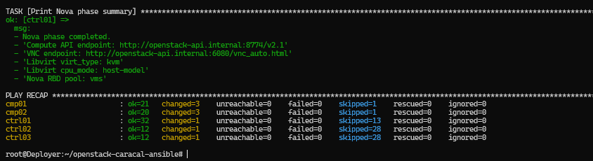

```
openstack compute service list
openstack hypervisor list
```

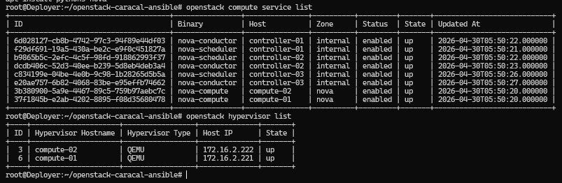

---

---

---

|

|

|

---

# ==Conf-11 (Neutron Controller + Neutron Compute)==

---

Tambah variable Neutron

```
nano inventories/lab-5node/group_vars/network.yml
```

```
# Tambahkan di bawah konfigurasi
# Neutron ML2 + OVS advanced config
neutron_tunnel_types:
  - vxlan

neutron_vxlan_vni_ranges: "1:1000"

neutron_enable_l3_ha: true
neutron_max_l3_agents_per_router: 3
neutron_min_l3_agents_per_router: 2
neutron_dhcp_agents_per_network: 2
neutron_enable_dvr: false

# External/provider network untuk validasi setelah Neutron
external_network_name: public
external_subnet_name: public-subnet
external_cidr: 172.16.3.0/24
external_gateway: 172.16.3.1
external_allocation_start: 172.16.3.100
external_allocation_end: 172.16.3.199

# Tenant/self-service network untuk smoke test setelah Neutron
tenant_network_name: private
tenant_subnet_name: private-subnet
tenant_cidr: 10.10.0.0/24
tenant_gateway: 10.10.0.1
tenant_dns_nameservers:
  - 8.8.8.8
```

```
nano inventories/lab-5node/group_vars/controllers.yml
```

```
# Perbaiki bagian ini
  - name: neutron_api
    bind_ip: "{{ vip_internal }}"
    bind_port: 9696
    backend_port: 9696
    mode: http
    httpchk:
      method: GET
      uri: /
      expect_status: 200
```

```
nano roles/ha/haproxy/templates/haproxy.cfg.j2
```

```
# Ganti bagian loop service

listen {{ svc.name }}
    bind {{ svc.bind_ip }}:{{ svc.bind_port }}
    mode {{ svc.mode | default('http') }}
    balance roundrobin


    option httpchk {{ svc.httpchk.method | default('GET') }} {{ svc.httpchk.uri | default('/') }}

    http-check expect status {{ svc.httpchk.expect_status }}


    option httpchk GET /
    http-check expect status 200



    server {{ host }} {{ hostvars[host].management_ip }}:{{ svc.backend_port }} check inter 2000 rise 2 fall 3



```

Rebuild HA

```
make ha
```

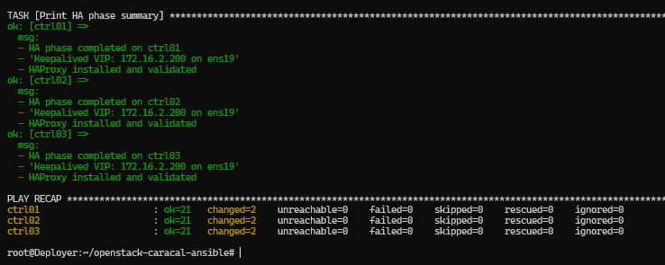

File playbooks/10-neutron.yml

```
nano playbooks/10-neutron.yml
```

```
 ---
- name: Phase 10 - Neutron Controller
  hosts: controllers
  become: true
  gather_facts: true
  serial: 1

  roles:
    - role: openstack/neutron_controller

- name: Phase 10 - Neutron Compute
  hosts: computes
  become: true
  gather_facts: true

  roles:
    - role: openstack/neutron_compute

- name: Phase 10 - Final Neutron validation
  hosts: "{{ groups['controllers'][0] }}"
  become: true
  gather_facts: false

  tasks:
    - name: Validate Neutron API through VIP
      ansible.builtin.uri:
        url: "{{ service_endpoints.neutron }}"
        method: GET
        status_code:
          - 200
          - 300
          - 401
        timeout: 10

    - name: Validate Neutron agents
      ansible.builtin.shell: |
        . /root/admin-openrc
        openstack network agent list
      register: neutron_agent_list
      changed_when: false

    - name: Print Neutron agents
      ansible.builtin.debug:
        var: neutron_agent_list.stdout_lines

    - name: Assert expected OVS agents are visible
      ansible.builtin.assert:
        that:
          - "'Open vSwitch agent' in neutron_agent_list.stdout"
          - "'L3 agent' in neutron_agent_list.stdout"
          - "'DHCP agent' in neutron_agent_list.stdout"
          - "'Metadata agent' in neutron_agent_list.stdout"
        fail_msg: "Neutron agents belum lengkap. Cek neutron-server, ovs-agent, l3-agent, dhcp-agent, metadata-agent."

    - name: Print Neutron phase summary
      ansible.builtin.debug:
        msg:
          - "Neutron phase completed."
          - "Endpoint: {{ service_endpoints.neutron }}"
          - "Provider bridge: {{ neutron_external_bridge }}"
          - "Provider physnet: {{ neutron_provider_physnet }}"
          - "Tunnel type: {{ neutron_tunnel_types | join(',') }}"
          - "VXLAN local IP uses each node management_ip"
```

```
nano roles/openstack/neutron_controller/defaults/main.yml
```

```
---
neutron_packages_controller:
  - neutron-server
  - neutron-plugin-ml2
  - neutron-openvswitch-agent
  - neutron-l3-agent
  - neutron-dhcp-agent
  - neutron-metadata-agent
  - python3-neutronclient

neutron_service_name: neutron
neutron_service_type: network
neutron_service_description: "OpenStack Networking"

neutron_database_name: neutron
neutron_database_user: neutron
neutron_db_password: "{{ vault_neutron_db_password }}"
neutron_service_password: "{{ vault_neutron_service_password }}"
neutron_metadata_secret: "{{ vault_metadata_secret }}"

rabbitmq_openstack_user: openstack
rabbitmq_openstack_password: "{{ vault_rabbitmq_openstack_password }}"

neutron_conf_path: /etc/neutron/neutron.conf
neutron_ml2_conf_path: /etc/neutron/plugins/ml2/ml2_conf.ini
neutron_ovs_agent_conf_path: /etc/neutron/plugins/ml2/openvswitch_agent.ini
neutron_l3_agent_conf_path: /etc/neutron/l3_agent.ini
neutron_dhcp_agent_conf_path: /etc/neutron/dhcp_agent.ini
neutron_metadata_agent_conf_path: /etc/neutron/metadata_agent.ini

neutron_db_sync_marker: /var/lib/neutron/.db_synced

neutron_services_controller:
  - neutron-server
  - neutron-openvswitch-agent
  - neutron-l3-agent
  - neutron-dhcp-agent
  - neutron-metadata-agent
```

```
nano roles/openstack/neutron_controller/templates/neutron.conf.j2
```

```
# Managed by Ansible - Neutron controller config

[DEFAULT]
core_plugin = ml2
service_plugins = router
allow_overlapping_ips = true
auth_strategy = keystone
transport_url = rabbit://{{ rabbitmq_openstack_user }}:{{ rabbitmq_openstack_password }}@{{ hostvars[host].management_ip }}:5672,/
notify_nova_on_port_status_changes = true
notify_nova_on_port_data_changes = true
l3_ha = {{ neutron_enable_l3_ha | bool | lower }}
max_l3_agents_per_router = {{ neutron_max_l3_agents_per_router }}
min_l3_agents_per_router = {{ neutron_min_l3_agents_per_router }}
dhcp_agents_per_network = {{ neutron_dhcp_agents_per_network }}

[agent]
root_helper = sudo /usr/bin/neutron-rootwrap /etc/neutron/rootwrap.conf

[database]
connection = mysql+pymysql://{{ neutron_database_user }}:{{ neutron_db_password }}@{{ db_host }}/{{ neutron_database_name }}

[keystone_authtoken]
www_authenticate_uri = {{ service_endpoints.keystone | regex_replace('/v3$', '') }}
auth_url = {{ service_endpoints.keystone }}
memcached_servers = {{ memcached_servers }}
auth_type = password
project_domain_name = {{ openstack_domain }}
user_domain_name = {{ openstack_domain }}
project_name = service
username = neutron
password = {{ neutron_service_password }}

[nova]
auth_url = {{ service_endpoints.keystone }}
auth_type = password
project_domain_name = {{ openstack_domain }}
user_domain_name = {{ openstack_domain }}
region_name = {{ openstack_region }}
project_name = service
username = nova
password = {{ nova_service_password }}

[oslo_concurrency]
lock_path = /var/lib/neutron/tmp
```

```
nano roles/openstack/neutron_controller/templates/ml2_conf.ini.j2
```

```
# Managed by Ansible - Neutron ML2 config

[ml2]
type_drivers = {{ neutron_type_drivers | join(',') }}
tenant_network_types = {{ neutron_tenant_network_types | join(',') }}
mechanism_drivers = {{ neutron_mechanism_driver }}
extension_drivers = port_security

[ml2_type_flat]
flat_networks = {{ neutron_flat_networks | join(',') }}

[ml2_type_vxlan]
vni_ranges = {{ neutron_vxlan_vni_ranges }}

[securitygroup]
enable_ipset = true
enable_security_group = true
firewall_driver = openvswitch
```

```
nano roles/openstack/neutron_controller/templates/openvswitch_agent.ini.j2
```

```
# Managed by Ansible - Neutron OVS agent config

[ovs]
bridge_mappings = {{ neutron_bridge_mappings | join(',') }}
local_ip = {{ neutron_local_ip }}

[agent]
tunnel_types = {{ neutron_tunnel_types | join(',') }}
l2_population = true
prevent_arp_spoofing = true

[securitygroup]
enable_security_group = true
firewall_driver = openvswitch
```

```
nano roles/openstack/neutron_controller/templates/l3_agent.ini.j2
```

```
# Managed by Ansible - Neutron L3 agent config

[DEFAULT]
interface_driver = openvswitch
external_network_bridge =
agent_mode = legacy
```

```
nano roles/openstack/neutron_controller/templates/dhcp_agent.ini.j2
```

```
# Managed by Ansible - Neutron DHCP agent config

[DEFAULT]
interface_driver = openvswitch
dhcp_driver = neutron.agent.linux.dhcp.Dnsmasq
enable_isolated_metadata = true
enable_metadata_network = true
force_metadata = true
```

```
nano roles/openstack/neutron_controller/templates/metadata_agent.ini.j2
```

```
# Managed by Ansible - Neutron metadata agent config

[DEFAULT]
nova_metadata_host = {{ vip_internal }}
nova_metadata_port = 8775
metadata_proxy_shared_secret = {{ neutron_metadata_secret }}
```

```
nano roles/openstack/neutron_controller/tasks/main.yml
```

```
---
- name: Assert Neutron controller variables exist
  ansible.builtin.assert:
    that:
      - neutron_db_password is defined
      - neutron_service_password is defined
      - neutron_metadata_secret is defined
      - nova_service_password is defined
      - db_host is defined
      - service_endpoints.neutron is defined
      - neutron_external_bridge is defined
      - neutron_bridge_mappings is defined
      - neutron_local_ip is defined
    fail_msg: "Variabel Neutron controller belum lengkap."

- name: Install Neutron controller packages
  ansible.builtin.apt:
    name: "{{ neutron_packages_controller }}"
    state: present
    update_cache: true

- name: Ensure Neutron database exists on bootstrap controller
  community.mysql.mysql_db:
    name: "{{ neutron_database_name }}"
    state: present
    login_user: root
    login_password: "{{ vault_mysql_root_password }}"
    login_host: localhost
    login_unix_socket: /run/mysqld/mysqld.sock
  when: inventory_hostname == groups['controllers'][0]
  no_log: true

- name: Ensure Neutron database user exists on bootstrap controller
  community.mysql.mysql_user:
    name: "{{ neutron_database_user }}"
    password: "{{ neutron_db_password }}"
    host: "%"
    priv: "{{ neutron_database_name }}.*:ALL"
    state: present
    login_user: root
    login_password: "{{ vault_mysql_root_password }}"
    login_host: localhost
    login_unix_socket: /run/mysqld/mysqld.sock
  when: inventory_hostname == groups['controllers'][0]
  no_log: true

- name: Check Neutron service user
  ansible.builtin.shell: |
    . /root/admin-openrc
    openstack user show neutron -f value -c id
  register: neutron_user_check
  changed_when: false
  failed_when: false
  when: inventory_hostname == groups['controllers'][0]

- name: Create Neutron service user
  ansible.builtin.shell: |
    . /root/admin-openrc
    openstack user create --domain {{ openstack_domain }} --password '{{ neutron_service_password }}' neutron
  when:
    - inventory_hostname == groups['controllers'][0]
    - neutron_user_check.rc != 0
  no_log: true

- name: Assign admin role to Neutron service user
  ansible.builtin.shell: |
    . /root/admin-openrc
    openstack role add --project service --user neutron admin
  register: neutron_role_add
  changed_when: neutron_role_add.rc == 0
  failed_when: neutron_role_add.rc != 0
  when: inventory_hostname == groups['controllers'][0]

- name: Check Neutron service
  ansible.builtin.shell: |
    . /root/admin-openrc
    openstack service show {{ neutron_service_name }} -f value -c id
  register: neutron_service_check
  changed_when: false
  failed_when: false
  when: inventory_hostname == groups['controllers'][0]

- name: Create Neutron service
  ansible.builtin.shell: |
    . /root/admin-openrc
    openstack service create --name {{ neutron_service_name }} --description "{{ neutron_service_description }}" {{ neutron_service_type }}
  when:
    - inventory_hostname == groups['controllers'][0]
    - neutron_service_check.rc != 0

- name: Ensure Neutron endpoints exist
  ansible.builtin.shell: |
    . /root/admin-openrc
    openstack endpoint list --service {{ neutron_service_name }} --interface {{ item }} --region {{ openstack_region }} -f value -c ID | grep -q . || \
    openstack endpoint create --region {{ openstack_region }} {{ neutron_service_name }} {{ item }} {{ service_endpoints.neutron }}
  loop:
    - public
    - internal
    - admin
  when: inventory_hostname == groups['controllers'][0]

- name: Deploy neutron.conf
  ansible.builtin.template:
    src: neutron.conf.j2
    dest: "{{ neutron_conf_path }}"
    owner: root
    group: neutron
    mode: "0640"
    backup: true
  no_log: true

- name: Deploy ML2 config
  ansible.builtin.template:
    src: ml2_conf.ini.j2
    dest: "{{ neutron_ml2_conf_path }}"
    owner: root
    group: neutron
    mode: "0640"
    backup: true

- name: Deploy OVS agent config
  ansible.builtin.template:
    src: openvswitch_agent.ini.j2
    dest: "{{ neutron_ovs_agent_conf_path }}"
    owner: root
    group: neutron
    mode: "0640"
    backup: true

- name: Deploy L3 agent config
  ansible.builtin.template:
    src: l3_agent.ini.j2
    dest: "{{ neutron_l3_agent_conf_path }}"
    owner: root
    group: neutron
    mode: "0640"
    backup: true

- name: Deploy DHCP agent config
  ansible.builtin.template:
    src: dhcp_agent.ini.j2
    dest: "{{ neutron_dhcp_agent_conf_path }}"
    owner: root
    group: neutron
    mode: "0640"
    backup: true

- name: Deploy metadata agent config
  ansible.builtin.template:
    src: metadata_agent.ini.j2
    dest: "{{ neutron_metadata_agent_conf_path }}"
    owner: root
    group: neutron
    mode: "0640"
    backup: true
  no_log: true

- name: Ensure neutron plugin.ini points to ML2 config
  ansible.builtin.file:
    src: "{{ neutron_ml2_conf_path }}"
    dest: /etc/neutron/plugin.ini
    state: link
    force: true

- name: Ensure br-ex exists
  ansible.builtin.command: "ovs-vsctl br-exists {{ neutron_external_bridge }}"
  register: neutron_br_ex_check
  failed_when: false
  changed_when: false

- name: Create br-ex when missing
  ansible.builtin.command: "ovs-vsctl add-br {{ neutron_external_bridge }}"
  when: neutron_br_ex_check.rc != 0

- name: Check br-ex ports
  ansible.builtin.command: "ovs-vsctl list-ports {{ neutron_external_bridge }}"
  register: neutron_br_ex_ports
  changed_when: false

- name: Attach provider interface to br-ex
  ansible.builtin.command: "ovs-vsctl add-port {{ neutron_external_bridge }} {{ provider_iface }}"
  when: provider_iface not in neutron_br_ex_ports.stdout_lines

- name: Check Neutron DB sync marker
  ansible.builtin.stat:
    path: "{{ neutron_db_sync_marker }}"
  register: neutron_db_sync_marker_stat
  when: inventory_hostname == groups['controllers'][0]

- name: Populate Neutron database
  ansible.builtin.command: neutron-db-manage --config-file /etc/neutron/neutron.conf --config-file /etc/neutron/plugins/ml2/ml2_conf.ini upgrade head
  become_user: neutron
  when:
    - inventory_hostname == groups['controllers'][0]
    - not neutron_db_sync_marker_stat.stat.exists

- name: Create Neutron DB sync marker
  ansible.builtin.file:
    path: "{{ neutron_db_sync_marker }}"
    state: touch
    owner: neutron
    group: neutron
    mode: "0600"
  when:
    - inventory_hostname == groups['controllers'][0]
    - not neutron_db_sync_marker_stat.stat.exists

- name: Configure Nova to use Neutron
  ansible.builtin.blockinfile:
    path: /etc/nova/nova.conf
    marker: "# {mark} ANSIBLE MANAGED NEUTRON INTEGRATION"
    block: |
      [neutron]
      auth_url = {{ service_endpoints.keystone }}
      auth_type = password
      project_domain_name = {{ openstack_domain }}
      user_domain_name = {{ openstack_domain }}
      region_name = {{ openstack_region }}
      project_name = service
      username = neutron
      password = {{ neutron_service_password }}
      service_metadata_proxy = true
      metadata_proxy_shared_secret = {{ neutron_metadata_secret }}
    backup: true
  no_log: true

- name: Restart Nova API after Neutron integration
  ansible.builtin.service:
    name: nova-api
    state: restarted
    enabled: true

- name: Restart Neutron controller services
  ansible.builtin.service:
    name: "{{ item }}"
    state: restarted
    enabled: true
  loop: "{{ neutron_services_controller }}"

- name: Wait for Neutron API port
  ansible.builtin.wait_for:
    host: "{{ management_ip }}"
    port: 9696
    timeout: 90

- name: Validate Neutron API locally
  ansible.builtin.uri:
    url: "http://{{ management_ip }}:9696"
    method: GET
    status_code:
      - 200
      - 300
      - 401
    timeout: 10

- name: Print Neutron controller summary
  ansible.builtin.debug:
    msg:
      - "Neutron controller configured on {{ inventory_hostname }}"
      - "API: http://{{ management_ip }}:9696"
      - "Provider bridge: {{ neutron_external_bridge }}"
      - "Bridge mappings: {{ neutron_bridge_mappings | join(',') }}"
      - "VXLAN local IP: {{ neutron_local_ip }}"
```

### Verifikasi Conf-11

```
make neutron
```

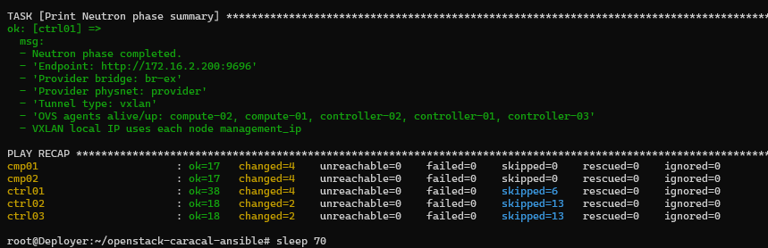

```
curl -i --max-time 5 http://172.16.2.200:9696
openstack network agent list --agent-type open-vswitch
openstack network agent list --host compute-01
openstack network agent list --host compute-02
```

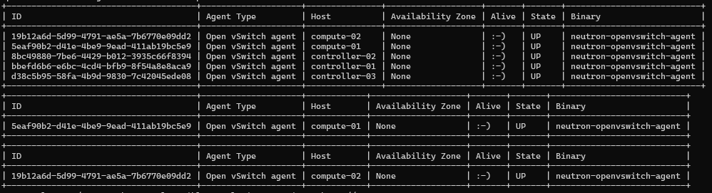

---

---

---

|

|

|

---

# ==Conf-12 (Cinder / Block Storage)==

---

```
nano playbooks/11-cinder.yml
```

```
---
- name: Phase 11 - Cinder Block Storage with Ceph RBD
  hosts: controllers
  become: true
  gather_facts: true

  roles:
    - role: openstack/cinder

  post_tasks:
    - name: Validate Cinder API local port
      ansible.builtin.wait_for:
        host: "{{ management_ip }}"
        port: "{{ cinder_bind_port }}"
        timeout: 60

    - name: Validate Cinder API through VIP
      ansible.builtin.uri:
        url: "{{ service_endpoints.cinder | regex_replace('/v3/%\\(project_id\\)s$', '') }}"
        method: GET
        status_code:
          - 200
          - 300
          - 401
        timeout: 10
      run_once: true
      delegate_to: "{{ bootstrap_controller }}"

    - name: Validate Cinder services from OpenStack CLI
      ansible.builtin.shell: |
        . {{ admin_openrc_path }}
        openstack volume service list
      register: cinder_service_list
      changed_when: false
      run_once: true
      delegate_to: "{{ bootstrap_controller }}"

    - name: Print Cinder services
      ansible.builtin.debug:
        var: cinder_service_list.stdout_lines
      run_once: true

    - name: Print Cinder phase summary
      ansible.builtin.debug:
        msg:
          - "Cinder phase completed."
          - "Endpoint: {{ service_endpoints.cinder }}"
          - "Cinder API bind: {{ management_ip }}:{{ cinder_bind_port }}"
          - "Cinder backend: Ceph RBD"
          - "Cinder RBD pool: {{ cinder_rbd_pool }}"
          - "Cinder RBD user: {{ cinder_rbd_user }}"
      run_once: true
```

```
nano roles/openstack/cinder/defaults/main.yml
```

```
---
admin_openrc_path: /root/admin-openrc
#admin_openrc_path: ~/root/openstack-caracal-ansible/admin-openrc-scratch

cinder_packages:
  - cinder-api
  - cinder-scheduler
  - cinder-volume
  - python3-cinderclient
  - python3-rbd
  - ceph-common

# Hanya service yang benar-benar dikelola systemd.
# cinder-api dikelola Apache WSGI, bukan systemctl cinder-api.
cinder_services:
  - cinder-scheduler
  - cinder-volume

cinder_api_service: apache2

cinder_service_name: cinder
cinder_service_type: volumev3
cinder_service_description: "OpenStack Block Storage"
cinder_database_name: cinder
cinder_database_user: cinder
cinder_db_password: "{{ vault_cinder_db_password }}"
cinder_service_user: cinder
cinder_service_password: "{{ vault_cinder_service_password }}"

cinder_bind_host: "{{ management_ip }}"
cinder_bind_port: 8776

cinder_conf_path: /etc/cinder/cinder.conf
cinder_policy_path: /etc/cinder/policy.yaml

cinder_state_path: /var/lib/cinder
cinder_lock_path: /var/lib/cinder/tmp

cinder_db_sync_marker: /var/lib/cinder/.db_synced

rabbitmq_openstack_user: openstack
rabbitmq_openstack_password: "{{ vault_rabbitmq_openstack_password }}"

cinder_rabbit_hosts: >-
  {{
    groups['controllers']
    | map('extract', hostvars, 'management_ip')
    | map('regex_replace', '^(.*)$', rabbitmq_openstack_user ~ ':' ~ rabbitmq_openstack_password ~ '@\\1:5672')
    | join(',')
  }}

cinder_transport_url: "rabbit://{{ cinder_rabbit_hosts }}/"

cinder_memcached_servers: "{{ memcached_servers }}"

cinder_rbd_pool: "{{ ceph_pools.cinder | default('volumes') }}"
cinder_rbd_user: "{{ cinder_rbd_user | default('cinder') }}"
cinder_rbd_secret_uuid: "{{ rbd_secret_uuid }}"
cinder_rbd_ceph_conf: /etc/ceph/ceph.conf
cinder_rbd_keyring: /etc/ceph/ceph.client.cinder.keyring

cinder_backend_name: ceph
cinder_enabled_backends:
  - ceph
```

```
nano roles/openstack/cinder/templates/cinder.conf.j2
```

```
# Managed by Ansible - Cinder Block Storage

[DEFAULT]
my_ip = {{ management_ip }}
osapi_volume_listen = {{ cinder_bind_host }}
osapi_volume_listen_port = {{ cinder_bind_port }}

#transport_url = {{ cinder_transport_url }}
transport_url = rabbit://{{ rabbitmq_openstack_user }}:{{ rabbitmq_openstack_password }}@{{ hostvars[host].management_ip }}:5672,/
auth_strategy = keystone

enabled_backends = {{ cinder_enabled_backends | join(',') }}
glance_api_servers = {{ service_endpoints.glance }}

state_path = {{ cinder_state_path }}
rootwrap_config = /etc/cinder/rootwrap.conf
api_paste_config = /etc/cinder/api-paste.ini

[database]
connection = mysql+pymysql://{{ cinder_database_user }}:{{ cinder_db_password }}@{{ db_host }}/{{ cinder_database_name }}

[keystone_authtoken]
www_authenticate_uri = {{ service_endpoints.keystone | regex_replace('/v3$', '') }}
auth_url = {{ service_endpoints.keystone }}
memcached_servers = {{ cinder_memcached_servers }}
auth_type = password
project_domain_name = {{ openstack_domain }}
user_domain_name = {{ openstack_domain }}
project_name = service
username = {{ cinder_service_user }}
password = {{ cinder_service_password }}
service_token_roles_required = true

[oslo_concurrency]
lock_path = {{ cinder_lock_path }}

[oslo_messaging_notifications]
driver = messagingv2

[ceph]
volume_driver = cinder.volume.drivers.rbd.RBDDriver
volume_backend_name = {{ cinder_backend_name }}
rbd_pool = {{ cinder_rbd_pool }}
rbd_user = {{ cinder_rbd_user }}
rbd_ceph_conf = {{ cinder_rbd_ceph_conf }}
rbd_secret_uuid = {{ cinder_rbd_secret_uuid }}
rbd_flatten_volume_from_snapshot = false
rbd_max_clone_depth = 5
rbd_store_chunk_size = 4
rados_connect_timeout = -1
report_discard_supported = true
```

```
nano roles/openstack/cinder/handlers/main.yml
```

```
---
- name: Restart Cinder API
  ansible.builtin.service:
    name: "{{ cinder_api_service | default('apache2') }}"
    state: restarted

- name: Restart Cinder services
  ansible.builtin.service:
    name: "{{ item }}"
    state: restarted
    enabled: true
  loop: "{{ cinder_services }}"
```

```
nano roles/openstack/cinder/tasks/main.yml
```

```
---
- name: Assert Cinder variables exist
  ansible.builtin.assert:
    that:
      - cinder_db_password is defined
      - cinder_service_password is defined
      - service_endpoints.cinder is defined
      - service_endpoints.keystone is defined
      - service_endpoints.glance is defined
      - cinder_transport_url is defined
      - cinder_rbd_pool is defined
      - cinder_rbd_secret_uuid is defined
    fail_msg: "Variabel Cinder belum lengkap."

- name: Install Cinder packages
  ansible.builtin.apt:
    name: "{{ cinder_packages }}"
    state: present
    update_cache: true
  retries: 3
  delay: 10
  register: cinder_pkg_result
  until: cinder_pkg_result is succeeded

- name: Ensure Cinder directories exist
  ansible.builtin.file:
    path: "{{ item }}"
    state: directory
    owner: cinder
    group: cinder
    mode: "0755"
  loop:
    - "{{ cinder_state_path }}"
    - "{{ cinder_lock_path }}"

- name: Validate admin-openrc exists on bootstrap controller
  ansible.builtin.stat:
    path: "{{ admin_openrc_path }}"
  register: admin_openrc_stat
  run_once: true
  delegate_to: "{{ bootstrap_controller }}"

- name: Assert admin-openrc exists
  ansible.builtin.assert:
    that:
      - admin_openrc_stat.stat.exists
    fail_msg: "{{ admin_openrc_path }} tidak ada di {{ bootstrap_controller }}. Buat/restore dulu file auth OpenStack admin."
  run_once: true

- name: Ensure Cinder database exists on bootstrap controller
  community.mysql.mysql_db:
    name: "{{ cinder_database_name }}"
    state: present
    login_user: root
    login_password: "{{ vault_mysql_root_password }}"
    login_unix_socket: /run/mysqld/mysqld.sock
  run_once: true
  delegate_to: "{{ bootstrap_controller }}"

- name: Ensure Cinder database user exists on bootstrap controller
  community.mysql.mysql_user:
    name: "{{ cinder_database_user }}"
    password: "{{ cinder_db_password }}"
    host: "{{ item }}"
    priv: "{{ cinder_database_name }}.*:ALL"
    state: present
    login_user: root
    login_password: "{{ vault_mysql_root_password }}"
    login_unix_socket: /run/mysqld/mysqld.sock
  loop:
    - "%"
    - localhost
  no_log: false
  run_once: true
  delegate_to: "{{ bootstrap_controller }}"

- name: Check Cinder service user
  ansible.builtin.shell: |
    . {{ admin_openrc_path }}
    openstack user show {{ cinder_service_user }} --domain {{ openstack_domain }} -f value -c id
  register: cinder_user_check
  changed_when: false
  failed_when: false
  run_once: true
  delegate_to: "{{ bootstrap_controller }}"

- name: Create Cinder service user
  ansible.builtin.shell: |
    . {{ admin_openrc_path }}
    openstack user create {{ cinder_service_user }} \
      --domain {{ openstack_domain }} \
      --password '{{ cinder_service_password }}'
  when: cinder_user_check.rc != 0
  no_log: false
  run_once: true
  delegate_to: "{{ bootstrap_controller }}"

- name: Assign admin role to Cinder service user
  ansible.builtin.shell: |
    . {{ admin_openrc_path }}
    openstack role add --project service --user {{ cinder_service_user }} admin
  register: cinder_role_add
  changed_when: cinder_role_add.rc == 0
  failed_when: cinder_role_add.rc != 0 and 'Conflict occurred' not in cinder_role_add.stderr
  run_once: true
  delegate_to: "{{ bootstrap_controller }}"

- name: Check Cinder service catalog
  ansible.builtin.shell: |
    . {{ admin_openrc_path }}
    openstack service show {{ cinder_service_name }} -f value -c id
  register: cinder_service_check
  changed_when: false
  failed_when: false
  run_once: true
  delegate_to: "{{ bootstrap_controller }}"

- name: Create Cinder volumev3 service
  ansible.builtin.shell: |
    . {{ admin_openrc_path }}
    openstack service create \
      --name {{ cinder_service_name }} \
      --description "{{ cinder_service_description }}" \
      {{ cinder_service_type }}
  when: cinder_service_check.rc != 0
  run_once: true
  delegate_to: "{{ bootstrap_controller }}"

- name: Ensure Cinder endpoints exist
  ansible.builtin.shell: |
    . {{ admin_openrc_path }}
    openstack endpoint create --region {{ openstack_region }} \
      {{ cinder_service_type }} {{ item }} "{{ service_endpoints.cinder }}"
  register: cinder_endpoint_create
  changed_when: cinder_endpoint_create.rc == 0
  failed_when: >
    cinder_endpoint_create.rc != 0 and
    'Conflict occurred' not in cinder_endpoint_create.stderr and
    'Duplicate entry' not in cinder_endpoint_create.stderr
  loop:
    - public
    - internal
    - admin
  run_once: true
  delegate_to: "{{ bootstrap_controller }}"

- name: Deploy cinder.conf
  ansible.builtin.template:
    src: cinder.conf.j2
    dest: "{{ cinder_conf_path }}"
    owner: root
    group: cinder
    mode: "0640"
    backup: true
  notify:
    - Restart Cinder API
    - Restart Cinder services

- name: Deploy Cinder Apache WSGI config
  ansible.builtin.template:
    src: apache-cinder.conf.j2
    dest: /etc/apache2/sites-available/cinder-api.conf
    owner: root
    group: root
    mode: "0644"
    backup: true
  notify: Restart Cinder API

- name: Disable packaged empty Cinder WSGI conf if present
  ansible.builtin.file:
    path: /etc/apache2/conf-enabled/cinder-wsgi.conf
    state: absent
  notify: Restart Cinder API

- name: Enable Cinder Apache site
  ansible.builtin.file:
    src: /etc/apache2/sites-available/cinder-api.conf
    dest: /etc/apache2/sites-enabled/cinder-api.conf
    state: link
  notify: Restart Cinder API

- name: Validate Apache config after Cinder API site
  ansible.builtin.command: apache2ctl configtest
  changed_when: false


- name: Validate Ceph client.cinder keyring exists
  ansible.builtin.stat:
    path: "{{ cinder_rbd_keyring }}"
  register: cinder_keyring_stat

- name: Assert Ceph client.cinder keyring exists
  ansible.builtin.assert:
    that:
      - cinder_keyring_stat.stat.exists
      - cinder_keyring_stat.stat.size | int > 0
    fail_msg: "{{ cinder_rbd_keyring }} tidak ada/kosong. Jalankan make ceph atau salin ceph.client.cinder.keyring dulu."

- name: Validate Cinder can access Ceph volumes pool
  ansible.builtin.command: "rbd -p {{ cinder_rbd_pool }} ls --id {{ cinder_rbd_user }}"
  changed_when: false

- name: Check Cinder DB sync marker
  ansible.builtin.stat:
    path: "{{ cinder_db_sync_marker }}"
  register: cinder_db_sync_marker_stat
  run_once: true
  delegate_to: "{{ bootstrap_controller }}"

- name: Sync Cinder database
  ansible.builtin.command: cinder-manage db sync
  become_user: cinder
  when: not cinder_db_sync_marker_stat.stat.exists
  run_once: true
  delegate_to: "{{ bootstrap_controller }}"

- name: Create Cinder DB sync marker
  ansible.builtin.file:
    path: "{{ cinder_db_sync_marker }}"
    state: touch
    owner: cinder
    group: cinder
    mode: "0600"
  when: not cinder_db_sync_marker_stat.stat.exists
  run_once: true
  delegate_to: "{{ bootstrap_controller }}"

- name: Flush handlers before service validation
  ansible.builtin.meta: flush_handlers

- name: Ensure Cinder services are enabled and started
  ansible.builtin.service:
    name: "{{ item }}"
    state: started
    enabled: true
  loop: "{{ cinder_services }}"

- name: Ensure Apache for Cinder API is enabled and started
  ansible.builtin.service:
    name: "{{ cinder_api_service | default('apache2') }}"
    state: started
    enabled: true

- name: Wait for Cinder API port
  ansible.builtin.wait_for:
    host: "{{ cinder_bind_host }}"
    port: "{{ cinder_bind_port }}"
    timeout: 90
```

```
nano roles/openstack/cinder/templates/apache-cinder.conf.j2
```

```
# Managed by Ansible - Cinder API WSGI backend
# Apache hanya listen di management IP. HAProxy listen di VIP.

Listen {{ cinder_bind_host }}:{{ cinder_bind_port }}

<VirtualHost {{ cinder_bind_host }}:{{ cinder_bind_port }}>
    ServerName {{ internal_fqdn }}

    WSGIDaemonProcess cinder-api \
        processes=4 \
        threads=1 \
        user=cinder \
        group=cinder \
        display-name=%{GROUP}

    WSGIProcessGroup cinder-api
    WSGIApplicationGroup %{GLOBAL}

    WSGIImportScript /usr/bin/cinder-wsgi \
        process-group=cinder-api \
        application-group=%{GLOBAL}

    WSGIScriptAlias / /usr/bin/cinder-wsgi \
        process-group=cinder-api \
        application-group=%{GLOBAL}

    WSGIPassAuthorization On

    ErrorLog /var/log/apache2/cinder_error.log
    CustomLog /var/log/apache2/cinder_access.log combined

    <Directory /usr/bin>
        Require all granted
    </Directory>
</VirtualHost>
```

### Verifikasi Conf-12

```
# Ubah Group Ownership dan Tambahkan Izin Baca (Read) user cinder
ansible controllers -i inventories/lab-5node/hosts.yml -b -m shell -a "chgrp cinder /etc/ceph/ceph.client.cinder.keyring && chmod 0640 /etc/ceph/ceph.client.cinder.keyring"
```

```
# Restart Cinder-Volume
ansible controllers -i inventories/lab-5node/hosts.yml -b -m service -a "name=cinder-volume state=restarted"
```

```
make cinder
```

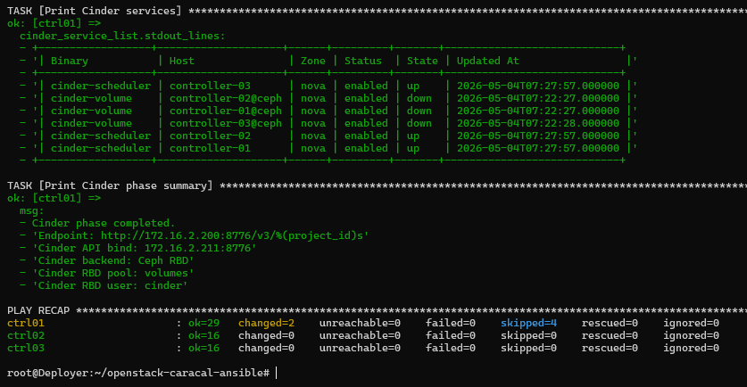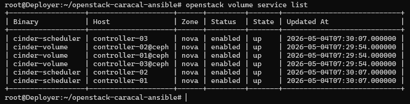

Testing buat Volume

```
openstack volume create --size 1 test-volume

openstack volume show test-volume

openstack volume list
```

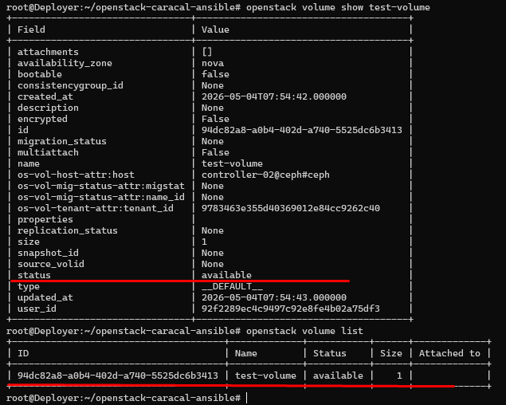

---

---

---

|

|

|

---

# ==Conf-13 (Horizon / Dashboard)==

---

```
nano playbooks/12-horizon.yml
```

```
---
- name: Phase 12 - Horizon Dashboard
  hosts: controllers
  become: true
  gather_facts: true

  roles:
    - role: openstack/horizon

  post_tasks:
    - name: Validate Horizon through VIP
      ansible.builtin.uri:
        url: "http://{{ vip_internal }}{{ horizon_webroot }}/"
        status_code:
          - 200
          - 302
        return_content: false
      register: horizon_vip_check
      changed_when: false
      run_once: true
      delegate_to: "{{ bootstrap_controller }}"

    - name: Print Horizon phase summary
      ansible.builtin.debug:
        msg:
          - "Horizon phase completed."
          - "Dashboard URL: http://{{ vip_internal }}{{ horizon_webroot }}/"
          - "Backend bind: {{ horizon_bind_ip }}:{{ horizon_bind_port }}"
          - "Keystone URL: {{ horizon_keystone_url }}"
      run_once: true
```

```
nano roles/openstack/horizon/defaults/main.yml
```

```
---
horizon_packages:
  - openstack-dashboard
  - python3-memcache

horizon_apache_service: apache2

horizon_local_settings_path: /etc/openstack-dashboard/local_settings.py
horizon_secret_key_path: /etc/openstack-dashboard/.secret_key

horizon_bind_ip: "{{ management_ip }}"
horizon_bind_port: 80
horizon_server_name: "{{ internal_fqdn | default('openstack-api.internal') }}"

horizon_allowed_hosts:
  - "*"

horizon_openstack_host: "{{ internal_fqdn | default('openstack-api.internal') }}"
horizon_keystone_url: "{{ service_endpoints.keystone | default('http://openstack-api.internal:5000/v3') }}"

horizon_timezone: Asia/Jakarta

horizon_session_engine: django.contrib.sessions.backends.cache
horizon_cache_backend: django.core.cache.backends.memcached.PyMemcacheCache
horizon_memcached_servers: "{{ groups['controllers'] | map('extract', hostvars, 'management_ip') | map('regex_replace', '$', ':11211') | list }}"

horizon_enable_lb_cookie: true
horizon_webroot: /horizon
```

```
nano roles/openstack/horizon/templates/local_settings.py.j2
```

```
# Managed by Ansible - OpenStack Horizon local_settings.py

import os
from django.utils.translation import gettext_lazy as _

DEBUG = False

WEBROOT = '{{ horizon_webroot }}/'
STATIC_URL = WEBROOT + 'static/'

ALLOWED_HOSTS = {{ horizon_allowed_hosts | to_json }}

OPENSTACK_HOST = "{{ horizon_openstack_host }}"
OPENSTACK_KEYSTONE_URL = "{{ horizon_keystone_url }}"
OPENSTACK_KEYSTONE_MULTIDOMAIN_SUPPORT = True
OPENSTACK_KEYSTONE_DEFAULT_DOMAIN = "{{ openstack_domain | default('Default') }}"
OPENSTACK_KEYSTONE_DEFAULT_ROLE = "member"
OPENSTACK_API_VERSIONS = {
    "identity": 3,
    "image": 2,
    "volume": 3,
}

OPENSTACK_NEUTRON_NETWORK = {
    "enable_router": True,
    "enable_quotas": True,
    "enable_ipv6": True,
    "enable_distributed_router": False,
    "enable_ha_router": True,
    "enable_fip_topology_check": True,
}

TIME_ZONE = "{{ horizon_timezone }}"

SESSION_ENGINE = "{{ horizon_session_engine }}"

CACHES = {
    "default": {
        "BACKEND": "{{ horizon_cache_backend }}",
        "LOCATION": {{ horizon_memcached_servers | to_json }},
    }
}

SECRET_KEY = "{{ horizon_secret_key }}"

LOGIN_REDIRECT_URL = WEBROOT
LOGOUT_REDIRECT_URL = WEBROOT

COMPRESS_OFFLINE = True
COMPRESS_ROOT = "/var/lib/openstack-dashboard/static"

POLICY_FILES_PATH = "/etc/openstack-dashboard"

AVAILABLE_REGIONS = [
    ("{{ horizon_keystone_url }}", "{{ openstack_region | default('RegionOne') }}"),
]
```

```
nano roles/openstack/horizon/templates/apache-horizon.conf.j2
```

```
# Managed by Ansible - Horizon Apache backend

Listen {{ horizon_bind_ip }}:{{ horizon_bind_port }}

<VirtualHost {{ horizon_bind_ip }}:{{ horizon_bind_port }}>
    ServerName {{ horizon_server_name }}

    WSGIDaemonProcess horizon \
        user=horizon \
        group=horizon \
        processes=4 \
        threads=1 \
        display-name=%{GROUP}

    WSGIProcessGroup horizon
    WSGIApplicationGroup %{GLOBAL}

    WSGIScriptAlias /horizon /usr/share/openstack-dashboard/openstack_dashboard/wsgi.py \
        process-group=horizon \
        application-group=%{GLOBAL}

    WSGIPassAuthorization On

    Alias /horizon/static/ /var/lib/openstack-dashboard/static/

    <Directory /usr/share/openstack-dashboard/openstack_dashboard>
        Require all granted
    </Directory>

    <Directory /var/lib/openstack-dashboard/static>
        Require all granted
    </Directory>

    ErrorLog /var/log/apache2/horizon_error.log
    CustomLog /var/log/apache2/horizon_access.log combined
</VirtualHost>
```

```
nano roles/openstack/horizon/handlers/main.yml
```

```
---
- name: Restart Apache for Horizon
  ansible.builtin.service:
    name: "{{ horizon_apache_service }}"
    state: restarted
```

```
nano roles/openstack/horizon/tasks/main.yml
```

```
---
- name: Assert Horizon variables exist
  ansible.builtin.assert:
    that:
      - service_endpoints.keystone is defined
      - internal_fqdn is defined or horizon_openstack_host is defined
      - groups['controllers'] is defined
    fail_msg: "Variabel Horizon belum lengkap."

- name: Install Horizon packages
  ansible.builtin.apt:
    name: "{{ horizon_packages }}"
    state: present
    update_cache: true
  retries: 3
  delay: 10
  register: horizon_pkg_result
  until: horizon_pkg_result is succeeded

- name: Ensure Horizon secret key file status
  ansible.builtin.stat:
    path: "{{ horizon_secret_key_path }}"
  register: horizon_secret_key_stat

- name: Generate Horizon secret key when missing
  ansible.builtin.command: python3 -c "import secrets; print(secrets.token_urlsafe(64))"
  register: horizon_secret_key_generated
  changed_when: true
  when: not horizon_secret_key_stat.stat.exists

- name: Write Horizon secret key when missing
  ansible.builtin.copy:
    content: "{{ horizon_secret_key_generated.stdout }}\n"
    dest: "{{ horizon_secret_key_path }}"
    owner: root
    group: horizon
    mode: "0640"
  when: not horizon_secret_key_stat.stat.exists
  notify: Restart Apache for Horizon

- name: Read Horizon secret key
  ansible.builtin.slurp:
    path: "{{ horizon_secret_key_path }}"
  register: horizon_secret_key_slurp
  no_log: true

- name: Set Horizon secret key fact
  ansible.builtin.set_fact:
    horizon_secret_key: "{{ horizon_secret_key_slurp.content | b64decode | trim }}"
  no_log: true

- name: Disable Ubuntu default openstack-dashboard Apache alias if present
  ansible.builtin.file:
    path: /etc/apache2/conf-enabled/openstack-dashboard.conf
    state: absent
  notify: Restart Apache for Horizon

- name: Remove previous Horizon site if managed
  ansible.builtin.file:
    path: /etc/apache2/sites-enabled/horizon.conf
    state: absent
  notify: Restart Apache for Horizon

- name: Deploy Horizon local_settings.py
  ansible.builtin.template:
    src: local_settings.py.j2
    dest: "{{ horizon_local_settings_path }}"
    owner: root
    group: horizon
    mode: "0640"
    backup: true
  notify: Restart Apache for Horizon

- name: Deploy Horizon Apache site
  ansible.builtin.template:
    src: apache-horizon.conf.j2
    dest: /etc/apache2/sites-available/horizon.conf
    owner: root
    group: root
    mode: "0644"
    backup: true
  notify: Restart Apache for Horizon

- name: Enable Horizon Apache site
  ansible.builtin.file:
    src: /etc/apache2/sites-available/horizon.conf
    dest: /etc/apache2/sites-enabled/horizon.conf
    state: link
  notify: Restart Apache for Horizon

- name: Ensure Apache WSGI module is enabled
  ansible.builtin.command: a2enmod wsgi
  register: horizon_a2enmod_wsgi
  changed_when: "'already enabled' not in horizon_a2enmod_wsgi.stdout"
  failed_when: horizon_a2enmod_wsgi.rc != 0
  notify: Restart Apache for Horizon

- name: Ensure Apache rewrite module is enabled
  ansible.builtin.command: a2enmod rewrite
  register: horizon_a2enmod_rewrite
  changed_when: "'already enabled' not in horizon_a2enmod_rewrite.stdout"
  failed_when: horizon_a2enmod_rewrite.rc != 0
  notify: Restart Apache for Horizon

- name: Validate Horizon local_settings syntax
  ansible.builtin.command: python3 -m py_compile "{{ horizon_local_settings_path }}"
  changed_when: false

#- name: Collect Horizon static assets
#  ansible.builtin.command: python3 /usr/share/openstack-dashboard/manage.py collectstatic --noinput
#  environment:
#    DJANGO_SETTINGS_MODULE: openstack_dashboard.settings
#  changed_when: false
#  failed_when: false

- name: Ensure Horizon static directory exists
  ansible.builtin.file:
    path: /var/lib/openstack-dashboard/static
    state: directory
    owner: horizon
    group: horizon
    mode: "0755"

- name: Collect Horizon static assets
  ansible.builtin.command: python3 /usr/share/openstack-dashboard/manage.py collectstatic --noinput --clear
  environment:
    DJANGO_SETTINGS_MODULE: openstack_dashboard.settings
  changed_when: false


- name: Compress Horizon static assets
  ansible.builtin.command: python3 /usr/share/openstack-dashboard/manage.py compress --force
  environment:
    DJANGO_SETTINGS_MODULE: openstack_dashboard.settings
  changed_when: false
  failed_when: false

- name: Validate Apache configuration
  ansible.builtin.command: apache2ctl configtest
  changed_when: false

- name: Flush handlers before Horizon validation
  ansible.builtin.meta: flush_handlers

- name: Ensure Apache is enabled and started
  ansible.builtin.service:
    name: "{{ horizon_apache_service }}"
    state: started
    enabled: true

- name: Wait for Horizon backend port
  ansible.builtin.wait_for:
    host: "{{ horizon_bind_ip }}"
    port: "{{ horizon_bind_port }}"
    timeout: 60

- name: Validate Horizon backend
  ansible.builtin.uri:
    url: "http://{{ horizon_bind_ip }}:{{ horizon_bind_port }}{{ horizon_webroot }}/"
    status_code:
      - 200
      - 302
    return_content: false
  register: horizon_backend_check
  changed_when: false
```

### Verifikasi Conf-13

```
make horizon
```

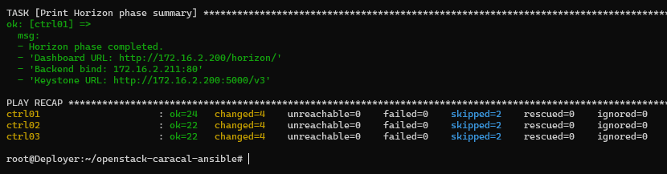

Akses Horizon

```
http://172.16.2.200/horizon
```

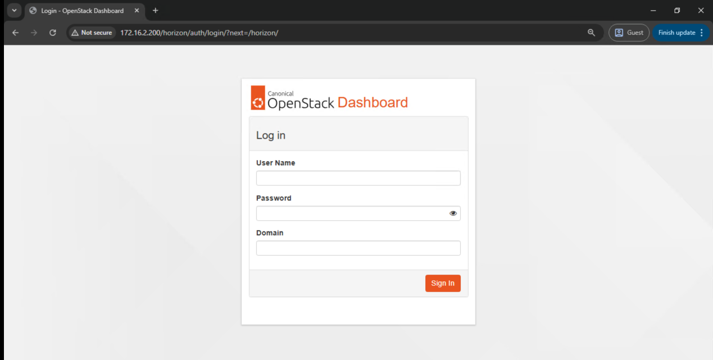

:::note
admin

2-Fe4FmwyC1CsLsQtwzeqoLqiicd7xBu34nqCtjf2JY

Default
:::

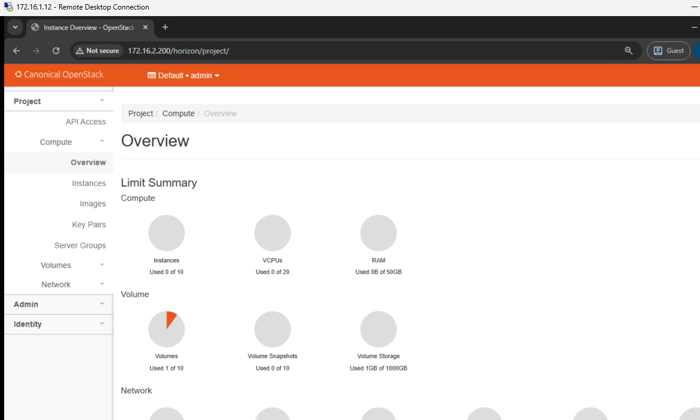

---

---

---

|

|

|

---

# ==Conf-14 ( Telemetry )==

---

:::note
**Ceilometer** – _Telemetry Data Collection Service_

**Gnocchi** – _Time Series Database as a Service_

**Aodh** – _Alarming Service_
:::

### PreRequirement

Ceph auth `client.gnocchi`

```
ssh root@172.16.1.21 '
ceph auth caps client.gnocchi \
  mon "profile rbd" \
  osd "profile rbd pool=metrics" \
  mgr "profile rbd"

ceph auth get client.gnocchi -o /tmp/ceph.client.gnocchi.keyring

echo "=== auth ==="
ceph auth get client.gnocchi

echo "=== keyring file ==="
ls -lah /tmp/ceph.client.gnocchi.keyring
cat /tmp/ceph.client.gnocchi.keyring
'
```

Copy keyring ke Deployer

```
scp root@172.16.1.21:/tmp/ceph.client.gnocchi.keyring files/ceph/ceph.client.gnocchi.keyring

ls -lah files/ceph/ceph.client.gnocchi.keyring
cat files/ceph/ceph.client.gnocchi.keyring
```

Copy keyring Genochi ke semua controller

```
ansible -i inventories/lab-5node/hosts.yml controllers -b -m copy -a '{"src":"files/ceph/ceph.client.gnocchi.keyring","dest":"/etc/ceph/ceph.client.gnocchi.keyring","owner":"root","group":"gnocchi","mode":"0640"}'
```

Validasi file di controller

```
ansible -i inventories/lab-5node/hosts.yml controllers -b -m shell -a '
echo "=== $(hostname) ==="
ls -lah /etc/ceph/ceph.conf /etc/ceph/ceph.client.gnocchi.keyring
stat -c "%U:%G %a %s %n" /etc/ceph/ceph.conf /etc/ceph/ceph.client.gnocchi.keyring
cat /etc/ceph/ceph.client.gnocchi.keyring
' -o
```

Tes Ceph sebagai user `gnocchi`

```
ansible -i inventories/lab-5node/hosts.yml controllers -b -m shell -a '
echo "=== $(hostname) ==="

sudo -u gnocchi ceph -s \
  --id gnocchi \
  --conf /etc/ceph/ceph.conf \
  --keyring /etc/ceph/ceph.client.gnocchi.keyring

sudo -u gnocchi rbd -p metrics ls \
  --id gnocchi \
  --conf /etc/ceph/ceph.conf \
  --keyring /etc/ceph/ceph.client.gnocchi.keyring
' -o
```

### variable telemetry

```
cd ~/openstack-caracal-ansible

cat >> inventories/lab-5node/group_vars/openstack.yml <<'EOF'

# Telemetry endpoints
gnocchi_api_port: 8041
aodh_api_port: 8042

gnocchi_service_user: gnocchi
gnocchi_service_name: gnocchi
gnocchi_service_type: metric
gnocchi_service_description: "OpenStack Metric Service"
gnocchi_database_name: gnocchi
gnocchi_database_user: gnocchi
gnocchi_db_password: "{{ vault_gnocchi_db_password }}"
gnocchi_service_password: "{{ vault_gnocchi_service_password }}"
gnocchi_rbd_pool: metrics
gnocchi_rbd_user: gnocchi
gnocchi_rbd_keyring: /etc/ceph/ceph.client.gnocchi.keyring
gnocchi_rbd_ceph_conf: /etc/ceph/ceph.conf
gnocchi_endpoint: "http://{{ vip_internal }}:8041"

aodh_service_user: aodh
aodh_service_name: aodh
aodh_service_type: alarming
aodh_service_description: "OpenStack Alarming Service"
aodh_database_name: aodh
aodh_database_user: aodh
aodh_db_password: "{{ vault_aodh_db_password }}"
aodh_service_password: "{{ vault_aodh_service_password }}"
aodh_endpoint: "http://{{ vip_internal }}:8042"

ceilometer_service_user: ceilometer
ceilometer_service_name: ceilometer
ceilometer_service_type: metering
ceilometer_service_description: "OpenStack Telemetry Service"
ceilometer_service_password: "{{ vault_ceilometer_service_password }}"
EOF
```

### Gnocchi

```
roles/openstack/gnocchi/defaults/main.yml
```

```
roles/openstack/gnocchi/templates/gnocchi.conf.j2
```

```
roles/openstack/gnocchi/handlers/main.yml
```

```
roles/openstack/gnocchi/tasks/main.yml
```

```
roles/openstack/gnocchi/templates/apache-gnocch
```

### Aodh

```
roles/openstack/aodh/defaults/main.yml
```

```
roles/openstack/aodh/templates/aodh.conf.j2
```

```
roles/openstack/aodh/handlers/main.yml
```

```
roles/openstack/aodh/tasks/main.yml
```

```
roles/openstack/aodh/templates/apache-aodh.conf.j2
```

### Ceilometer

```
roles/openstack/ceilometer/defaults/main.yml
```

```
roles/openstack/ceilometer/templates/ceilometer.conf.j2
```

```
roles/openstack/ceilometer/templates/pipeline.yaml.j2
```

```
roles/openstack/ceilometer/templates/polling.yaml.j2
```

```
roles/openstack/ceilometer/handlers/main.yml
```

```
roles/openstack/ceilometer/tasks/main.yml
```

playbook telemetry

```
playbooks/13-telemetry.yml
```

### Verifikasi Conf-14

```
ansible-playbook -i inventories/lab-5node/hosts.yml playbooks/13-telemetry.yml --syntax-check
```

```
make telemetry
```

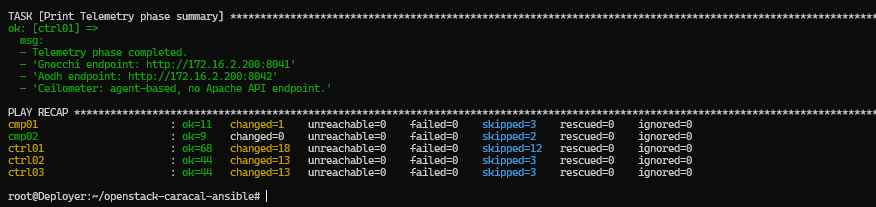

Validasi HAProxy Gnocchi

```
curl -i --max-time 10 http://172.16.2.200:8041/

ssh controller-01 'printf "show stat\n" | socat - /run/haproxy/admin.sock | awk -F, '\''/gnocchi_api/ {print $1,$2,$18,$35,$36,$37,$58}'\'''
```

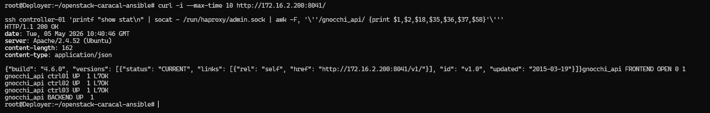

Validasi dengan token OpenStack

```
source admin-openrc-scratch

TOKEN=$(openstack token issue -f value -c id)

curl -sS -i --max-time 20 \
  -H "X-Auth-Token: $TOKEN" \
  http://172.16.2.200:8041/v1/status

gnocchi status
```

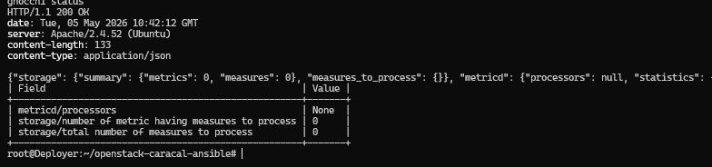

---

---

---

|

|

|

---

# ==Conf-15 (Instance-ha / Masakari )==

---

:::note
Masakari API + engine di controller, Pacemaker/Corosync + masakari-hostmonitor + masakari-instancemonitor di compute, recovery hanya untuk instance yang diberi metadata HA_Enabled=True.
:::

Tambahkan variabel OpenStack di paling bawah

```
inventories/lab-5node/group_vars/openstack.yml
```

```
# Masakari / Instance HA
masakari_database_name: masakari
masakari_database_user: masakari
masakari_db_password: "{{ vault_masakari_db_password }}"

masakari_service_name: masakari
masakari_service_type: instance-ha
masakari_service_description: "OpenStack Instance High Availability Service"
masakari_service_user: masakari
masakari_service_password: "{{ vault_masakari_service_password }}"

masakari_api_port: 15868
masakari_endpoint: "http://{{ internal_vip | default(vip_internal) }}:15868/v1/%(tenant_id)s"

# Recovery policy:
# False = hanya instance dengan metadata HA_Enabled=True yang diproses.
masakari_ha_metadata_key: HA_Enabled
masakari_evacuate_all_instances: false
masakari_process_all_instances: false
masakari_ignore_error_instances: true

# Failover segment
masakari_segment_name: compute-ha-segment
masakari_segment_recovery_method: auto
masakari_segment_service_type: COMPUTE

# Pacemaker/Corosync untuk compute host failure detection
masakari_enable_compute_pacemaker: true
masakari_corosync_cluster_name: openstack-compute-ha
masakari_corosync_token: 10000
masakari_corosync_consensus: 12000
masakari_corosync_two_node: true

# Horizon plugin dashboard
masakari_dashboard_enabled: true
masakari_dashboard_tarball: "https://tarballs.opendev.org/openstack/masakari-dashboard/masakari-dashboard-stable-2024.1.tar.gz"
```

:::note
Masakari API memakai service type instance-ha, dan API reference menyebut recovery method segment mendukung auto, reserved_host, auto_priority, dan rh_priority; untuk baseline ini saya pakai auto.

https://docs.openstack.org/api-ref/instance-ha
:::

```
roles/openstack/masakari/defaults/main.yml
```

```
roles/openstack/masakari/templates/masakari.conf.j2
```

```
roles/openstack/masakari/templates/masakari.conf.j2
```

```
roles/openstack/masakari/templates/masakarimonitors.conf.j2
```

```
roles/openstack/masakari/templates/corosync.conf.j2
```

```
roles/openstack/masakari/templates/masakari-api.service.j2
```

```
roles/openstack/masakari/handlers/main.yml
```

```
roles/openstack/masakari/tasks/main.yml
```

```
playbooks/14-instance-ha.yml
```

```
ansible-playbook -i inventories/lab-5node/hosts.yml playbooks/14-instance-ha.yml --syntax-check
```

### Verifikasi Conf-15

```
make masakari
```

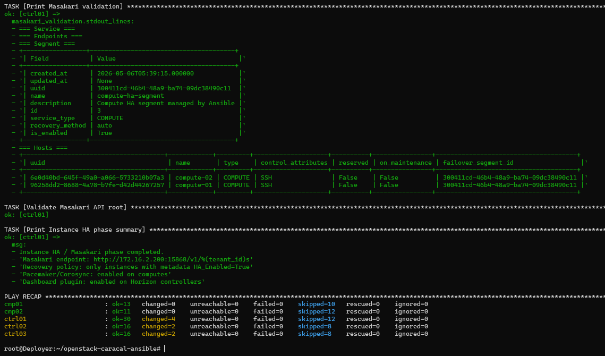

```
curl -i --max-time 10 http://172.16.2.200:15868/
```

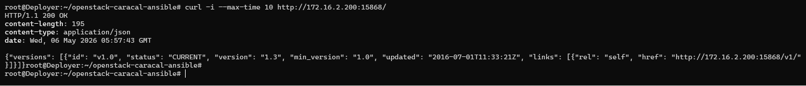

```
apt update
apt install -y python3-masakariclient
source admin-openrc-scratch

openstack segment list
openstack segment show compute-ha-segment

SEG_ID=$(openstack segment show compute-ha-segment -f value -c uuid)
openstack segment host list "$SEG_ID"
```

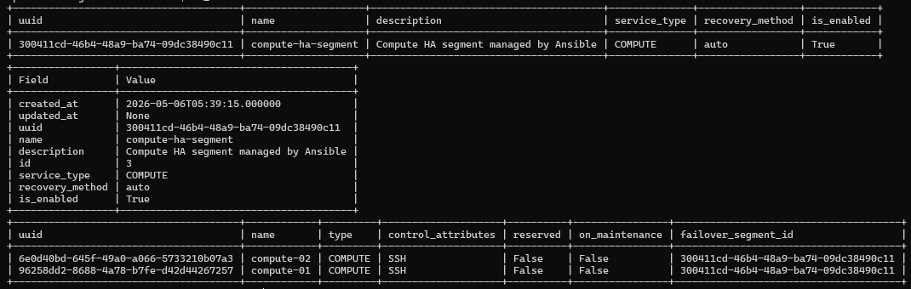

### Note untuk uji failover

:::info
Karena policy only instances with metadata HA_Enabled=True
:::

```
# Harus buat instance test dengan metadata
openstack server set --property HA_Enabled=True <server-name-or-id>

# Cek metadata
openstack server show <server-name-or-id> -c properties

# Untuk instance ephemeral/local disk yang tidak boleh dipulihkan
openstack server unset --property HA_Enabled <SERVER_ID_OR_NAME>
```

```
# Untuk simulasi event tanpa mematikan node compute, menggunakan notification Masakari
oopenstack notification create COMPUTE_HOST compute-01 "$(date -u +%Y-%m-%dT%H:%M:%S)" '{"event":"STOPPED"}'
```

---

---

---

|

|

|

---

# ==Conf-16 (Validate )==

---

:::note
Untuk cek semua service, endpoint, API VIP, HAProxy backend, OpenStack CLI, compute/network/storage agent, telemetry, Masakari, dan Horizon.
:::

```
playbooks/99-validate.yml
```

```
roles/validation/service_checks/defaults/main.yml
```

```
roles/validation/service_checks/tasks/main.yml
```

```
roles/validation/openstack_cli/defaults/main.yml
```

```
roles/validation/openstack_cli/tasks/main.yml
```

```
roles/validation/smoke_tests/defaults/main.yml
```

```
roles/validation/smoke_tests/tasks/main.yml
```

### Validate Conf-16

```
ansible-playbook -i inventories/lab-5node/hosts.yml playbooks/99-validate.yml --syntax-check
make validate
```

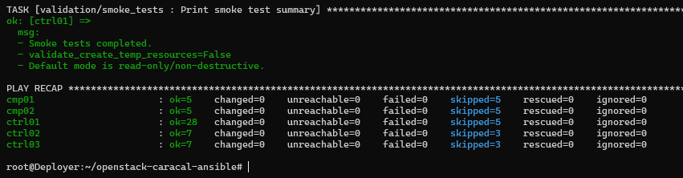

---