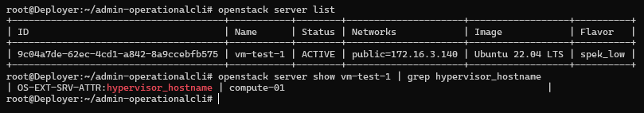
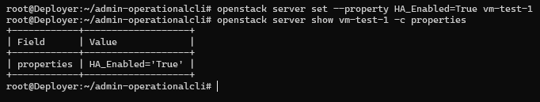
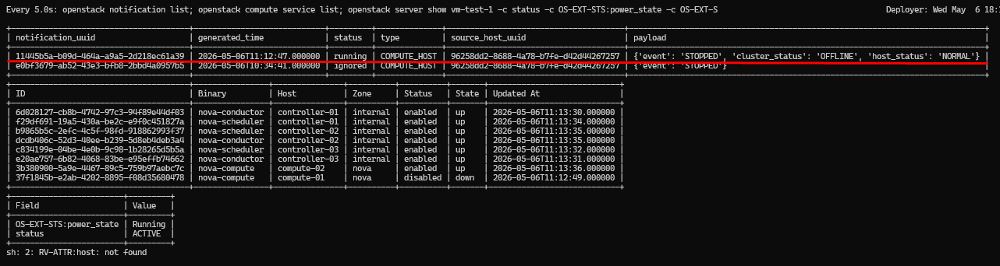

# Testing HA Masakari

```
openstack server list
openstack server show vm-test-1 | grep hypervisor_hostname
```



Tambah Metadata HA_Enabled=True

```
openstack server set --property HA_Enabled=True vm-test-1
```

```
openstack server show vm-test-1 -c properties
```



Paksa host failure Compte-01

```
ssh compute-01 "poweroff"
```

```
watch -n 5 "openstack notification list; openstack compute service list; openstack server show vm-test-1 -c status -c OS-EXT-STS:power_state -c OS-EXT-S
RV-ATTR:host -c OS-EXT-SRV-ATTR:hypervisor_hostname"
```

